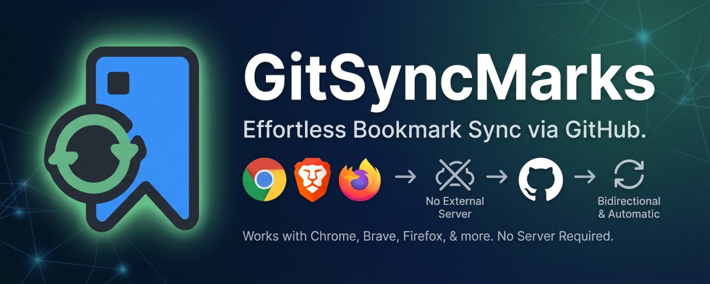
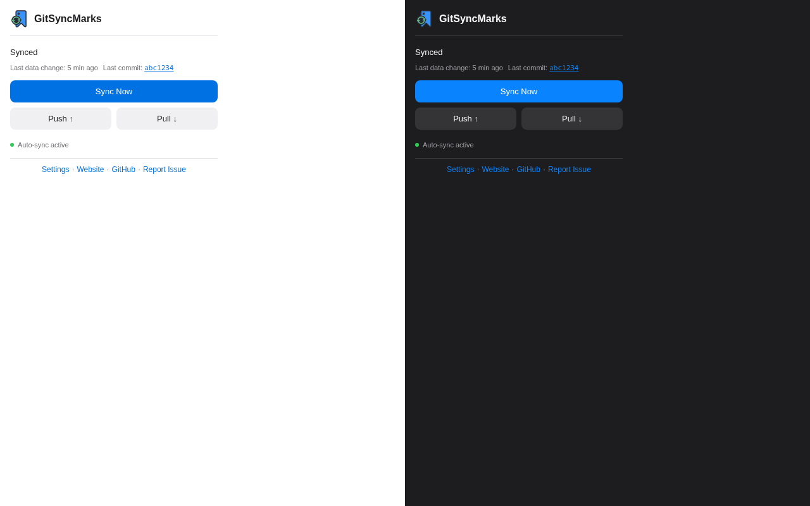
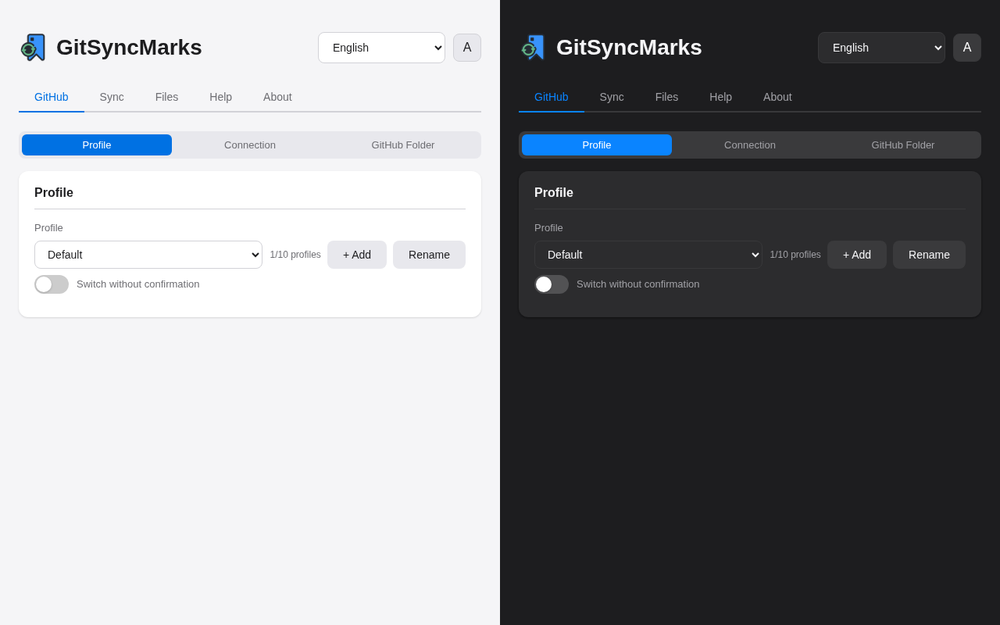
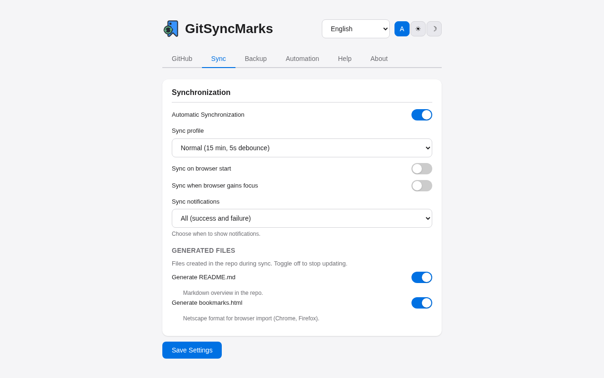
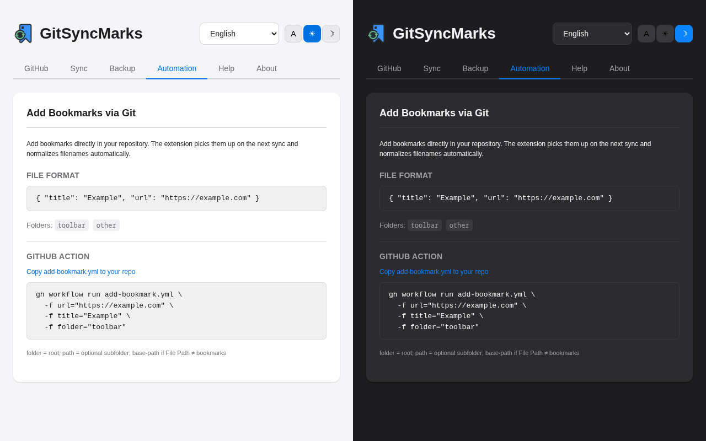
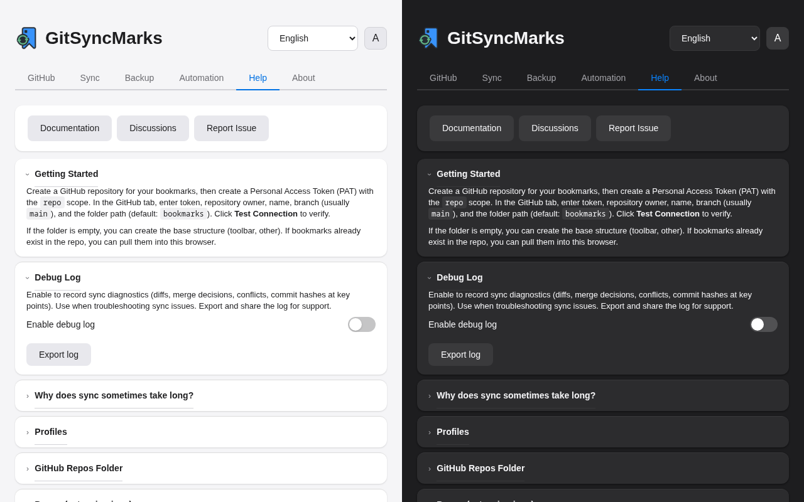
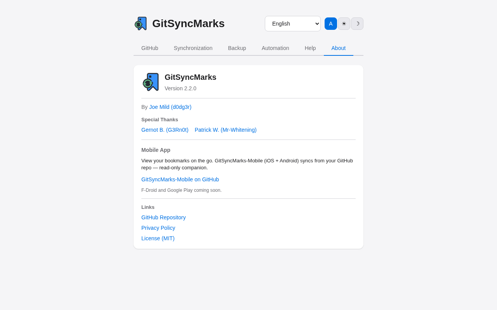

<p align="center">
  
</p>

<h1 align="center">GitSyncMarks</h1>

<p align="center">
  <a href="https://github.com/d0dg3r/GitSyncMarks/releases"></a>
  <a href="https://github.com/d0dg3r/GitSyncMarks/releases?q=pre"></a>
  <a href="https://chromewebstore.google.com/detail/kogijidhfkoibgihpiaiippajhgdgmif"></a>
  <a href="https://addons.mozilla.org/en-US/firefox/addon/gitsyncmarks/"></a>
  <a href="https://github.com/d0dg3r/GitSyncMarks-Mobile"></a>
</p>

<p align="center">
  
</p>

<p align="center">
  A browser extension that bidirectionally syncs your bookmarks with a GitHub repository.<br>
  Supports Chrome and Firefox. No server needed — syncs directly via the GitHub API.
</p>

<p align="center">
  <strong>Why GitSyncMarks?</strong> Your bookmarks live in <em>your</em> Git repo. Per-file storage means every bookmark is a readable JSON file — you can edit, version, and browse them on GitHub. Use multiple profiles for work/personal, automate bookmarking via CLI or GitHub Actions, and keep everything in sync across devices.
</p>

<table align="center">
<tr>
<td align="center"><br><sub>1. Popup</sub></td>
<td align="center"><br><sub>2. GitHub</sub></td>
<td align="center"><br><sub>3. Synchronization</sub></td>
<td align="center"><br><sub>4. Backup</sub></td>
</tr>
<tr>
<td align="center"><br><sub>5. Automation</sub></td>
<td align="center"><br><sub>6. Help</sub></td>
<td align="center"><br><sub>7. About</sub></td>
<td align="center"></td>
</tr>
</table>

See [CHANGELOG.md](CHANGELOG.md) for version history and release notes. See [ROADMAP.md](ROADMAP.md) for planned features.

## Mobile App

**[GitSyncMarks-Mobile](https://github.com/d0dg3r/GitSyncMarks-Mobile)** — View your bookmarks on iOS and Android. Read-only companion app that syncs from your GitHub repo. F-Droid and Google Play coming soon.

## Features

- **Per-file storage**: Each bookmark is stored as an individual JSON file in your Git repo — human-readable and diff-friendly
- **Three-way merge**: Automatic conflict-free sync when changes happen on both sides simultaneously
- **Cross-browser**: Works with Chrome, Chromium, Brave, Edge, and Firefox
- **Auto-sync**: Automatically syncs on every bookmark change (configurable debounce)
- **Multiple profiles**: Up to 10 profiles (work, personal, etc.); each has its own GitHub repo config and bookmark set; Add, Rename, Delete; switching replaces local bookmarks with the target profile's data
- **Sync profiles**: Presets — Real-time (1 min), Frequent (5 min), Normal (15 min), Power save (60 min); Custom for manual interval and debounce
- **Theme**: Light, dark, or auto (follow system) in options and popup
- **Periodic sync**: Checks for remote changes at configurable intervals (1–120 minutes)
- **Manual sync**: Push, Pull, and full Sync via popup buttons
- **Conflict detection**: Notifies you when automatic merge is not possible
- **Readable overview**: A `README.md` with all bookmarks is generated in the repo for easy browsing on GitHub
- **Automation**: Add bookmarks via Git, CLI, or GitHub Actions — the extension picks them up automatically
- **GitHub Repos folder**: Optional folder with bookmarks to all your GitHub repositories (public and private); configurable position (toolbar/other); manual refresh; preserved on pull when not in Git
- **Auto-save**: Switches and action buttons (Update GitHub Repos, Test Connection) save settings automatically
- **Import/Export**: Export and import bookmarks or extension settings as JSON files
- **Multilanguage**: English, German, French, and Spanish, with manual language selection
- **Keyboard shortcuts**: Quick sync (`Ctrl+Shift+.`), Open settings (`Ctrl+Shift+,`) — customizable in browser extension settings
- **Debug Log**: Options → Help — enable to record sync diagnostics (diffs, merge decisions); export and share for troubleshooting
- **No server needed**: Communicates directly with the GitHub API using your Personal Access Token

## Installation

### Chrome / Chromium

1. Go to the [Releases page](https://github.com/d0dg3r/GitSyncMarks/releases)
2. Download `GitSyncMarks-vX.X.X-chrome.zip` (or a pre-release build for testing)
3. Extract the ZIP to a folder
4. Open `chrome://extensions/`, enable **Developer mode**
5. Click **Load unpacked** and select the extracted folder

### Firefox

1. Go to the [Releases page](https://github.com/d0dg3r/GitSyncMarks/releases)
2. Download `GitSyncMarks-vX.X.X-firefox.zip` (or a pre-release build for testing)
3. Open `about:debugging#/runtime/this-firefox`
4. Click **Load Temporary Add-on** and select the ZIP file

> **Note:** For Firefox, "Load Temporary Add-on" loads the extension until you restart the browser. For a permanent install, use the [Firefox Add-on](https://addons.mozilla.org/en-US/firefox/addon/gitsyncmarks/) store.

### Create a GitHub Personal Access Token

1. Go to [GitHub Settings > Tokens](https://github.com/settings/tokens/new?scopes=repo&description=GitSyncMarks+Sync)
2. Create a token with the **`repo`** scope
3. Copy the token

### Configure the extension

1. Click the extension icon in the toolbar, then **Open Settings**
2. In the **GitHub** tab, select a **Profile** (or add one with **+ Add** — you can have up to 10 profiles)
3. Enter your **Personal Access Token**, **Repository Owner**, and **Repository Name**
4. Set **Branch** (usually `main`) and **File Path** (default `bookmarks` — the folder in your repo where bookmark files will live)
5. Click **Test Connection** to verify (settings are saved automatically before the test):
   - If the folder is **empty**: You can create the base structure (toolbar, other)
   - If **bookmarks already exist** in the repo: You can pull them into this browser
6. Click **Save** (switches save automatically; Save is needed for text fields)

### First sync

1. Click the extension icon
2. Click **Sync Now** — a full three-way merge sync runs
3. Your bookmarks are pushed to your GitHub repository as individual JSON files, organized by folder

---

## Profiles

Each profile has its own bookmark set and GitHub repo configuration. Use profiles to separate work and personal bookmarks, or different projects.

- **Add**: Click **+ Add**, enter a name — a new profile is created and you switch to it
- **Rename**: Select a profile, click **Rename**, enter the new name
- **Delete**: Select the profile to remove, click **Delete** — the selected profile is deleted (not the active one)
- **Switch**: Select another profile in the dropdown. Your current bookmarks are saved and pushed to the current profile's repo; the target profile's bookmarks replace the local ones
- **Limit**: Up to 10 profiles; the UI shows the count (e.g. `3/10 profiles`)

Use **Switch without confirmation** in the profile options to skip the confirmation dialog when switching.

> **Note:** Profiles work reliably. With multiple profiles, sync conflicts can occasionally occur — trying Push or Pull 2–3 times usually resolves them. This feature is still evolving. If you encounter reproducible bugs, please [open an issue](https://github.com/d0dg3r/GitSyncMarks/issues) on GitHub.

---

## Popup

Click the extension icon to open the popup:

- **Profile selector**: Change profile directly from the header
- **Sync Now**: Full three-way merge — local and remote changes are merged automatically when possible
- **Push ↑**: Upload local bookmarks to GitHub (overwrites remote changes)
- **Pull ↓**: Download from GitHub (overwrites local changes)

Status line shows last sync time and next scheduled sync. When a conflict occurs, the icon shows a **!** badge and you must choose Push or Pull.

---

## Backup

In the **Backup** tab of the options page:

- **Export / Import Bookmarks**: Export all browser bookmarks as JSON; import replaces all local bookmarks (use with caution)
- **Export / Import Settings**: Export GitHub connection and sync settings, including all profiles with decrypted tokens. Import replaces all settings and reloads the page. Useful for migrating to another browser or device

## Files in the GitHub Repository

After the first sync, your repository will contain:

```
bookmarks/
  _index.json                     # Metadata (format version, device info)
  README.md                       # Auto-generated overview — browse all bookmarks on GitHub
  toolbar/                        # Bookmarks Bar
    _order.json                   # Defines order of items and subfolders in this folder
    github_a1b2.json              # One file per bookmark
    stackoverflow_c3d4.json
    dev-tools/
      _order.json
      mdn-web-docs_e5f6.json
  other/                          # Other Bookmarks (Chrome) / Bookmarks Menu (Firefox)
    _order.json
    ...
```

Each bookmark is a simple JSON file:
```json
{
  "title": "GitHub",
  "url": "https://github.com"
}
```

The `README.md` in the repo is regenerated on each sync — it lists all bookmarks with links, so you can browse your bookmarks directly on GitHub.

## Automation

Add bookmarks without opening the browser:

1. **Directly in Git**: Create a `.json` file with `title` and `url` in any bookmark folder (e.g. `bookmarks/toolbar/` or `bookmarks/toolbar/dev-tools/`). The extension detects it on the next sync and normalizes the filename and folder order.

2. **GitHub Action**: Copy `.github/workflows/add-bookmark.yml` to your bookmark repo. Run it via the GitHub web UI (Actions → Add Bookmark) or via CLI:

```bash
gh workflow run add-bookmark.yml \
  -f url="https://example.com" \
  -f title="Example" \
  -f folder="toolbar" \
  -f path="dev-tools"
```

- `folder`: Root folder (`toolbar` or `other`)
- `path`: Optional subfolder (e.g. `dev-tools` → `bookmarks/toolbar/dev-tools/`)
- `base-path`: Base folder in repo (default `bookmarks`; must match the extension's **File Path** setting)

See the **Automation** tab in the extension settings for more examples and parameters.

## Configuration

| Setting | Default | Description |
|---------|---------|-------------|
| Profile | Default | Active bookmark profile (each has its own GitHub repo config) |
| Personal Access Token | – | GitHub PAT with `repo` scope |
| Repository Owner | – | Your GitHub username or organization |
| Repository Name | – | Name of the target repository |
| Branch | `main` | Target branch for sync |
| File Path | `bookmarks` | Base folder in the repository |
| Auto-Sync | On | Automatically sync on bookmark changes |
| Sync Profile | Normal | Real-time / frequent / normal / power-save / custom |
| Sync Interval | 15 min | How often to check for remote changes (custom profile) |
| Sync on Start | Off | Sync when the browser starts |
| Sync on Focus | Off | Sync when the browser gains focus |
| Switch without confirmation | Off | Skip confirmation when changing profiles |
| GitHub Repos folder | Off | Create folder with bookmarks to all your GitHub repos |
| GitHub Repos position | Other Bookmarks | Where to place the folder (toolbar/other) |
| Notifications | All | When to show sync notifications: All, Errors only, or Off |
| Theme | Auto | Light, Dark, or Auto (follow system) — options page and popup |
| Language | Auto | Auto (browser), English, German, French, or Spanish |
| Debounce delay | 5 s | Wait time before syncing after bookmark changes (varies by sync profile) |

## Conflict Resolution

A conflict occurs when both your local bookmarks and the remote (GitHub) version have been modified, and automatic merge is not possible.

1. The extension icon shows a **!** badge
2. Open the popup — you'll see a conflict message with two options
3. Choose:
   - **Local → GitHub** (Push): Your local bookmarks overwrite the remote version
   - **GitHub → Local** (Pull): The remote version overwrites your local bookmarks

There is no automatic merge for conflicts — you must pick one side. Choose based on which version has the changes you want to keep.

## Technical Details

- **Manifest V3** browser extension (Chrome + Firefox)
- **Per-file bookmark storage**: One JSON file per bookmark; directory structure mirrors folder hierarchy
- **GitHub Git Data API** for atomic multi-file commits (blobs, trees, commits, refs)
- **Three-way merge**: Base vs Local vs Remote comparison with per-file diff; automatic when no overlap
- **Role-based folder mapping**: Cross-browser root folder detection (toolbar, other; Chrome Other = Firefox Bookmarks Menu)
- **Debounced auto-sync**: Rapid changes are bundled into one sync (2–10 s delay by profile)
- **Token encryption**: AES-256-GCM at rest in `chrome.storage.local`
- **Custom i18n**: Runtime language switching without page reload

## Troubleshooting

| Issue | What to check |
|-------|---------------|
| Token invalid | Ensure the PAT has the `repo` scope; token may have been revoked |
| Repo not found | Verify Repository Owner and Name; check repo exists and you have access |
| Sync takes long | Many changed bookmarks = many API calls; see *Why does sync take long?* in Options → Help |
| Sync issues / debugging | Enable Debug Log in Options → Help, reproduce the issue, export the log and share for support |
| Conflict not resolving | You must choose Push or Pull in the popup; there is no automatic merge for conflicts |
| Profile switch slow | When switching to a new (empty) profile, sync is fast; when the current profile has many bookmarks, it pushes to GitHub first |

## Documentation & Help

- **[GitSyncMarks-Mobile](https://github.com/d0dg3r/GitSyncMarks-Mobile)** — iOS + Android companion app (read-only; F-Droid and Google Play coming soon)
- **[docs/](docs/)** — Architecture, release process, testing guide
- **Options → Help tab** — Keyboard shortcuts, feature overview, conflict explanation, Debug Log (sync troubleshooting), full feature list
- **[docs/TESTING.md](docs/TESTING.md)** — Local testing (Chrome, Firefox desktop, Firefox Android)
- **[CHANGELOG.md](CHANGELOG.md)** — Version history
- **[ROADMAP.md](ROADMAP.md)** — Planned features
- **[Discussions](https://github.com/d0dg3r/GitSyncMarks/discussions)** · **[Issues](https://github.com/d0dg3r/GitSyncMarks/issues)** — Feedback, questions, bug reports

## Requirements

- Chrome, Chromium, Brave, Edge, or Firefox
- GitHub account with a repository for bookmarks
- Personal Access Token with the `repo` scope

## License

[MIT](LICENSE)
