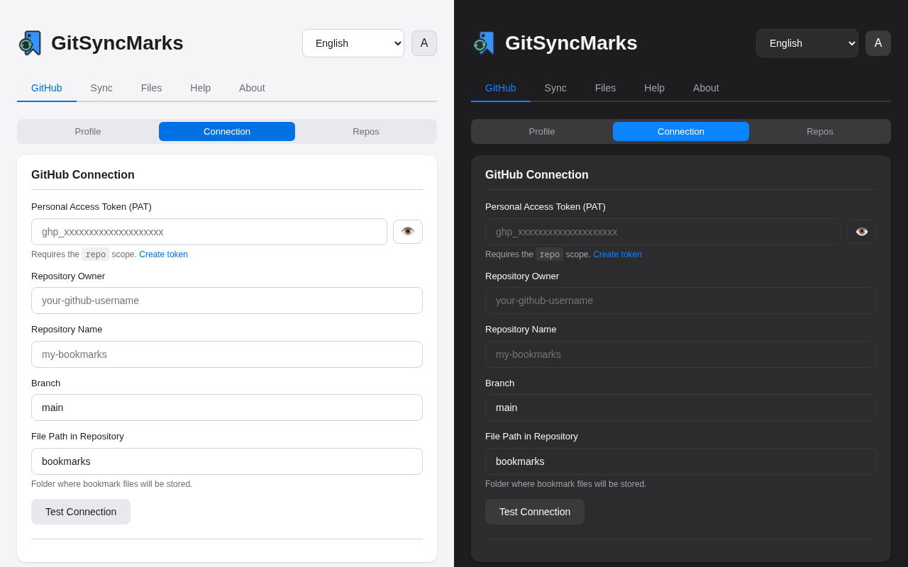
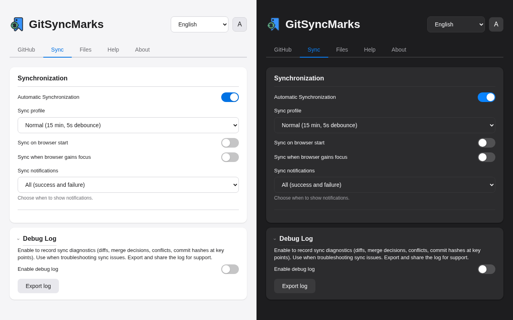
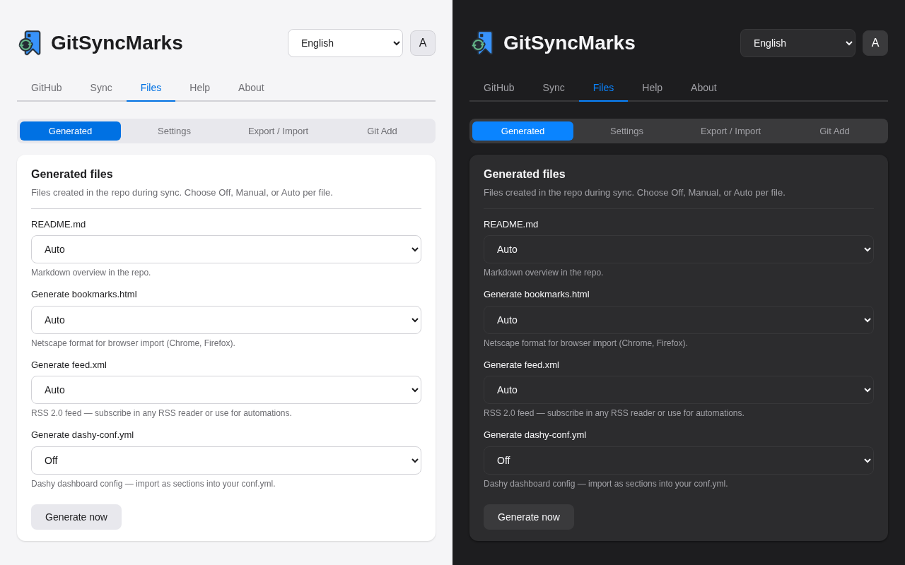
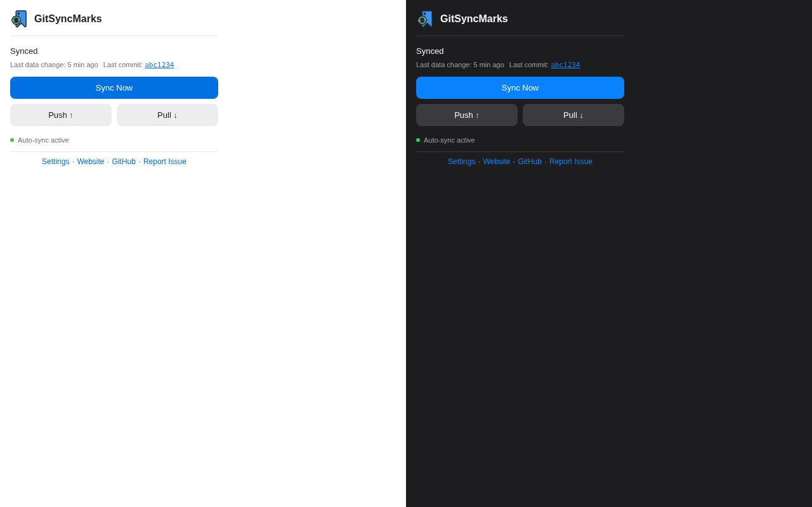

<p align="center">
  
</p>

<p align="center">
  <a href="https://github.com/d0dg3r/GitSyncMarks/releases"></a>
  <a href="https://github.com/d0dg3r/GitSyncMarks/releases?q=pre"></a>
  <a href="https://chromewebstore.google.com/detail/kogijidhfkoibgihpiaiippajhgdgmif"></a>
  <a href="https://addons.mozilla.org/en-US/firefox/addon/gitsyncmarks/"></a>
  <a href="https://github.com/d0dg3r/GitSyncMarks-Mobile"></a>
</p>

<p align="center">
  A browser extension that bidirectionally syncs your bookmarks with a GitHub repository.<br>
  Supports Chrome and Firefox. No middleman — syncs directly via the GitHub API.
</p>

<p align="center">
  <strong>Why GitSyncMarks?</strong> Your bookmarks live in <em>your</em> Git repo. Per-file storage means every bookmark is a readable JSON file — you can edit, version, and browse them on GitHub. Use multiple profiles for work/personal, automate bookmarking via CLI or GitHub Actions, and keep everything in sync across devices.
</p>

<table align="center">
<tr>
<td align="center"><br><sub>1. GitHub</sub></td>
<td align="center"><br><sub>2. Connection</sub></td>
<td align="center"><br><sub>3. Sync</sub></td>
</tr>
<tr>
<td align="center"><br><sub>4. Files</sub></td>
<td align="center"><br><sub>5. Export / Import</sub></td>
<td align="center"><br><sub>6. Popup</sub></td>
</tr>
</table>

See [CHANGELOG.md](CHANGELOG.md) for version history and release notes. See [ROADMAP.md](ROADMAP.md) for planned features. Vote on the [backlog poll](https://github.com/d0dg3r/GitSyncMarks/discussions/37) to influence what we build next. Release codenames (cult nerd figures): 2.3 *Data*, 2.4 *R2-D2*, 3.0 *GLaDOS* — see [docs/RELEASE.md](docs/RELEASE.md).

## Mobile App

**[GitSyncMarks-Mobile](https://github.com/d0dg3r/GitSyncMarks-Mobile)** — View your bookmarks on iOS and Android. Read-only companion app that syncs from your GitHub repo. F-Droid and Google Play coming soon.

## Features

### Core — Why GitSyncMarks

- **No middleman**: Communicates directly with the GitHub API — no third-party server, no backend, your data stays between your browser and your GitHub repo
- **Per-file storage**: Each bookmark is stored as an individual JSON file in your Git repo — human-readable and diff-friendly
- **Three-way merge**: Automatic conflict-free sync when changes happen on both sides simultaneously
- **Cross-browser**: Works with Chrome, Chromium, Brave, Edge, and Firefox
- **Auto-sync**: Automatically syncs on every bookmark change (configurable debounce)

### Power Features

- **Multiple profiles**: Up to 10 profiles (work, personal, etc.); each has its own GitHub repo config and bookmark set; Add, Rename, Delete; switching replaces local bookmarks with the target profile's data
- **Context menu**: Right-click on any page or link — Add to Toolbar, Add to Other Bookmarks, Sync Now, Switch Profile, Copy Favicon URL, Download Favicon; bookmark is auto-synced after adding
- **Favicon tools**: Copy any site's favicon URL to clipboard or download it as PNG — accessible from the context menu; uses the browser's favicon with Google favicon service fallback
- **Automation**: Add bookmarks via Git, CLI, or GitHub Actions — the extension picks them up automatically (Files → Git Add)
- **GitHub Repos folder**: Optional folder with bookmarks to all your GitHub repositories (public and private); configurable position (toolbar/other); manual refresh

### Sync Configuration

- **Sync profiles**: Presets — Real-time (1 min), Frequent (5 min), Normal (15 min), Power save (60 min); Custom for manual interval and debounce
- **Sync on startup / focus**: Optional sync when the browser starts or gains focus (with cooldown to avoid duplicates)
- **Periodic sync**: Checks for remote changes at configurable intervals (1–120 minutes)
- **Manual sync**: Push, Pull, and full Sync via popup buttons
- **Conflict detection**: Notifies you when automatic merge is not possible

### Files & Export

- **Generated files**: README.md (Markdown overview), bookmarks.html (Netscape import), feed.xml (RSS 2.0), dashy-conf.yml (Dashy dashboard) — each configurable as Off, Manual, or Auto
- **Settings sync to Git**: Encrypted backup of extension settings in the repo — user-first workflow with named repo settings, explicit actions (`Import & Apply`, `Sync current to selected`, `Create new setting`), and password prompts only when an action is executed. Global write-back to `settings.enc` stays read-only by default unless explicitly enabled per client
- **Import/Export**: Export bookmarks (JSON), Dashy config (YAML), or settings (plain JSON / encrypted .enc); import bookmarks or settings with automatic format detection

### UX & Extras

- **Onboarding**: Test Connection detects whether the repo folder is empty or has bookmarks — create base structure or pull existing data with one click; folder browser to select the sync path from your repo
- **Folder browser**: Browse your repository folders to select the sync path — navigate into subfolders or select with one click; no manual typing needed
- **Multilanguage**: 12 languages — English, German, French, Spanish, Portuguese (Brazil), Italian, Japanese, Chinese (Simplified), Korean, Russian, Turkish, Polish; manual language selection or auto-detect from browser
- **Keyboard shortcuts**: Quick sync (`Ctrl+Shift+.`), Open settings (`Ctrl+Shift+,`) — customizable in browser extension settings
- **Theme**: Light, dark, or auto — single cycle button (A → Dark → Light → A) in options and popup
- **Options UI**: 5 tabs (GitHub, Sync, Files, Help, About) with sub-tabs for GitHub and Files — clean, organized settings
- **Notifications**: Configurable sync notifications — All (success + failure), Errors only, or Off
- **Auto-save**: All settings save automatically when changed — no Save buttons needed
- **Debug Log**: Options → Sync — enable to record sync diagnostics (diffs, merge decisions, commit hashes); export and share for troubleshooting
- **Vote on backlog**: Community poll in Help tab — vote on which features to prioritize next

## Installation

### Chrome / Chromium

1. Go to the [Releases page](https://github.com/d0dg3r/GitSyncMarks/releases)
2. Download `GitSyncMarks-vX.X.X-chrome.zip` (or a pre-release build for testing)
3. Extract the ZIP to a folder
4. Open `chrome://extensions/`, enable **Developer mode**
5. Click **Load unpacked** and select the extracted folder

### Firefox

1. Go to the [Releases page](https://github.com/d0dg3r/GitSyncMarks/releases)
2. Download `GitSyncMarks-vX.X.X-firefox.zip` (or a pre-release build for testing)
3. Open `about:debugging#/runtime/this-firefox`
4. Click **Load Temporary Add-on** and select the ZIP file

> **Note:** For Firefox, "Load Temporary Add-on" loads the extension until you restart the browser. For a permanent install, use the [Firefox Add-on](https://addons.mozilla.org/en-US/firefox/addon/gitsyncmarks/) store.

### Create a GitHub Personal Access Token

1. Go to [GitHub Settings > Tokens](https://github.com/settings/tokens/new?scopes=repo&description=GitSyncMarks+Sync)
2. Create a token with the **`repo`** scope
3. Copy the token

### Configure the extension

1. Click the extension icon in the toolbar, then **Open Settings**
2. In the **GitHub** tab, select a **Profile** (or add one with **+ Add** — you can have up to 10 profiles)
3. Enter your **Personal Access Token**, **Repository Owner**, and **Repository Name**
4. Set **Branch** (usually `main`) and **File Path** (default `bookmarks` — the folder in your repo where bookmark files will live). Use the **Browse** button to select an existing folder from your repo
5. Click **Test Connection** to verify (settings are saved automatically before the test):
   - If the folder is **empty**: You can create the base structure (toolbar, other)
   - If **bookmarks already exist** in the repo: You can pull them into this browser
6. All settings save automatically when you change them

### First sync

1. Click the extension icon
2. Click **Sync Now** — a full three-way merge sync runs
3. Your bookmarks are pushed to your GitHub repository as individual JSON files, organized by folder

---

## Options Tabs

The extension settings open in a new tab with five main tabs. Header: language dropdown, theme cycle button (A → Dark → Light → A). All settings auto-save.

| Tab | Sub-tabs | Contents |
|-----|----------|----------|
| **GitHub** | Profile, Connection, Repos | Profile selector (add/rename/delete); token, repo, branch, file path, Test Connection, onboarding; GitHub Repos folder toggle |
| **Sync** | — | Auto-sync, sync profile, sync on start/focus, notifications; Debug Log |
| **Files** | Generated, Settings, Export/Import, Git Add | Generated files (README.md, bookmarks.html, feed.xml, dashy-conf.yml) with Off/Manual/Auto; Settings sync to Git (encrypted, global/individual); Export/import bookmarks and settings (JSON or encrypted .enc); Add bookmarks via Git or GitHub Actions |
| **Help** | — | Backlog poll, quick links (Docs, Discussions, Report Issue), feature overview, keyboard shortcuts |
| **About** | — | Version, links, license, contributors, mobile app |

---

## GitHub Tab & Profiles

Each profile has its own bookmark set and GitHub repo configuration. Use profiles to separate work and personal bookmarks, or different projects.

- **Add**: Click **+ Add**, enter a name — a new profile is created and you switch to it
- **Rename**: Select a profile, click **Rename**, enter the new name
- **Delete**: Select the profile to remove, click **Delete** — the selected profile is deleted (not the active one)
- **Switch**: Select another profile in the dropdown. Your current bookmarks are saved and pushed to the current profile's repo; the target profile's bookmarks replace the local ones
- **Limit**: Up to 10 profiles; the UI shows the count (e.g. `3/10 profiles`)

Use **Switch without confirmation** in the profile options to skip the confirmation dialog when switching.

> **Note:** Profiles work reliably. With multiple profiles, sync conflicts can occasionally occur — trying Push or Pull 2–3 times usually resolves them. This feature is still evolving. If you encounter reproducible bugs, please [open an issue](https://github.com/d0dg3r/GitSyncMarks/issues) on GitHub.

---

## Sync Tab

In the **Sync** tab:

- **Auto-sync**: When enabled, bookmarks sync automatically on every change (debounce delay by profile)
- **Sync profile**: Real-time (1 min), Frequent (5 min), Normal (15 min), Power save (60 min), or Custom (manual interval/debounce)
- **Sync on start / Sync on focus**: Optional sync when the browser starts or gains focus (with cooldown)
- **Notifications**: All, Errors only, or Off
- **Debug Log**: Enable to record sync diagnostics (diffs, merge decisions, commit hashes); export for troubleshooting

---

## Popup

Click the extension icon to open the popup:

- **Profile selector**: Change profile directly from the header
- **Sync Now**: Full three-way merge — local and remote changes are merged automatically when possible
- **Push ↑**: Upload local bookmarks to GitHub (overwrites remote changes)
- **Pull ↓**: Download from GitHub (overwrites local changes)

Status line shows last sync time and next scheduled sync. When a conflict occurs, the icon shows a **!** badge and you must choose Push or Pull.

---

## Files Tab

In the **Files** tab (four sub-tabs):

- **Generated**: Each file — **README.md** (Markdown overview), **bookmarks.html** (Netscape format for browser import), **feed.xml** (RSS 2.0 feed), and **dashy-conf.yml** (Dashy dashboard config) — can be set to **Off**, **Manual**, or **Auto**. Use "Generate now" to manually trigger generation and push
- **Settings**: Sync extension settings to Git (encrypted). Settings are listed from the repository (named entries from `settings-index.json` + legacy `settings*.enc`). Select a setting, then run explicit actions: **Import & Apply**, **Sync current to selected**, or **Create new setting**. Password is requested only on these actions. Global imports ask for confirmation before applying, and global write-back is opt-in
- **Export / Import**: Export bookmarks (JSON), Dashy config (YAML), or settings (plain JSON / encrypted .enc). Import bookmarks or settings — encrypted files are decrypted with your password
- **Git Add**: Add bookmarks without opening the browser — create a JSON file in the repo or use the GitHub Actions workflow (`add-bookmark.yml`)

## Files in the GitHub Repository

After the first sync, your repository will contain:

```
bookmarks/
  _index.json                     # Metadata (format version, device info)
  README.md                       # Auto-generated overview — browse all bookmarks on GitHub
  bookmarks.html                  # Netscape format — import directly in Chrome, Firefox, Edge
  feed.xml                        # RSS 2.0 feed — subscribe in any reader or use for automations
  dashy-conf.yml                  # Dashy dashboard config — sections with bookmark links
  settings.enc                    # Encrypted settings backup (if settings sync enabled)
  settings-index.json             # Named settings registry metadata
  toolbar/                        # Bookmarks Bar
    _order.json                   # Defines order of items and subfolders in this folder
    github_a1b2.json              # One file per bookmark
    stackoverflow_c3d4.json
    dev-tools/
      _order.json
      mdn-web-docs_e5f6.json
  other/                          # Other Bookmarks (Chrome) / Bookmarks Menu (Firefox)
    _order.json
    ...
```

Each bookmark is a simple JSON file:
```json
{
  "title": "GitHub",
  "url": "https://github.com"
}
```

The `README.md` in the repo is regenerated on each sync — it lists all bookmarks with links, so you can browse your bookmarks directly on GitHub. The `bookmarks.html` file uses the Netscape format and can be imported in any browser (Chrome: Bookmarks → Import; Firefox: Import and Backup → Import Bookmarks from file). The `feed.xml` file is an RSS 2.0 feed that can be subscribed to in any RSS reader (Feedly, Thunderbird, etc.) or used for automations (Slack, IFTTT, n8n). The `dashy-conf.yml` provides bookmark sections for the [Dashy](https://github.com/Lissy93/dashy) dashboard. Each file can be set to Off, Manual (generate via button), or Auto (on every sync) in Settings → Files → Generated.

## Automation (Git Add)

Add bookmarks without opening the browser. The **Files → Git Add** sub-tab provides copy buttons for JSON and the `gh` command, plus a parameter table.

### 1. Create file in repo

Add a JSON file with `title` and `url` to any bookmark folder. Folders: `toolbar` (Bookmarks Bar) or `other` (Other Bookmarks).

```json
{ "title": "Example", "url": "https://example.com" }
```

Place in `bookmarks/toolbar/` or `bookmarks/toolbar/dev-tools/` (subfolder). The extension detects it on the next sync and normalizes the filename.

### 2. GitHub Action

Copy [add-bookmark.yml](https://github.com/d0dg3r/GitSyncMarks/blob/main/.github/workflows/add-bookmark.yml) to your repo. Run via GitHub Actions or CLI:

```bash
gh workflow run add-bookmark.yml \
  -f url="https://example.com" \
  -f title="Example" \
  -f folder="toolbar" \
  -f path="dev-tools" \
  -f base-path="bookmarks"
```

| Parameter | Description |
|-----------|-------------|
| `url` | Bookmark URL (required) |
| `title` | Title (optional; URL used if empty) |
| `folder` | Section: `toolbar` or `other` |
| `path` | Subfolder within section (e.g. `dev-tools` → `bookmarks/toolbar/dev-tools/`) |
| `base-path` | Base folder in repo (default `bookmarks`; must match **File Path** in extension settings) |

## Configuration

| Setting | Location | Default | Description |
|---------|----------|---------|-------------|
| Profile | GitHub | Default | Active bookmark profile (each has its own GitHub repo config) |
| Personal Access Token | GitHub | – | GitHub PAT with `repo` scope |
| Repository Owner | GitHub | – | Your GitHub username or organization |
| Repository Name | GitHub | – | Name of the target repository |
| Branch | GitHub | `main` | Target branch for sync |
| File Path | GitHub | `bookmarks` | Base folder in the repository |
| Switch without confirmation | GitHub | Off | Skip confirmation when changing profiles |
| Auto-Sync | Sync | On | Automatically sync on bookmark changes |
| Sync Profile | Sync | Normal | Real-time / frequent / normal / power-save / custom |
| Sync Interval | Sync | 15 min | How often to check for remote changes (custom profile) |
| Sync on Start | Sync | Off | Sync when the browser starts |
| Sync on Focus | Sync | Off | Sync when the browser gains focus |
| Notifications | Sync | All | When to show sync notifications: All, Errors only, or Off |
| GitHub Repos folder | GitHub → Repos | Off | Create folder with bookmarks to all your GitHub repos |
| GitHub Repos position | GitHub → Repos | Other Bookmarks | Where to place the folder (toolbar/other) |
| Generate README.md | Files → Generated | Auto | Off / Manual / Auto — Markdown overview in the repo |
| Generate bookmarks.html | Files → Generated | Auto | Off / Manual / Auto — Netscape-format file for browser import |
| Generate feed.xml | Files → Generated | Auto | Off / Manual / Auto — RSS 2.0 feed for readers and automations |
| Generate dashy-conf.yml | Files → Generated | Off | Off / Manual / Auto — Dashy dashboard config |
| Sync settings to Git | Files → Settings | Off | Encrypted backup of settings in the repo (global/individual) |
| Theme | Header | Auto | Light, Dark, or Auto (cycle button: A → Dark → Light → A) |
| Language | Header | Auto | Auto (browser) or manual — 12 languages (EN, DE, FR, ES, PT-BR, IT, JA, ZH-CN, KO, RU, TR, PL) |
| Debounce delay | Sync | 5 s | Wait time before syncing after bookmark changes (varies by sync profile) |

## Conflict Resolution

A conflict occurs when both your local bookmarks and the remote (GitHub) version have been modified, and automatic merge is not possible.

1. The extension icon shows a **!** badge
2. Open the popup — you'll see a conflict message with two options
3. Choose:
   - **Local → GitHub** (Push): Your local bookmarks overwrite the remote version
   - **GitHub → Local** (Pull): The remote version overwrites your local bookmarks

There is no automatic merge for conflicts — you must pick one side. Choose based on which version has the changes you want to keep.

## Technical Details

- **Manifest V3** browser extension (Chrome + Firefox)
- **Per-file bookmark storage**: One JSON file per bookmark; directory structure mirrors folder hierarchy
- **GitHub Git Data API** for atomic multi-file commits (blobs, trees, commits, refs)
- **Three-way merge**: Base vs Local vs Remote comparison with per-file diff; automatic when no overlap
- **Role-based folder mapping**: Cross-browser root folder detection (toolbar, other; Chrome Other = Firefox Bookmarks Menu)
- **Debounced auto-sync**: Rapid changes are bundled into one sync (2–10 s delay by profile)
- **Token encryption**: AES-256-GCM at rest in `chrome.storage.local`
- **Custom i18n**: Runtime language switching without page reload

## Troubleshooting

| Issue | What to check |
|-------|---------------|
| Token invalid | Ensure the PAT has the `repo` scope; token may have been revoked |
| Repo not found | Verify Repository Owner and Name; check repo exists and you have access |
| Sync takes long | Many changed bookmarks = many API calls; see *Why does sync take long?* in Options → Help |
| Sync issues / debugging | Enable Debug Log in Options → Sync, reproduce the issue, export the log (includes commit hashes at key points) and share for support |
| Conflict not resolving | You must choose Push or Pull in the popup; there is no automatic merge for conflicts |
| Profile switch slow | When switching to a new (empty) profile, sync is fast; when the current profile has many bookmarks, it pushes to GitHub first |

## Help Tab

In the **Help** tab of the options page:

- **Vote on backlog**: Quick access to the community poll for feature prioritization
- **Quick links**: Documentation, Discussions, Report Issue
- **Collapsible sections**: Getting Started, Why does sync take long?, Profiles, GitHub Repos Folder, Popup, Sync (incl. Debug Log), Files (incl. Settings sync, Export/Import), Notifications, Conflicts, Keyboard Shortcuts, Theme & Auto-save

## Documentation & Links

- **[Backlog Poll](https://github.com/d0dg3r/GitSyncMarks/discussions/37)** — Vote on which features to prioritize next
- **[Discussions](https://github.com/d0dg3r/GitSyncMarks/discussions)** — Q&A, ideas, show and tell; see [docs/GITHUB-DISCUSSIONS.md](docs/GITHUB-DISCUSSIONS.md) for category overview
- **[GitSyncMarks-Mobile](https://github.com/d0dg3r/GitSyncMarks-Mobile)** — iOS + Android companion app (read-only; F-Droid and Google Play coming soon)
- **[docs/](docs/)** — Architecture, release process, testing guide, GitHub Discussions setup
- **[docs/TESTING.md](docs/TESTING.md)** — Local testing (Chrome, Firefox desktop, Firefox Android)
- **[CHANGELOG.md](CHANGELOG.md)** — Version history
- **[ROADMAP.md](ROADMAP.md)** — Planned features
- **[Discussions](https://github.com/d0dg3r/GitSyncMarks/discussions)** · **[Issues](https://github.com/d0dg3r/GitSyncMarks/issues)** — Feedback, questions, bug reports
- **[Help translate](docs/TRANSLATING.md)** — Improve translations or add new languages (no programming required)

## Requirements

- Chrome, Chromium, Brave, Edge, or Firefox
- GitHub account with a repository for bookmarks
- Personal Access Token with the `repo` scope

## License

[MIT](LICENSE)
