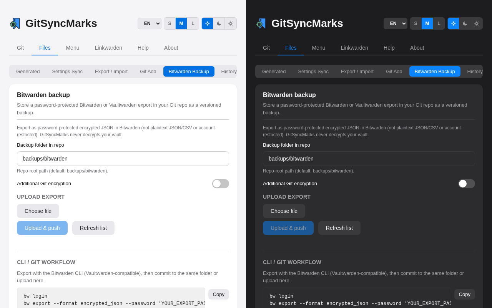

  

  
  
  
  
  

  <strong>GitSyncMarks</strong> — Your bookmarks, safe in your Git repo.  
  Bidirectional, automatic sync for Chrome, Firefox, and the <strong>Companion App</strong>.  
  <em>No middleman. No privacy concerns. Total control.</em>

> [!NOTE]
> *"With a distributed tool, no single place is vital to your data."*
> — **Linus Torvalds** (Git creator)

> [!IMPORTANT]
> **GitSyncMarks 3.0.0 is now stable** — [v3.0.0 (*GLaDOS*)](https://github.com/d0dg3r/GitSyncMarks/releases/tag/v3.0.0) adds **multi-provider Git sync** (GitHub, GitLab, Codeberg, Gitea, Forgejo, Gogs), **Bitwarden backup to Git**, **profile transfer**, **push mirrors**, **live sync progress**, and a refreshed **nested-card UI**. Existing GitHub profiles keep working — no breaking bookmark format changes. Chrome Web Store and Firefox Add-ons listing updates are prepared with this release; store approval may take a few days after submission.

---

## Features

### Core Sync & Workflow
- **Bidirectional & Automatic**: Syncs bookmarks seamlessly with GitHub, GitLab, Codeberg, Gitea, Forgejo, or Gogs across Chrome, Firefox, Edge, and Brave.
- **Three-Way Merge**: Industrial-grade reliability. Handles concurrent changes across multiple devices automatically.
- **Multiple Profiles**: Manage up to 10 separate profiles (e.g., Work, Personal, Research) with individual repositories.
- **Native Integration**: Full support for native browser structures, including toolbars, menus, and context menus.
- **Multi-Provider Git Sync**: Each profile can use its own provider and server URL. See [docs/PROVIDERS.md](docs/PROVIDERS.md).
- **Live Sync Progress**: Popup, wizard, and options show step text during sync (e.g. `3 / 12 files` while pushing) and profile switch (`1 of 3` steps).
- **Profile Transfer**: Copy bookmarks between profiles (replace or merge) — ideal for migrating GitHub → Gitea or similar.
- **Push Mirrors**: Optional backup remotes receive a push-only copy after each successful primary commit.
- **Bitwarden Backup to Git**: Upload a password-protected Bitwarden/Vaultwarden export to your Git repo — versioned vault backup, optional extra Git encryption, list/download/delete remote backups.
- **Clean Remote Orphans**: Preview and delete remote bookmark files that no longer exist locally.
- **Guided Onboarding**: Step-by-step wizard from token to first sync. **Check connection** only validates access; you then choose pull, merge/sync, push, folder setup, or skip — with confirm dialogs before anything is written to the repo ([#146](https://github.com/d0dg3r/GitSyncMarks/issues/146)).
- **Sync History & Restore**: Browse past commits, preview diffs, and restore any previous bookmark state.

### Privacy & Security
- **Private-by-Design**: Direct communication with your Git provider's API. No third-party servers, no analytics, no tracking.
- **You Own the Data**: Your bookmarks are stored in *your* repository, under *your* control.
- **Human-Readable Storage**: Every bookmark is a separate, editable JSON file—perfect for versioning and manual audits.
- **Settings Sync to Git**: Encrypted settings backup (`settings.enc`) in your repository for cross-device configuration.

### Linkwarden Synergy
Save any page or link directly to your **[Linkwarden](https://linkwarden.app/)** instance.
- **Auto-Screenshots**: Automatically captures and uploads a viewport screenshot on save.
- **Collection Sync**: Seamlessly pull Linkwarden collections into your browser and push them to Git.
- **Tag Management**: Organize with pre-configured tags and collection targets.

### Smart Search Popup
A dedicated, lightning-fast search interface accessible from anywhere via the extension icon or keyboard.
- **Instant Results**: Supercharged search with immediate feedback.
- **Theme Support**: Beautifully crafted light and dark modes.
- **Keyboard Power**: Navigate and select results entirely from your keyboard.

### Companion App
Take your bookmarks everywhere with the **[GitSyncMarks-App](https://github.com/d0dg3r/GitSyncMarks-App)**.
- **Cross-Platform**: Native apps for **Android, iOS, Windows, macOS, and Linux**.
- **Direct Access**: Connects directly to your Git repository for mobile management.

### Developer & Power User Tools
- **Automation Ready**: Use provided GitHub Actions (`add-bookmark.yml`) or CLI tools to add bookmarks programmatically.
- **GitHub Repos Folder**: Automatically keep a folder of all your own repositories synced as bookmarks.
- **Auto-Generated Files**: Every sync can generate `README.md` (index), `bookmarks.html` (netscape), `feed.xml` (RSS), and `dashy-conf.yml`.
- **Context Menu**: Quick folders, Search Bookmarks popup, Open All from Folder, favicon copy/download, and profile actions.
- **Favicon Utilities**: Copy or download high-quality site favicons as PNGs directly from the context menu.
- **I18n**: Professionally translated into **12 languages** (EN, DE, FR, ES, JA, and more).
- **Appearance**: **UI density** (compact / medium / large) and **nested-card UI** for clearer grouped settings; **theme** supports light, dark, or system auto.

---

## Visual Tour

| **1. Guided Onboarding** | **2. Smart Search** | **3. Linkwarden Tab** |
| :---: | :---: | :---: |
|  |  |  |
| *Easy Step-by-Step* | *Lightning Fast Search* | *Deep Integration* |

| **4. Git Connection** | **5. Action Popup** | **6. Save to Linkwarden** |
| :---: | :---: | :---: |
|  |  |  |
| *Manage Profiles* | *Status at a Glance* | *Context Menu Power* |

| **7. Sync History** | **8. Bitwarden Backup** | |
| :---: | :---: | :---: |
|  |  | |
| *Review & restore commits* | *Vault exports in Git* | |

---

## Upgrading

### From v2.x to v3.0.0

> [!IMPORTANT]
> **v3.0.0** adds multi-provider Git sync, Bitwarden backup to Git, profile transfer, push mirrors, live sync progress, and nested-card UI. **No breaking changes** to bookmark file format or existing GitHub profiles.

- **No action needed**: Existing GitHub profiles keep working without reconfiguration.
- **What's new popup**: After updating, the toolbar popup highlights 3.0 features once.
- **New providers**: **Settings → Git → Connection** — choose GitLab, Codeberg, Gitea, etc. See [docs/PROVIDERS.md](docs/PROVIDERS.md).
- **Profile transfer**: **Transfer…** on the Profile tab (e.g. GitHub → Gitea migration).
- **Push mirrors**: Optional backup remotes on the Connection tab.
- **Bitwarden backup**: **Files → Bitwarden Backup** — upload encrypted vault exports to your repo.
- **Wizard**: Connection test does not sync; pick your first action explicitly ([#146](https://github.com/d0dg3r/GitSyncMarks/issues/146)).

### v2.8 highlights (still included in 3.0)

- **Sync history and restore** in the Backup tab — preview diffs and restore bookmarks.
- **Linkwarden**: Configure in the **Linkwarden** tab (instance URL + API key).
- **Long-running sync fix** ([#143](https://github.com/d0dg3r/GitSyncMarks/issues/143)): background stays alive until sync completes.

---

## Setup & Installation

### 1. Browser extension

- **Chrome/Edge/Brave**: [Chrome Web Store](https://chromewebstore.google.com/detail/kogijidhfkoibgihpiaiippajhgdgmif) or download **[v3.0.0](https://github.com/d0dg3r/GitSyncMarks/releases/tag/v3.0.0)** and **Load unpacked**
- **Firefox**: [Firefox Add-ons](https://addons.mozilla.org/en-US/firefox/addon/gitsyncmarks/) or install from the release ZIP via **Install temporary add-on** in `about:debugging`

### 2. Git configuration

1. Open **Settings → Git → Connection** and choose **Git provider** (GitHub, GitLab, Codeberg, Gitea, Forgejo, or Gogs).
2. For **self-hosted** providers, enter your server URL and allow host access when prompted. **Codeberg** presets `codeberg.org`; **GitLab.com** needs no server URL.
3. Create a **Personal Access Token** (GitHub / GitLab `api` / Gitea-family repo read+write).
4. Enter token, owner, repository, branch, and bookmark path. For **GitLab subgroup** projects, use `group/subgroup` as owner.
5. Use the **Setup Wizard** (Help → Getting Started) for a guided walkthrough.

See [docs/PROVIDERS.md](docs/PROVIDERS.md) for API details per provider.

### 3. Linkwarden Integration
1. Go to the **Linkwarden** tab in settings.
2. Enter your Instance URL and API Key.
3. Enable features like **Auto-Screenshots** for the best experience.

---

## Community & Support

- **[Website](https://gitsyncmarks.com/)**: Official landing page.
- **[Discussions](https://github.com/d0dg3r/GitSyncMarks/discussions)**: Q&A, ideas, and show-and-tell.
- **[Backlog Voting](https://github.com/d0dg3r/GitSyncMarks/discussions/37)**: Vote on the next feature we build!
- **[Changelog](CHANGELOG.md)**: Stay up to date with the latest releases.

Licensed under [MIT](LICENSE). Made with heart by developers, for developers.

## Requirements

- Chrome, Chromium, Brave, Edge, or Firefox
- Git repository on **GitHub**, **GitLab**, **Codeberg**, **Gitea**, **Forgejo**, or **Gogs** (self-hosted supported) + provider-specific token

## License

[MIT](LICENSE)

---

## Support the Project

If you find **GitSyncMarks** helpful, consider supporting its development:

- **[Sponsor on GitHub](https://github.com/sponsors/d0dg3r)**: Directly support the developer.
- **Star the Repository**: Help others discover the project.
- **[Contribute](CONTRIBUTING.md)**: Submit bug reports, feature ideas, or pull requests.
