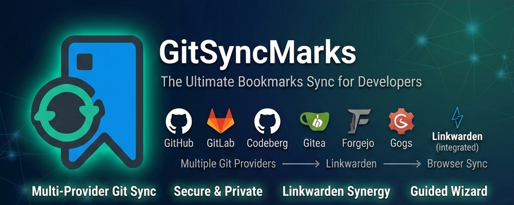
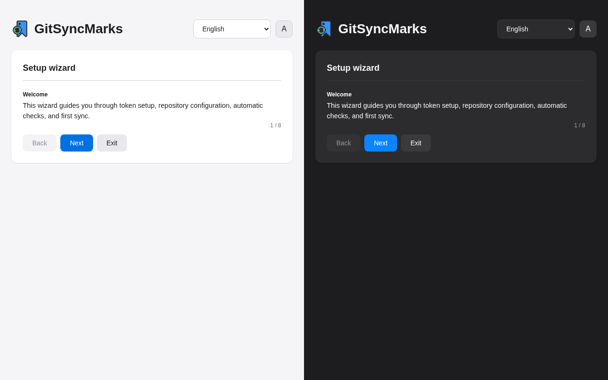
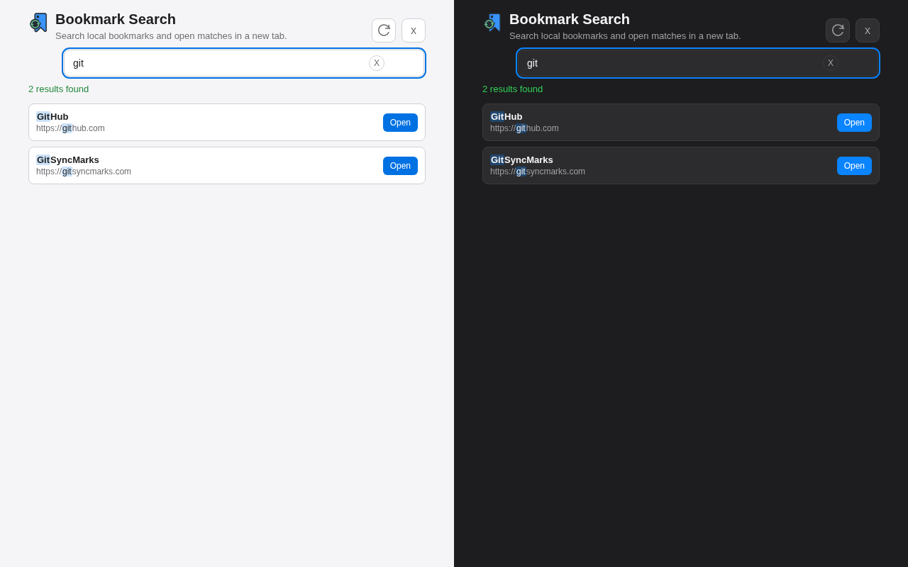
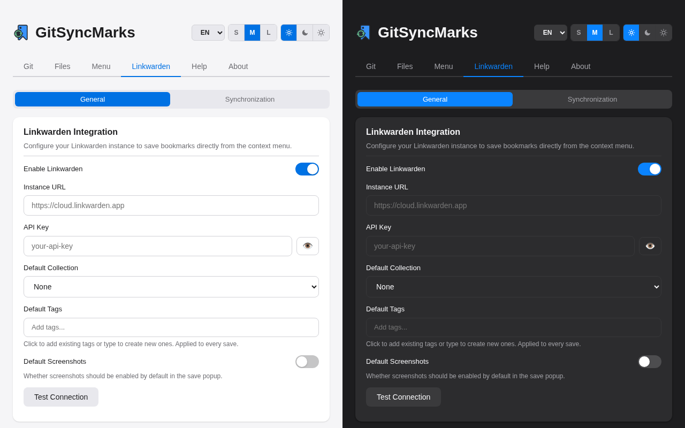
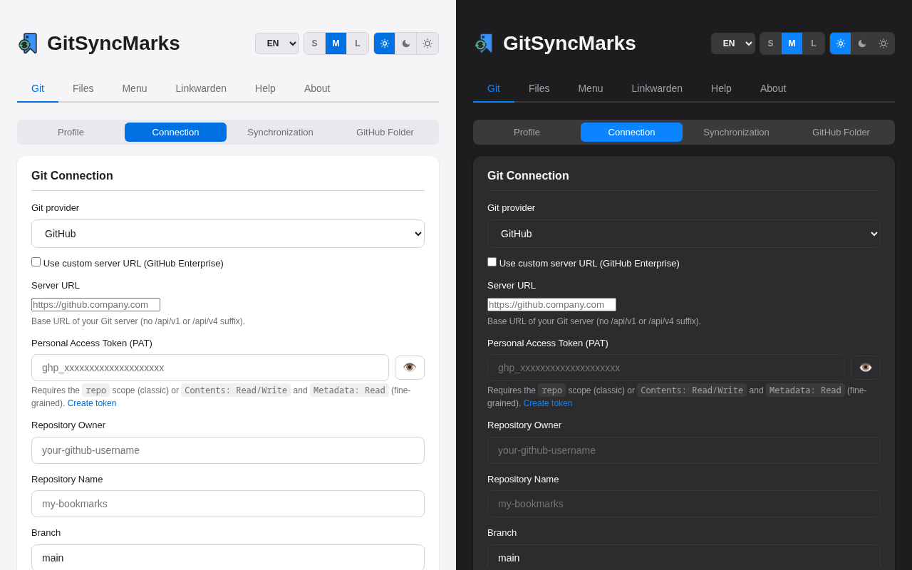
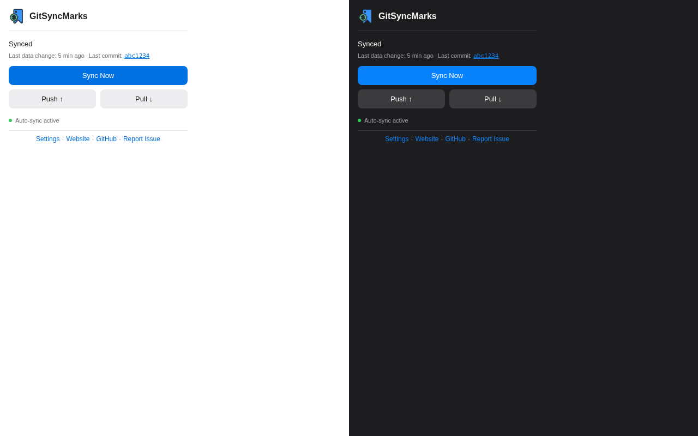
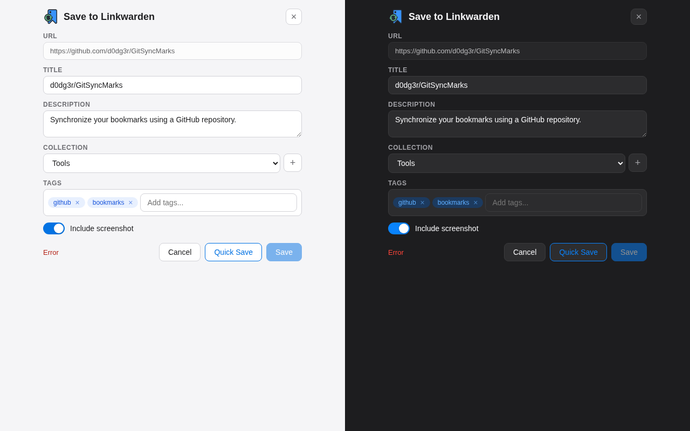

  

  
  
  
  
  

  <strong>GitSyncMarks</strong> — Your bookmarks, safe on GitHub.  
  Bidirectional, automatic sync for Chrome, Firefox, and the <strong>Companion App</strong>.  
  <em>No middleman. No privacy concerns. Total control.</em>

> [!NOTE]
> *"With a distributed tool, no single place is vital to your data."*
> — **Linus Torvalds** (Git creator)

---

---

## Features

### Core Sync & Workflow
- **Bidirectional & Automatic**: Syncs bookmarks seamlessly between GitHub and your browsers (Chrome, Firefox, Edge, Brave).
- **Three-Way Merge**: Industrial-grade reliability. Handles concurrent changes across multiple devices automatically.
- **Guided Onboarding**: A step-by-Step wizard leads you from token creation to your first successful sync.
- **Multiple Profiles**: Manage up to 10 separate profiles (e.g., Work, Personal, Research) with individual repositories.
- **Native Integration**: Full support for native browser structures, including toolbars, menus, and context menus.

### 🛡️ Privacy & Security
- **Private-by-Design**: Direct communication with the GitHub API. No third-party servers, no analytics, no tracking.
- **You Own the Data**: Your bookmarks are stored in *your* repository, under *your* control.
- **Human-Readable Storage**: Every bookmark is a separate, editable JSON file—perfect for versioning and manual audits.

### Linkwarden Synergy
Save any page or link directly to your **[Linkwarden](https://linkwarden.app/)** instance.
- **Auto-Screenshots**: Automatically captures and uploads a viewport screenshot on save.
- **Collection Sync**: Seamlessly pull Linkwarden collections into your browser and push them to Git.
- **Tag Management**: Organize with pre-configured tags and collection targets.

### 🔍 Smart Search Popup
A dedicated, lightning-fast search interface accessible from anywhere via the extension icon or keyboard.
- **Instant Results**: Supercharged search with immediate feedback.
- **Theme Support**: Beautifully crafted light and dark modes.
- **Keyboard Power**: Navigate and select results entirely from your keyboard.

### Companion App
Take your bookmarks everywhere with the **[GitSyncMarks-App](https://github.com/d0dg3r/GitSyncMarks-App)**.
- **Cross-Platform**: Native apps for **Android, iOS, Windows, macOS, and Linux**.
- **Direct Access**: Connects directly to your GitHub repository for mobile management.

### Developer & Power User Tools
- **Automation Ready**: Use provided GitHub Actions (`add-bookmark.yml`) or CLI tools to add bookmarks programmatically.
- **GitHub Repos Folder**: Automatically keep a folder of all your own repositories synced as bookmarks.
- **Auto-Generated Files**: Every sync generates a `README.md` (index), `bookmarks.html` (netscape), `feed.xml` (RSS), and `dashy-conf.yml`.
- **Favicon Utilities**: Copy or download high-quality site favicons as PNGs directly from the context menu.
- **I18n**: Professionally translated into **12 languages** (EN, DE, FR, ES, JA, and more).

---

## Visual Tour

| **1. Guided Onboarding** | **2. Smart Search** | **3. Linkwarden Tab** |
| :---: | :---: | :---: |
|  |  |  |
| *Easy Step-by-Step* | *Lightning Fast Search* | *Deep Integration* |

| **4. GitHub Connection** | **5. Action Popup** | **6. Save to Linkwarden** |
| :---: | :---: | :---: |
|  |  |  |
| *Manage Profiles* | *Status at a Glance* | *Context Menu Power* |

---

---

## Upgrading to v2.6.2

> [!IMPORTANT]
> **v2.6.2** is a maintenance and stability update. While there are **no breaking changes** to your core bookmark sync, please review the notes below if you are upgrading from v2.5.x.

### Migration Steps
- **No Action Needed**: Your current GitHub bookmark sync will continue to work perfectly after the update.
- **Linkwarden Setup**: To use the new "Save to Linkwarden" feature, visit the new **Linkwarden tab** in settings and enter your instance URL and API key.
- **Wizard Access**: If you want to re-verify your connection, use the **Restart Wizard** button in the **Help** tab.

---

## Setup & Installation

### 1. Installation
- **Chrome/Edge/Brave**: [Download ZIP](https://github.com/d0dg3r/GitSyncMarks/releases), Extract, and Load Unpacked in `chrome://extensions/` (Developer Mode).
- **Firefox**: [Install from AMO](https://addons.mozilla.org/en-US/firefox/addon/gitsyncmarks/).

### 2. GitHub Configuration
1. Create a **GitHub Token**:
   - **Fine-grained PAT (Recommended)**: For repository-specific access. Requires `Contents: Read/Write` and `Metadata: Read`. *Use this if you want "App-like" restricted permissions.*
   - **Classic PAT**: Requires the `repo` scope.
   - **GitHub App**: Installation tokens are supported (note: these typically expire after 1 hour).
2. Open extension settings, enter your token, owner, and repository name.
3. Use the **Setup Wizard** (Help -> Getting Started) for a guided walkthrough.

### 3. Linkwarden Integration
1. Go to the **Linkwarden** tab in settings.
2. Enter your Instance URL and API Key.
3. Enable features like **Auto-Screenshots** for the best experience.

---

## Community & Support

- **[Website](https://gitsyncmarks.com/)**: Official landing page.
- **[Discussions](https://github.com/d0dg3r/GitSyncMarks/discussions)**: Q&A, ideas, and show-and-tell.
- **[Backlog Voting](https://github.com/d0dg3r/GitSyncMarks/discussions/37)**: Vote on the next feature we build!
- **[Changelog](CHANGELOG.md)**: Stay up to date with the latest releases.

Licensed under [MIT](LICENSE). Made with heart by developers, for developers.

## Requirements

- Chrome, Chromium, Brave, Edge, or Firefox
- GitHub account with a repository for bookmarks
- GitHub Token (Classic `repo` scope or Fine-grained `Contents: R/W`)

## License

[MIT](LICENSE)

---

## Support the Project

If you find **GitSyncMarks** helpful, consider supporting its development:

- **[Sponsor on GitHub](https://github.com/sponsors/d0dg3r)**: Directly support the developer.
- **Star the Repository**: Help others discover the project.
- **[Contribute](CONTRIBUTING.md)**: Submit bug reports, feature ideas, or pull requests.
