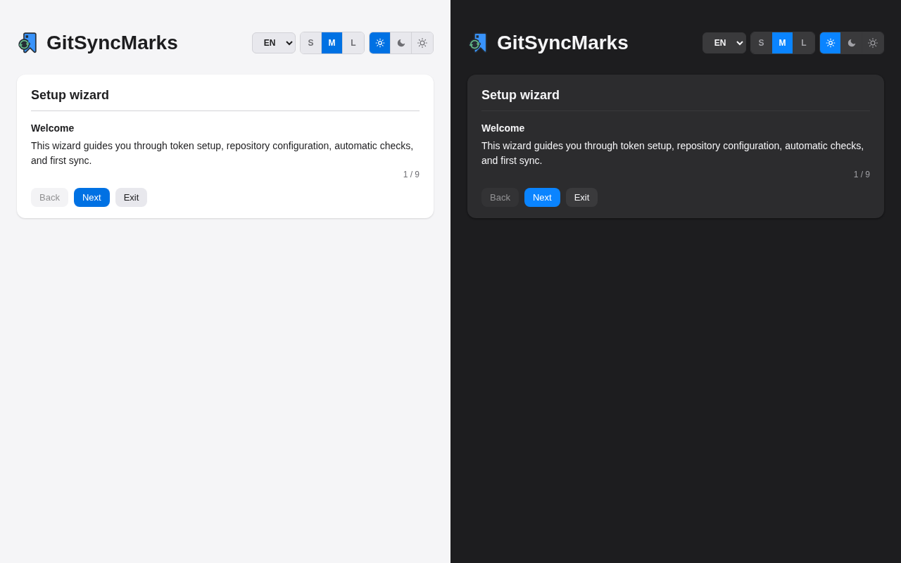
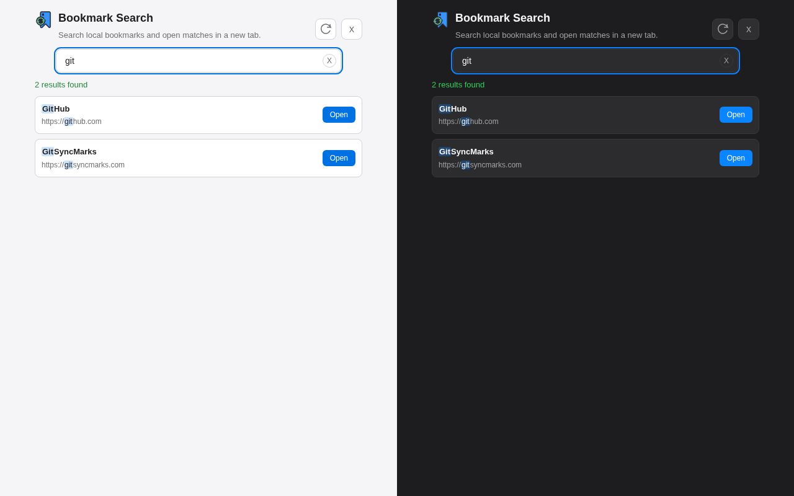
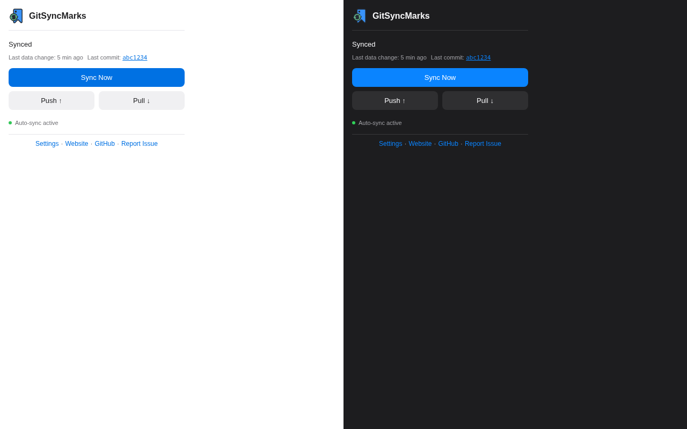
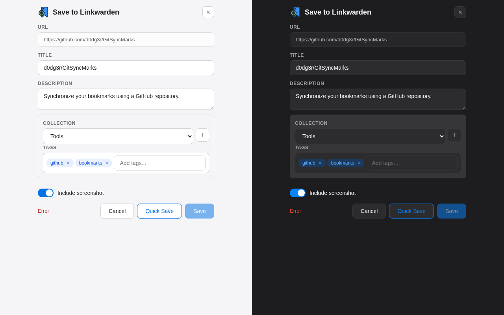
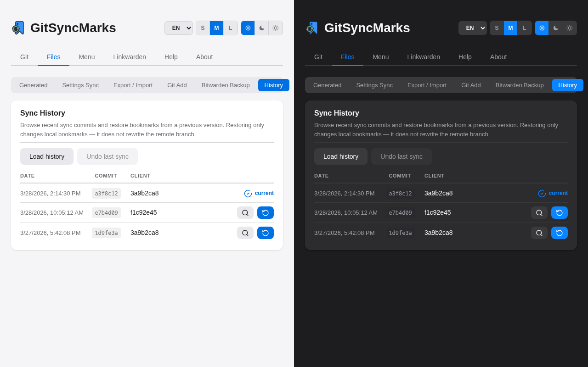

  

  
  
  
  
  

  <strong>GitSyncMarks</strong> — Your bookmarks, safe in your Git repo (GitHub, GitLab, Codeberg, Gitea & more).  
  Bidirectional, automatic sync for Chrome, Firefox, and the <strong>Companion App</strong>.  
  <em>No middleman. No privacy concerns. Total control.</em>

> [!NOTE]
> *"With a distributed tool, no single place is vital to your data."*
> — **Linus Torvalds** (Git creator)

> [!TIP]
> **v3.0.0 pre-release:** Latest beta is **[v3.0.0-beta.2](https://github.com/d0dg3r/GitSyncMarks/releases/tag/v3.0.0-beta.2)** — multi-provider sync plus **setup wizard sync confirmation** ([#146](https://github.com/d0dg3r/GitSyncMarks/issues/146)): connection check no longer pushes; you choose pull, merge/sync, push, or skip with warnings. Download Chrome/Firefox ZIPs from [Releases](https://github.com/d0dg3r/GitSyncMarks/releases). Feedback welcome before stable 3.0.0.

---

## Features

### Core Sync & Workflow
- **Multi-Provider Git Sync**: GitHub, GitLab, Codeberg, Gitea, Forgejo, or Gogs — each profile can use its own provider and server URL.
- **Bidirectional & Automatic**: Syncs bookmarks seamlessly between your Git remote and browsers (Chrome, Firefox, Edge, Brave).
- **Three-Way Merge**: Industrial-grade reliability. Handles concurrent changes across multiple devices automatically.
- **Live Sync Progress**: Popup, wizard, and options show step text during sync (e.g. `3 / 12 files` while pushing).
- **Profile Transfer**: Copy bookmarks between profiles (replace or merge) — ideal for migrating GitHub → Gitea or similar.
- **Push Mirrors**: Optional backup remotes receive a push-only copy after each successful primary commit.
- **Clean Remote Orphans**: Preview and delete remote bookmark files that no longer exist locally.
- **Guided Onboarding**: Step-by-step wizard from token to first sync. **Check connection** only validates access; you then choose pull, merge/sync, push, folder setup, or skip — with confirm dialogs before anything is written to the repo ([#146](https://github.com/d0dg3r/GitSyncMarks/issues/146)).
- **Multiple Profiles**: Manage up to 10 separate profiles (e.g., Work, Personal, Research) with individual repositories.
- **Native Integration**: Full support for native browser structures, including toolbars, menus, and context menus.

### 🛡️ Privacy & Security
- **Private-by-Design**: Direct communication with your Git provider's API. No third-party servers, no analytics, no tracking.
- **You Own the Data**: Your bookmarks are stored in *your* repository, under *your* control.
- **Human-Readable Storage**: Every bookmark is a separate, editable JSON file—perfect for versioning and manual audits.

### Linkwarden Synergy
Save any page or link directly to your **[Linkwarden](https://linkwarden.app/)** instance.
- **Auto-Screenshots**: Automatically captures and uploads a viewport screenshot on save.
- **Collection Sync**: Seamlessly pull Linkwarden collections into your browser and push them to Git.
- **Tag Management**: Organize with pre-configured tags and collection targets.

### 🔍 Smart Search Popup
A dedicated, lightning-fast search interface accessible from anywhere via the extension icon or keyboard.
- **Instant Results**: Supercharged search with immediate feedback.
- **Theme Support**: Beautifully crafted light and dark modes.
- **Keyboard Power**: Navigate and select results entirely from your keyboard.

### Companion App
Take your bookmarks everywhere with the **[GitSyncMarks-App](https://github.com/d0dg3r/GitSyncMarks-App)**.
- **Cross-Platform**: Native apps for **Android, iOS, Windows, macOS, and Linux**.
- **Direct Access**: Connects directly to your Git repository for mobile management.

### Developer & Power User Tools
- **Automation Ready**: Use provided GitHub Actions (`add-bookmark.yml`) or CLI tools to add bookmarks programmatically.
- **GitHub Repos Folder**: Automatically keep a folder of all your own repositories synced as bookmarks.
- **Auto-Generated Files**: Every sync generates a `README.md` (index), `bookmarks.html` (netscape), `feed.xml` (RSS), and `dashy-conf.yml`.
- **Favicon Utilities**: Copy or download high-quality site favicons as PNGs directly from the context menu.
- **I18n**: Professionally translated into **12 languages** (EN, DE, FR, ES, JA, and more).
- **Appearance**: **UI density** (compact / medium / large) scales typography and spacing across Settings, the toolbar popup, Smart Search, and the Linkwarden save dialog; **theme** supports light, dark, or system auto. Both sync via `chrome.storage.sync`.

---

## Visual Tour

| **1. Guided Onboarding** | **2. Smart Search** | **3. Linkwarden Tab** |
| :---: | :---: | :---: |
|  |  |  |
| *Easy Step-by-Step* | *Lightning Fast Search* | *Deep Integration* |

| **4. Git Connection** | **5. Action Popup** | **6. Save to Linkwarden** |
| :---: | :---: | :---: |
|  |  |  |
| *Manage Profiles* | *Status at a Glance* | *Context Menu Power* |

| **7. Sync History** | | |
| :---: | :---: | :---: |
|  | | |
| *Backup tab — review & restore* | | |

---

---

## Upgrading to v3.0.0

> [!IMPORTANT]
> **v3.0.0** adds **multi-provider Git sync** (GitLab, Codeberg, Gitea family), **profile transfer**, **push mirrors**, **clean remote orphans**, and **live sync progress**. There are **no breaking changes** for existing GitHub profiles; your bookmark sync continues as before.

### Migration Steps
- **No Action Needed**: Existing GitHub profiles keep working without reconfiguration.
- **New Providers**: Open **Settings → Git → Connection**, choose a provider (GitLab, Codeberg, Gitea, etc.), and run **Test Connection**. See [docs/PROVIDERS.md](docs/PROVIDERS.md).
- **Profile Transfer**: Use **Transfer…** on the Profile tab to copy bookmarks between profiles (e.g. GitHub → Gitea migration).
- **Push Mirrors**: Optional backup remotes on the Connection tab — configure per profile after the primary sync works.
- **Wizard Access**: Use **Restart Wizard** in the **Help** tab to re-run setup. Connection test does not sync; pick your first action explicitly (see beta.2+ ([#146](https://github.com/d0dg3r/GitSyncMarks/issues/146))).
- **Try the beta**: Install **[v3.0.0-beta.2](https://github.com/d0dg3r/GitSyncMarks/releases/tag/v3.0.0-beta.2)** from GitHub Releases (Load unpacked / temporary add-on) if you want the wizard fix before the stable store build.

---

## Setup & Installation

### 1. Installation
- **Chrome/Edge/Brave**: [Download ZIP](https://github.com/d0dg3r/GitSyncMarks/releases), Extract, and Load Unpacked in `chrome://extensions/` (Developer Mode).
- **Firefox**: [Install from AMO](https://addons.mozilla.org/en-US/firefox/addon/gitsyncmarks/).

### 2. Git Configuration
1. Open **Settings → Git → Connection** and choose **Git provider** (GitHub, GitLab, Codeberg, Gitea, Forgejo, or Gogs).
2. For **self-hosted** providers, enter your server URL and allow host access when prompted. **Codeberg** presets `codeberg.org`; **GitLab.com** needs no server URL.
3. Create a **Personal Access Token**:
   - **GitHub — Fine-grained PAT (Recommended)**: Requires `Contents: Read/Write` and `Metadata: Read`.
   - **GitHub — Classic PAT**: Requires the `repo` scope.
   - **GitLab**: `api` scope (read/write repository).
   - **Gitea / Forgejo / Gogs / Codeberg**: User settings → Applications → token with repository read/write.
4. Enter token, owner, repository, branch, and bookmark path. For **GitLab subgroup** projects, use `group/subgroup` as owner.
5. Use the **Setup Wizard** (Help → Getting Started) for a guided walkthrough.

See [docs/PROVIDERS.md](docs/PROVIDERS.md) for API details per provider.

### 3. Linkwarden Integration
1. Go to the **Linkwarden** tab in settings.
2. Enter your Instance URL and API Key.
3. Enable features like **Auto-Screenshots** for the best experience.

---

## Community & Support

- **[Website](https://gitsyncmarks.com/)**: Official landing page.
- **[Discussions](https://github.com/d0dg3r/GitSyncMarks/discussions)**: Q&A, ideas, and show-and-tell.
- **[Backlog Voting](https://github.com/d0dg3r/GitSyncMarks/discussions/37)**: Vote on the next feature we build!
- **[Changelog](CHANGELOG.md)**: Stay up to date with the latest releases.

Licensed under [MIT](LICENSE). Made with heart by developers, for developers.

## Requirements

- Chrome, Chromium, Brave, Edge, or Firefox
- Git repository on **GitHub**, **GitLab**, **Codeberg**, **Gitea**, **Forgejo**, or **Gogs** (self-hosted supported)
- Personal access token with repository read/write (provider-specific: GitHub `repo` or fine-grained `Contents: R/W`; GitLab `api`; Gitea-family repo scope)

## License

[MIT](LICENSE)

---

## Support the Project

If you find **GitSyncMarks** helpful, consider supporting its development:

- **[Sponsor on GitHub](https://github.com/sponsors/d0dg3r)**: Directly support the developer.
- **Star the Repository**: Help others discover the project.
- **[Contribute](CONTRIBUTING.md)**: Submit bug reports, feature ideas, or pull requests.
