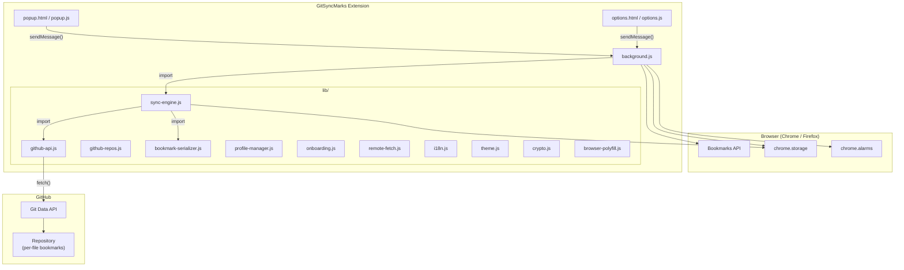

# GitSyncMarks — Architecture Overview

## High-Level Architecture

GitSyncMarks is a browser extension (Manifest V3, Chrome + Firefox) that bidirectionally synchronizes bookmarks with a GitHub repository. It stores each bookmark as an individual JSON file and uses a three-way merge algorithm for conflict-free synchronization.



## Component Descriptions

### `manifest.json` / `manifest.firefox.json`

Extension metadata. Two manifests for browser-specific differences:

| Field | Chrome | Firefox |
|---|---|---|
| Background | `service_worker: "background.js"` | `scripts: ["background.js"]` |
| Browser-specific | — | `browser_specific_settings.gecko` |

Shared: Manifest V3, permissions (`bookmarks`, `storage`, `alarms`), host permissions (`api.github.com`).

### `background.js` — Background Script

The central coordinator:

- **Bookmark event listeners** — `onCreated`, `onRemoved`, `onChanged`, `onMoved` trigger debounced auto-sync
- **Periodic sync alarm** — `chrome.alarms` for periodic three-way merge sync
- **Message handler** — Receives `sync`, `push`, `pull`, `generateFilesNow`, `getStatus`, `switchProfile`, `settingsChanged`, `setSettingsSyncPassword`, `clearSettingsSyncPassword`, `listDeviceConfigs`, `importDeviceConfig`, `getDebugLog` from popup/options
- **Migration** — Checks for and migrates legacy `bookmarks.json` format on startup

### `popup.html` / `popup.js` — Popup UI

Toolbar popup with header (icon, title, profile dropdown when 2+ profiles), status area (status line, last change, commit link), conflict box, action buttons (Sync Now, Push, Pull), and compact footer (Settings, GitHub, Report Issue).

### `options.html` / `options.js` — Settings Page

Full-page settings (opens in tab) with five tabs. Header: language dropdown, theme cycle button (A → Dark → Light → A). All settings auto-save on change; no Save buttons.

1. **GitHub** (sub-tabs: Profile, Connection, Repos) — Profile selector (multiple profiles with separate repos); token, repository, connection test, onboarding (create folder or pull when path empty/has bookmarks); GitHub Repos folder (optional, position toolbar/other)
2. **Sync** — Sync profile, auto-sync, sync on start/focus, notifications; Debug Log
3. **Files** (sub-tabs: Generated, Settings, Export/Import, Git Add) — Generated files (README.md, bookmarks.html, feed.xml, dashy-conf.yml) with Off/Manual/Auto mode; settings sync to Git (Global `settings.enc` or Individual `settings-{id}.enc`, with device config import); compact export/import (bookmarks, Dashy, settings plain/encrypted via dropdown); automation guide for adding bookmarks via Git, CLI, or GitHub Actions
4. **Help** — Quick links (Vote on backlog, Documentation, Discussions, Report Issue) as pill buttons; collapsible feature sections (Getting Started, Profiles, GitHub Repos, Popup, Sync, Files, Notifications, Conflicts, Keyboard Shortcuts)
5. **About** — Version, links, license, mobile app

### `lib/sync-engine.js` — Sync Engine

Core synchronization with three-way merge:

| Function | Description |
|---|---|
| `sync()` | Three-way merge: base vs local vs remote, auto-merge or conflict |
| `push()` | Full push of local bookmarks as individual files |
| `pull()` | Full pull from remote, replace local bookmarks |
| `computeDiff(base, current)` | Compute added/removed/modified files between two states |
| `mergeDiffs(localDiff, remoteDiff)` | Merge two diffs into push/pull/conflict actions |
| `debouncedSync()` | Debounced auto-sync (5s default) |
| `getSyncStatus()` | Return current sync state for the popup |
| `migrateFromLegacyFormat()` | Migrate from old `bookmarks.json` to per-file format |

State is stored as `LAST_SYNC_FILES` (path → {sha, content}) and `LAST_COMMIT_SHA`.

### `lib/github-api.js` — GitHub API Wrapper

Wraps both the **Contents API** (legacy, used for migration/validation) and the **Git Data API** (for atomic multi-file commits):

| Method | API | Description |
|---|---|---|
| `validateToken()` | REST | Check PAT validity |
| `checkRepo()` | REST | Verify repository access |
| `getFile()` / `createOrUpdateFile()` | Contents | Single-file operations (legacy) |
| `getLatestCommitSha()` | Git Data | Get current branch HEAD |
| `getCommit()` / `getTree()` / `getBlob()` | Git Data | Read commit, tree, file content |
| `createBlob()` / `createTree()` / `createCommit()` | Git Data | Build new commit |
| `updateRef()` / `createRef()` | Git Data | Update or create branch |
| `atomicCommit(message, fileChanges)` | Git Data | All-in-one: atomic multi-file commit |

### `lib/bookmark-serializer.js` — Serializer

Converts between browser bookmark trees and the per-file format:

| Function | Description |
|---|---|
| `bookmarkTreeToFileMap(tree, basePath)` | Browser tree → file map (path → content) |
| `fileMapToBookmarkTree(files, basePath)` | File map → bookmark tree (role → children) |
| `fileMapToMarkdown(files, basePath)` | File map → human-readable Markdown |
| `fileMapToNetscapeHtml(files, basePath)` | File map → Netscape bookmarks HTML (browser import) |
| `fileMapToRssFeed(files, basePath)` | File map → RSS 2.0 XML feed |
| `fileMapToDashyYaml(files, basePath)` | File map → Dashy dashboard YAML config |
| `generateFilename(title, url)` | Deterministic filename: `{slug}_{hash}.json` |
| `detectRootFolderRole(node)` | Detect toolbar/other from browser IDs |
| `gitTreeToShaMap(entries, basePath)` | Git tree → SHA map for remote change detection |
| `serializeToJson()` / `deserializeFromJson()` | Legacy format (for import/export) |

### `lib/crypto.js` — Encryption

AES-256-GCM encryption for the GitHub PAT at rest (non-extractable CryptoKey in IndexedDB, token in `chrome.storage.local`). Also provides password-based encryption (`encryptWithPassword` / `decryptWithPassword` using PBKDF2 + AES-256-GCM) for settings export (.enc files) and settings sync to Git.

### `lib/i18n.js` — Internationalization

Custom runtime i18n with manual language selection. Loads `_locales/{lang}/messages.json`, translates DOM via `data-i18n` attributes. English fallback.

### `lib/theme.js` — Theme

Light, dark, or auto (system) theme. Single cycle button in options header switches A → Dark → Light → A. Stores preference in `chrome.storage.sync`, applies `html.dark` class when dark mode is active. Used by options page and popup.

### `lib/profile-manager.js` — Profile Manager

Multiple bookmark profiles (Work/Personal) with separate GitHub repo config:

| Function | Description |
|---|---|
| `getProfiles()` / `getActiveProfileId()` | List profiles, get current active profile |
| `addProfile()` / `deleteProfile()` / `saveProfile()` | CRUD for profiles |
| `switchProfile(targetId)` | Save current bookmarks, push to current repo, pull target profile, replace local bookmarks |
| `migrateToProfiles()` | Migrate legacy single-config to profiles format |

State stored in `chrome.storage.sync` (profiles, activeProfileId) and `chrome.storage.local` (per-profile tokens, sync state).

### `lib/onboarding.js` — Onboarding

First-time and new-profile setup when configuring GitHub:

| Function | Description |
|---|---|
| `checkPathSetup(api, basePath)` | Check if path exists and has bookmarks (unreachable / empty / hasBookmarks) |
| `createMinimalBookmarkStructure(basePath)` | Build `_index.json` and role folders with `_order.json` |
| `initializeRemoteFolder(api, basePath)` | Create minimal structure via `atomicCommit` |

### `lib/github-repos.js` — GitHub Repos Folder

Fetches the authenticated user's repos via GitHub REST API and maintains a "GitHubRepos (username)" folder:

| Function | Description |
|---|---|
| `fetchCurrentUser(token)` | GET /user → `{ login }` for folder name |
| `fetchUserRepos(token)` | GET /user/repos (paginated) → `{ full_name, html_url, private }` |
| `updateGitHubReposFolder(token, parentRole, username?, onUsername?)` | Find/create folder, diff existing bookmarks with API list, add/remove/update; optional callback to persist username on first run |

### `lib/remote-fetch.js` — Remote File Map

| Function | Description |
|---|---|
| `fetchRemoteFileMap(api, basePath, baseFiles)` | Fetch bookmark files from GitHub via Git Data API; returns `{ shaMap, fileMap, commitSha }` or `null` for empty repo |

### `lib/browser-polyfill.js` — Browser Detection

Minimal shim: `isFirefox`, `isChrome`, `getBrowserName()`.

## File Structure

```
GitSyncMarks/
├── manifest.json                 # Chrome manifest
├── manifest.firefox.json         # Firefox manifest
├── background.js                 # Background script
├── popup.html / popup.js / popup.css
├── options.html / options.js / options.css
├── lib/
│   ├── sync-engine.js            # Three-way merge sync
│   ├── github-api.js             # GitHub REST + Git Data API
│   ├── bookmark-serializer.js    # Per-file bookmark conversion
│   ├── bookmark-replace.js       # Replace local bookmarks (used by sync + profile switch)
│   ├── github-repos.js          # GitHub Repos folder (user repos as bookmarks)
│   ├── profile-manager.js       # Multiple profiles, switchProfile, migration
│   ├── onboarding.js            # checkPathSetup, initializeRemoteFolder
│   ├── remote-fetch.js           # fetchRemoteFileMap
│   ├── crypto.js                 # Token encryption (AES-256-GCM)
│   ├── debug-log.js              # Debug log for sync diagnostics
│   ├── i18n.js                   # Internationalization
│   ├── theme.js                  # Light/dark/auto theme (cycle button)
│   └── browser-polyfill.js      # Browser detection
├── _locales/
│   ├── en/messages.json
│   ├── de/messages.json
│   ├── fr/messages.json
│   └── es/messages.json
├── icons/
├── scripts/
│   ├── build.sh                  # Build Chrome + Firefox packages
│   └── generate-screenshots.js   # Auto-generate store screenshots (Playwright + Sharp)
├── package.json                  # npm scripts for building
├── .github/workflows/
│   ├── test-e2e.yml              # E2E tests (manual trigger only; CI disabled)
│   ├── release.yml               # Build ZIPs, create release on tag
│   └── add-bookmark.yml          # Automation: add bookmark via dispatch
├── docs/                         # Architecture documentation
├── store-assets/                 # Chrome Web Store assets
├── LICENSE
├── PRIVACY.md
└── README.md
```

## Technology Stack

| Layer | Technology |
|---|---|
| Extension Framework | Manifest V3 (Chrome + Firefox) |
| Background | Service Worker (Chrome) / Background Script (Firefox) |
| Browser APIs | `chrome.bookmarks`, `chrome.storage`, `chrome.alarms` |
| Remote Storage | GitHub Git Data API (atomic multi-file commits) |
| Authentication | Personal Access Token (PAT) with `repo` scope |
| Sync Algorithm | Three-way merge (base vs local vs remote, per-file diff) |
| i18n | Custom runtime system + Chrome `_locales/` |
| Build | Shell script (`build.sh`), separate Chrome/Firefox packages |
| CI/CD | GitHub Actions |
| JavaScript | Vanilla ES modules (no bundler) |
