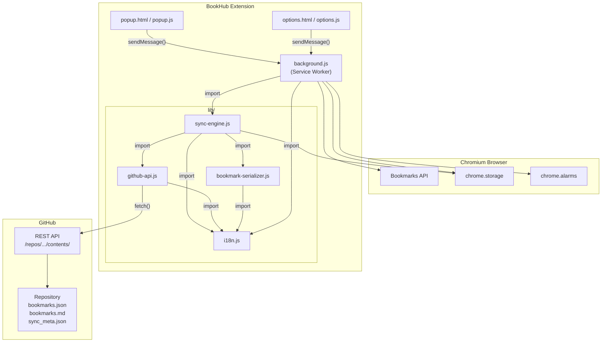

# BookHub — Architecture Overview

## High-Level Architecture

BookHub is a Chromium browser extension (Manifest V3) that bidirectionally synchronizes bookmarks with a GitHub repository. It uses a **Service Worker** as its background process, communicates via **Chrome messaging**, and interacts with the **GitHub REST API** for remote storage.



## Component Descriptions

### `manifest.json`

Extension metadata and configuration. Declares:

| Field | Value |
|---|---|
| Manifest Version | 3 |
| Permissions | `bookmarks`, `storage`, `alarms` |
| Host Permissions | `https://api.github.com/*` |
| Background | Service Worker (`background.js`, ES module) |
| UI | Popup (`popup.html`), Options page (`options.html`, opens in tab) |
| i18n | `default_locale: "en"`, name/description via `__MSG_` placeholders |

### `background.js` — Service Worker

The central coordinator. Responsibilities:

- **Bookmark event listeners** — Listens to `onCreated`, `onRemoved`, `onChanged`, `onMoved` and triggers a debounced auto-push.
- **Periodic sync alarm** — Creates a `chrome.alarms` alarm to periodically run a full bidirectional sync.
- **Message handler** — Receives `sync`, `push`, `pull`, `getStatus`, `settingsChanged` actions from popup/options and delegates to the sync engine.
- **i18n initialization** — Calls `initI18n()` at startup and on install/update events.

### `popup.html` / `popup.js` — Popup UI

The extension's toolbar popup. Shows:

- Current sync status (synced, not synced, conflict)
- Last sync time (relative)
- Manual action buttons: Sync Now, Push, Pull
- Conflict resolution UI (force push / force pull)
- Auto-sync status indicator
- Link to settings

All text is translated via `data-i18n` attributes and `getMessage()`.

### `options.html` / `options.js` — Settings Page

Full-page settings UI (opens in a tab). Sections:

1. **Language** — Dropdown for manual language selection (Auto / English / Deutsch)
2. **GitHub Connection** — Token (PAT), owner, repo, branch, file path, connection test
3. **Synchronization** — Auto-sync toggle, sync interval

Settings are stored in `chrome.storage.sync`. Language changes re-translate the page instantly without reload.

### `lib/sync-engine.js` — Sync Engine

The core synchronization logic. Key exports:

| Function | Description |
|---|---|
| `push()` | Push local bookmarks to GitHub |
| `pull()` | Pull remote bookmarks from GitHub and replace local |
| `sync()` | Bidirectional sync: detect changes, push/pull/conflict |
| `debouncedPush()` | Debounced auto-push (5s default delay) |
| `getSyncStatus()` | Return current sync state for the popup |
| `isSyncInProgress()` | Re-entrancy guard |
| `getSettings()` | Load settings from `chrome.storage.sync` |
| `isConfigured()` | Check if all required settings are present |

Uses a module-level `isSyncing` flag to prevent concurrent sync operations.

### `lib/github-api.js` — GitHub API Wrapper

Wraps the GitHub Contents API (`GET/PUT /repos/{owner}/{repo}/contents/{path}`).

- Authenticates via Personal Access Token (PAT)
- Handles base64 encoding/decoding (Unicode-safe)
- Error handling for 401, 403 (rate limit), 409 (conflict), 404
- Token validation via `GET /user`
- Repository access check

### `lib/bookmark-serializer.js` — Serializer

Converts between Chrome's bookmark tree and storage formats:

- `serializeToJson()` — Chrome tree → JSON with metadata (version, deviceId, exportedAt)
- `deserializeFromJson()` — JSON → bookmark node array for recreation
- `serializeToMarkdown()` — JSON → human-readable Markdown
- `bookmarksEqual()` — Content comparison ignoring metadata

### `lib/i18n.js` — Internationalization Helper

Custom i18n system for runtime language switching:

- Loads `_locales/{lang}/messages.json` dynamically via `fetch()`
- Supports "Auto (Browser)" detection and manual language selection
- `applyI18n()` translates DOM elements via `data-i18n` attributes
- `getMessage()` for dynamic strings with `$1`, `$2` substitutions
- English fallback for missing keys

## File Structure

```
BookHub/
├── manifest.json                 # Extension configuration
├── background.js                 # Service Worker (event handling, alarms)
├── popup.html                    # Popup UI markup
├── popup.js                      # Popup logic
├── popup.css                     # Popup styles
├── options.html                  # Settings page markup
├── options.js                    # Settings logic
├── options.css                   # Settings styles
├── lib/
│   ├── sync-engine.js            # Core sync logic
│   ├── github-api.js             # GitHub REST API wrapper
│   ├── bookmark-serializer.js    # Bookmark ↔ JSON/Markdown conversion
│   └── i18n.js                   # Internationalization helper
├── _locales/
│   ├── en/messages.json          # English strings
│   └── de/messages.json          # German strings
├── icons/
│   ├── icon16.png
│   ├── icon48.png
│   └── icon128.png
├── .github/workflows/
│   └── release.yml               # CI: build ZIP + GitHub Release on tag
├── store-assets/                 # Chrome Web Store listing assets
├── docs/                         # Architecture documentation (this folder)
├── LICENSE                       # MIT License
├── PRIVACY.md                    # Privacy policy
└── README.md                     # User-facing documentation
```

## Technology Stack

| Layer | Technology |
|---|---|
| Extension Framework | Chrome Extension Manifest V3 |
| Background Processing | Service Worker (ES modules) |
| Chrome APIs | `chrome.bookmarks`, `chrome.storage`, `chrome.alarms`, `chrome.runtime` |
| Remote Storage | GitHub REST API v3 (Contents API) |
| Authentication | Personal Access Token (PAT) with `repo` scope |
| i18n | Custom runtime system + Chrome `_locales/` for manifest strings |
| CI/CD | GitHub Actions (`softprops/action-gh-release`) |
| Styling | Plain CSS (no frameworks) |
| JavaScript | Vanilla ES modules (no build step, no bundler) |
