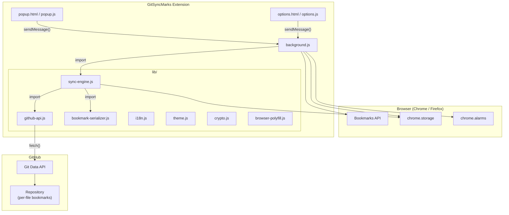

# GitSyncMarks — Architecture Overview

## High-Level Architecture

GitSyncMarks is a browser extension (Manifest V3, Chrome + Firefox) that bidirectionally synchronizes bookmarks with a GitHub repository. It stores each bookmark as an individual JSON file and uses a three-way merge algorithm for conflict-free synchronization.



## Component Descriptions

### `manifest.json` / `manifest.firefox.json`

Extension metadata. Two manifests for browser-specific differences:

| Field | Chrome | Firefox |
|---|---|---|
| Background | `service_worker: "background.js"` | `scripts: ["background.js"]` |
| Browser-specific | — | `browser_specific_settings.gecko` |

Shared: Manifest V3, permissions (`bookmarks`, `storage`, `alarms`), host permissions (`api.github.com`).

### `background.js` — Background Script

The central coordinator:

- **Bookmark event listeners** — `onCreated`, `onRemoved`, `onChanged`, `onMoved` trigger debounced auto-sync
- **Periodic sync alarm** — `chrome.alarms` for periodic three-way merge sync
- **Message handler** — Receives `sync`, `push`, `pull`, `getStatus`, `settingsChanged` from popup/options
- **Migration** — Checks for and migrates legacy `bookmarks.json` format on startup

### `popup.html` / `popup.js` — Popup UI

Toolbar popup showing:
- Sync status, last sync time, conflict warnings
- Manual action buttons: Sync Now, Push, Pull
- Conflict resolution (force push / force pull)
- Auto-sync status indicator

### `options.html` / `options.js` — Settings Page

Full-page settings (opens in tab) with five tabs. Header: language selector and theme (light/dark/auto).

1. **GitHub** — Token, repository, connection test
2. **Synchronization** — Sync profile, auto-sync, sync on start/focus, debounce
3. **Backup** — Export/import bookmarks and settings as JSON (file picker with chosen filename)
4. **Automation** — Guide for adding bookmarks via Git, CLI, or GitHub Actions
5. **About** — Version, links, license

### `lib/sync-engine.js` — Sync Engine

Core synchronization with three-way merge:

| Function | Description |
|---|---|
| `sync()` | Three-way merge: base vs local vs remote, auto-merge or conflict |
| `push()` | Full push of local bookmarks as individual files |
| `pull()` | Full pull from remote, replace local bookmarks |
| `computeDiff(base, current)` | Compute added/removed/modified files between two states |
| `mergeDiffs(localDiff, remoteDiff)` | Merge two diffs into push/pull/conflict actions |
| `debouncedSync()` | Debounced auto-sync (5s default) |
| `getSyncStatus()` | Return current sync state for the popup |
| `migrateFromLegacyFormat()` | Migrate from old `bookmarks.json` to per-file format |

State is stored as `LAST_SYNC_FILES` (path → {sha, content}) and `LAST_COMMIT_SHA`.

### `lib/github-api.js` — GitHub API Wrapper

Wraps both the **Contents API** (legacy, used for migration/validation) and the **Git Data API** (for atomic multi-file commits):

| Method | API | Description |
|---|---|---|
| `validateToken()` | REST | Check PAT validity |
| `checkRepo()` | REST | Verify repository access |
| `getFile()` / `createOrUpdateFile()` | Contents | Single-file operations (legacy) |
| `getLatestCommitSha()` | Git Data | Get current branch HEAD |
| `getCommit()` / `getTree()` / `getBlob()` | Git Data | Read commit, tree, file content |
| `createBlob()` / `createTree()` / `createCommit()` | Git Data | Build new commit |
| `updateRef()` / `createRef()` | Git Data | Update or create branch |
| `atomicCommit(message, fileChanges)` | Git Data | All-in-one: atomic multi-file commit |

### `lib/bookmark-serializer.js` — Serializer

Converts between browser bookmark trees and the per-file format:

| Function | Description |
|---|---|
| `bookmarkTreeToFileMap(tree, basePath)` | Browser tree → file map (path → content) |
| `fileMapToBookmarkTree(files, basePath)` | File map → bookmark tree (role → children) |
| `fileMapToMarkdown(files, basePath)` | File map → human-readable Markdown |
| `generateFilename(title, url)` | Deterministic filename: `{slug}_{hash}.json` |
| `detectRootFolderRole(node)` | Detect toolbar/other/menu/mobile from browser IDs |
| `gitTreeToShaMap(entries, basePath)` | Git tree → SHA map for remote change detection |
| `serializeToJson()` / `deserializeFromJson()` | Legacy format (for import/export) |

### `lib/crypto.js` — Token Encryption

AES-256-GCM encryption for the GitHub PAT at rest. Non-extractable CryptoKey in IndexedDB. Token stored only in `chrome.storage.local`.

### `lib/i18n.js` — Internationalization

Custom runtime i18n with manual language selection. Loads `_locales/{lang}/messages.json`, translates DOM via `data-i18n` attributes. English fallback.

### `lib/theme.js` — Theme

Light, dark, or auto (system) theme. Stores preference in `chrome.storage.sync`, applies `html.dark` class when dark mode is active. Used by options page and popup.

### `lib/browser-polyfill.js` — Browser Detection

Minimal shim: `isFirefox`, `isChrome`, `getBrowserName()`.

## File Structure

```
GitSyncMarks/
├── manifest.json                 # Chrome manifest
├── manifest.firefox.json         # Firefox manifest
├── background.js                 # Background script
├── popup.html / popup.js / popup.css
├── options.html / options.js / options.css
├── lib/
│   ├── sync-engine.js            # Three-way merge sync
│   ├── github-api.js             # GitHub REST + Git Data API
│   ├── bookmark-serializer.js    # Per-file bookmark conversion
│   ├── crypto.js                 # Token encryption (AES-256-GCM)
│   ├── i18n.js                   # Internationalization
│   ├── theme.js                  # Light/dark/auto theme
│   └── browser-polyfill.js       # Browser detection
├── _locales/
│   ├── en/messages.json
│   └── de/messages.json
├── icons/
├── scripts/
│   └── build.sh                  # Build Chrome + Firefox packages
├── package.json                  # npm scripts for building
├── .github/workflows/
│   ├── release.yml               # CI: build + release on tag
│   └── add-bookmark.yml          # Automation: add bookmark via dispatch
├── docs/                         # Architecture documentation
├── store-assets/                 # Chrome Web Store assets
├── LICENSE
├── PRIVACY.md
└── README.md
```

## Technology Stack

| Layer | Technology |
|---|---|
| Extension Framework | Manifest V3 (Chrome + Firefox) |
| Background | Service Worker (Chrome) / Background Script (Firefox) |
| Browser APIs | `chrome.bookmarks`, `chrome.storage`, `chrome.alarms` |
| Remote Storage | GitHub Git Data API (atomic multi-file commits) |
| Authentication | Personal Access Token (PAT) with `repo` scope |
| Sync Algorithm | Three-way merge (base vs local vs remote, per-file diff) |
| i18n | Custom runtime system + Chrome `_locales/` |
| Build | Shell script (`build.sh`), separate Chrome/Firefox packages |
| CI/CD | GitHub Actions |
| JavaScript | Vanilla ES modules (no bundler) |
