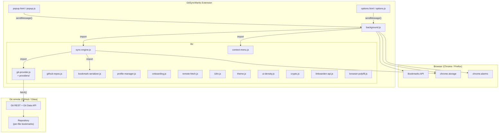

# GitSyncMarks — Architecture Overview

## High-Level Architecture

GitSyncMarks is a browser extension (Manifest V3, Chrome + Firefox) that bidirectionally synchronizes bookmarks with a Git repository (GitHub or self-hosted Gitea/Forgejo). It stores each bookmark as an individual JSON file and uses a three-way merge algorithm for conflict-free synchronization.


```mermaid
flowchart TB
    subgraph Browser["Browser (Chrome / Firefox)"]
        BM["Bookmarks API"]
        Storage["chrome.storage"]
        Alarms["chrome.alarms"]
    end

    subgraph Extension["GitSyncMarks Extension"]
        BG["background.js"]
        Popup["popup.html / popup.js"]
        Options["options.html / options.js"]
        subgraph Lib["lib/"]
            SE["sync-engine.js"]
            GH["git-provider.js\n+ providers/"]
            GR["github-repos.js"]
            BS["bookmark-serializer.js"]
            PM["profile-manager.js"]
            OB["onboarding.js"]
            RF["remote-fetch.js"]
            I18N["i18n.js"]
            Theme["theme.js"]
            UiDensity["ui-density.js"]
            Crypto["crypto.js"]
            CM["context-menu.js"]
            LW["linkwarden-api.js"]
            Polyfill["browser-polyfill.js"]
        end
    end

    subgraph Remote["Git remote (GitHub / Gitea)"]
        GitAPI["Git REST + Git Data API"]
        Repo["Repository\n(per-file bookmarks)"]
    end

    Popup -- "sendMessage()" --> BG
    Options -- "sendMessage()" --> BG
    BG -- "import" --> CM
    BG -- "import" --> SE
    SE -- "import" --> GH
    SE -- "import" --> BS
    BG --> BM
    BG --> Storage
    BG --> Alarms
    SE --> Storage
    GH -- "fetch()" --> GitAPI
    GitAPI --> Repo
```

## Component Descriptions

### `manifest.json` / `manifest.firefox.json`

Extension metadata. Two manifests for browser-specific differences:

| Field | Chrome | Firefox |
|---|---|---|
| `description` | `__MSG_extDescription__` | `__MSG_extDescriptionFirefox__` |
| Background | `service_worker: "background.js"` | `scripts: ["background.js"]` |
| Browser-specific | — | `browser_specific_settings.gecko` |

Shared: Manifest V3, permissions (`bookmarks`, `storage`, `alarms`, `notifications`, `contextMenus`, `activeTab`, `scripting`, `downloads`), host permissions (`api.github.com`; Gitea origins via optional permissions + runtime grant).

### `background.js` — Background Script

The central coordinator:

- **Bookmark event listeners** — `onCreated`, `onRemoved`, `onChanged`, `onMoved` trigger debounced auto-sync
- **Context menu** — `contextMenus.onClicked` listener (top-level for SW persistence); `setupContextMenus()` runs on service worker start (after migrations), `chrome.runtime.onStartup`, and `onInstalled` (and when sync storage for profiles, menu config, or Linkwarden visibility changes) so the menu matches `chrome.storage.sync` after every SW wake
- **Periodic sync alarm** — `chrome.alarms` for periodic three-way merge sync
- **Message handler** — Receives `sync`, `push`, `pull`, `generateFilesNow`, `getStatus`, `switchProfile`, `settingsChanged`, `setSettingsSyncPassword`, `clearSettingsSyncPassword`, `listDeviceConfigs`, `importDeviceConfig`, `getDebugLog` from popup/options
- **Badge & Error Visibility** — Uses a centralized `updateSyncStatusBadge` helper to set an orange `!` badge and a descriptive tooltip (via `chrome.action.setTitle`) on sync failure, ensuring it clears reliably on success across all triggers.
- **Migration** — Checks for and migrates legacy `bookmarks.json` format on startup

### `popup.html` / `popup.js` — Popup UI

Toolbar popup with header (icon, title, profile dropdown when 2+ profiles), status area (status line, last change, commit link), conflict box, action buttons (Sync Now, Push, Pull), and compact footer (Settings, GitHub, Report Issue).

### `options.html` / `options.js` — Settings Page

Full-page settings (opens in tab) with five tabs. `options.js` is the entry point that imports and orchestrates focused sub-modules in `options/`.

1. **Git** (sub-tabs: Profile, Connection, Repos) — Profile selector (multiple profiles with separate repos); Git provider (GitHub or Gitea), token, repository, connection test, onboarding; optional Git repos folder (GitHubRepos / GiteaRepos)
2. **Sync** — Sync profile, auto-sync, sync on start/focus, notifications; Debug Log
3. **Files** (sub-tabs: Generated, Settings, Export/Import, Git Add) — Generated files (README.md, bookmarks.html, feed.xml, dashy-conf.yml) with Off/Manual/Auto mode; settings sync to Git (client name + Create in one row; Refresh, profile list, Import & Apply, Sync current to selected in one row; buttons disabled until client name set; password saved after Import/Sync/Create); compact export/import (bookmarks, Dashy, settings plain/encrypted via dropdown); automation guide for adding bookmarks via Git, CLI, or GitHub Actions
4. **Help** — Quick links (Vote on backlog, Documentation, Discussions, Report Issue) as pill buttons; collapsible feature sections (Getting Started with Start setup wizard button, Profiles, GitHub Repos, Popup, Sync, Files, Notifications, Conflicts, Keyboard Shortcuts)
5. **About** — Version, links, license, mobile app

Sub-modules (`options/`):

- **`wizard.js`** — Onboarding wizard flow (token validation, repo setup, environment check, first sync)
- **`profiles.js`** — Profile switching, add/rename/delete with confirmation dialogs
- **`linkwarden.js`** — Linkwarden tab: connection test, tag picker, sync, debug log export
- **`history.js`** — Sync history listing (four-column header + rows: date, SHA, client id, actions; checkmark + “current” for `lastCommitSha`), diff preview, bookmark restore, undo
- **`context-menu-config.js`** — Context menu item ordering, toggling, category submenu configuration
- **`settings.js`** — Settings sync to Git, file export/import, generated files toggles, automation clipboard
- **`help-shortcuts.js`** — Help tab: keyboard shortcut labels and “Customize shortcuts” link
- **`factory-reset.js`** — Files tab: full extension data reset (sync + local `storage` clear)

### `lib/sync-engine.js` — Sync Engine (barrel)

Barrel module re-exporting from focused sub-modules:

- **`lib/storage-keys.js`** — Single source for `STORAGE_KEYS` and `LOCAL_STORAGE_KEYS` string names; re-exported from `sync-settings.js` / `sync-engine.js` for the rest of the app
- **`lib/context-menu-defaults.js`** — Default context menu item list, submenu flags, and `ensureContextMenuItemDefaults()` (shared by options and `context-menu-setup.js`)
- **`lib/sync-settings.js`** — Re-exports `STORAGE_KEYS` and `LOCAL_STORAGE_KEYS` from `storage-keys.js`; `SYNC_PRESETS`, settings accessors (`getSettings`, `isConfigured`, `createApi`, `getDeviceId`), local bookmark access (`getLocalFileMap`), file map filtering (`filterForDiff`, `addGeneratedFiles`), and encrypted settings sync (`buildEncryptedSettings`, `applyEncryptedSettings`, profile CRUD)
- **`lib/sync-core.js`** — Core sync operations (`push`, `pull`, `sync`), three-way merge (`computeDiff`, `mergeDiffs`, `mergeOrderJson`), sync state management (`saveSyncState`, `getSyncStatus`, `isSyncInProgress`), debounced auto-sync (`debouncedSync`, `bootstrapFirstSync`), Linkwarden mirroring, and a sync-activity listener (`setSyncActivityListener`) the background uses to keep the worker alive during long operations
- **`lib/sync-history.js`** — Commit history listing (`listSyncHistory`), bookmark restore (`restoreFromCommit`), undo support (`getPreviousCommitSha`), and diff preview (`getCommitDiffPreview`)
- **`lib/sync-commit-message.js`** — Parses standard GitSyncMarks commit subjects to extract the device/client id (`extractClientIdFromCommitMessage`) for Sync History display
- **`lib/sync-migration.js`** — Legacy single-file format migration (`migrateFromLegacyFormat`)

State is stored as `LAST_SYNC_FILES` (path → {sha, content}) and `LAST_COMMIT_SHA`.

### `lib/git-provider.js` — Git Provider Factory

Selects GitHub or Gitea adapter via `createGitProvider()`. Shared URL helpers and `GitProviderError` live in `lib/git-provider-common.js`. See [GITEA-PROVIDER.md](GITEA-PROVIDER.md).

### `lib/providers/github-api.js` — GitHub API Wrapper

Wraps both the **Contents API** (legacy, used for migration/validation) and the **Git Data API** (for atomic multi-file commits on GitHub):

| Method | API | Description |
|---|---|---|
| `validateToken()` | REST | Check PAT validity |
| `checkRepo()` | REST | Verify repository access |
| `listContents(path)` | Contents | List directories at a given path (for folder browser) |
| `getFile()` / `createOrUpdateFile()` | Contents | Single-file operations (legacy) |
| `getLatestCommitSha()` | Git Data | Get current branch HEAD |
| `getCommit()` / `getTree()` / `getBlob()` | Git Data | Read commit, tree, file content. `getTree()` returns `{ tree, truncated }`; callers must abort on `truncated` to avoid acting on a partial listing |
| `getCommitTreeSha()` | Git Data | Resolve a commit's tree SHA, reusing the tree built by the last `atomicCommit` to skip a redundant `getCommit` |
| `getAuthenticatedUser()` / `listUserRepos()` | REST | `/user` and paginated `/user/repos` (used by `lib/github-repos.js`) |
| `createBlob()` / `createTree()` / `createCommit()` | Git Data | Build new commit |
| `updateRef()` / `createRef()` | Git Data | Update or create branch |
| `atomicCommit(message, fileChanges)` | Git Data | Atomic multi-file commit via layered `POST /git/trees` with inline `content` (`lib/github-tree-batch.js`) |
| `listCommits({ path, perPage })` | REST | List recent commits, optionally filtered by path |

### `lib/bookmark-serializer.js` — Serializer

Converts between browser bookmark trees and the per-file format. All generators (Markdown, Netscape HTML, RSS, Dashy YAML) and the tree builder include **orphan subfolders**: folders present in the file map with their own `_order.json` but not listed in the parent's `_order.json`. This handles manually created folders, corrupted `_order.json`, or migration from older formats.

| Function | Description |
|---|---|
| `bookmarkTreeToFileMap(tree, basePath)` | Browser tree → file map (path → content) |
| `fileMapToBookmarkTree(files, basePath)` | File map → bookmark tree (role → children) |
| `fileMapToMarkdown(files, basePath)` | File map → human-readable Markdown |
| `fileMapToNetscapeHtml(files, basePath)` | File map → Netscape bookmarks HTML (browser import) |
| `fileMapToRssFeed(files, basePath)` | File map → RSS 2.0 XML feed |
| `fileMapToDashyYaml(files, basePath)` | File map → Dashy dashboard YAML config |
| `generateFilename(title, url)` | Deterministic filename: `{slug}_{hash}.json` |
| `detectRootFolderRole(node)` | Detect toolbar/other from browser IDs |
| `gitTreeToShaMap(entries, basePath)` | Git tree → SHA map for remote change detection |
| `serializeToJson()` / `deserializeFromJson()` | Legacy format (for import/export) |

### `lib/crypto.js` — Encryption

AES-256-GCM encryption for the GitHub PAT at rest (non-extractable CryptoKey in IndexedDB, token in `chrome.storage.local`). Also provides password-based encryption (`encryptWithPassword` / `decryptWithPassword` using PBKDF2 + AES-256-GCM) for settings export (.enc files) and settings sync to Git.

### `lib/linkwarden-api.js` — Linkwarden API

Minimal wrapper for the Linkwarden REST API:
- `saveLink(data)`: Create a new link in a collection with tags.
- `uploadScreenshot(linkId, blob)`: Upload a PNG screenshot to an existing link.

### `lib/keep-alive.js` — Background keep-alive

Keeps the non-persistent background (Firefox MV3 event page / Chrome MV3 service worker) alive while long operations run, so they are not terminated at the ~30s idle limit (issue [#143](https://github.com/d0dg3r/GitSyncMarks/issues/143)). `startKeepAlive()` / `stopKeepAlive()` are reference-counted; while held, a timer touches `runtime.getPlatformInfo()` every 20s to reset the idle timer. The background wires this to `sync-core`'s `setSyncActivityListener` so it covers every `sync`/`push`/`pull`/`restore`, and wraps `generateFilesNow` explicitly.

### `lib/i18n.js` — Internationalization

Custom runtime i18n with manual language selection. `SUPPORTED_LANGUAGES` in `lib/i18n.js` lists each locale with `code`, `name`, and `short` (e.g. `EN`, `DE`); the options language `<select>` shows `short` in the label and `name` in each option’s `title`. Loads `_locales/{lang}/messages.json`, translates DOM via `data-i18n` attributes. Plain `data-i18n` sets `textContent` on each match except `<select>` elements (so `<option data-i18n>` still translates; `<select data-i18n>` is not used). English fallback.

### `lib/theme.js` — Theme

Light, dark, or auto (system) theme. `initTheme()` / `applyTheme()` read `chrome.storage.sync` (`theme` key), resolve dark vs light (including `prefers-color-scheme` when `auto`), and toggle `html.dark` on `<html>`. On the options page, `#theme-selector` is a three-segment control (Auto / Dark / Light) with SVG icons; `options.js` persists the choice and calls `applyTheme()`. The toolbar popup uses the same storage key via `initTheme()` (no segment UI there).

### `lib/ui-density.js` — UI Density

Three density levels (compact / medium / large). Stores the choice in `chrome.storage.sync` (`uiDensity` key) and sets `data-ui-density` on `<html>`. CSS tokens in `ui-density.css` respond to the attribute; `initUiDensity()` is called early in every entry point (options, popup, search, linkwarden-save). A segmented S / M / L selector in the options header controls the setting.

### `ui-density.css` — Density Tokens

Root-level CSS custom properties for typography, spacing, padding, and control sizing across three density levels. Loaded before all page-specific stylesheets. Page CSS references these tokens instead of hard-coded values.

### `shared.css` — Shared Theme & Base Components

Loaded after `ui-density.css` and before each page stylesheet on options, popup, search, and Linkwarden save. Defines the extension-wide `--color-*` palette for light and `html.dark`, `*` box-sizing reset, default `body` font stack and `font-size` / `line-height` from density tokens, shared `.btn` variants, `.spinner` + `@keyframes spin`, and `--focus-ring`. Page CSS may override a small subset (e.g. popup `--color-bg` and `--radius`).

### `lib/whats-new.js` / `lib/whats-new-ui.js` — Post-update release notes

On `chrome.runtime.onInstalled` with `reason === 'update'`, [background.js](../background.js) writes `showWhatsNewForVersion` (manifest version string) to `chrome.storage.local`. [popup.js](../popup.js) and [options.js](../options.js) call `mountWhatsNewIfPending()` from `whats-new-ui.js`, which shows a dismissible overlay (styled by [whats-new.css](../whats-new.css)) when the pending version matches the manifest and `whats-new.js` has copy for that version. If `.popup` is present, the overlay gets `whats-new-overlay--popup` for a compact, no-scroll layout; the options page uses the default larger panel. Closing the overlay removes the storage key. New installs do not set the flag, so onboarding stays first. Options defers the overlay until the onboarding wizard is hidden (MutationObserver on `#onboarding-wizard-screen` style).

### `lib/profile-manager.js` — Profile Manager

Multiple bookmark profiles (Work/Personal) with separate GitHub repo config:

| Function | Description |
|---|---|
| `getProfiles()` / `getActiveProfileId()` | List profiles, get current active profile |
| `addProfile()` / `deleteProfile()` / `saveProfile()` | CRUD for profiles |
| `switchProfile(targetId)` | Save current bookmarks, push to current repo, pull target profile, replace local bookmarks |
| `migrateToProfiles()` | Migrate legacy single-config to profiles format |

State stored in `chrome.storage.sync` (profiles, activeProfileId) and `chrome.storage.local` (per-profile tokens, sync state).

### `lib/onboarding.js` — Onboarding

First-time and new-profile setup when configuring GitHub:

| Function | Description |
|---|---|
| `checkPathSetup(api, basePath)` | Check if path exists and has bookmarks (unreachable / empty / hasBookmarks) |
| `createMinimalBookmarkStructure(basePath)` | Build `_index.json` and role folders with `_order.json` |
| `initializeRemoteFolder(api, basePath)` | Create minimal structure via `atomicCommit` |

### `lib/providers/gitea-api.js` — Gitea / Forgejo Adapter

Extends the GitHub client for read paths; implements `atomicCommit` via Gitea Change Files API (`POST /repos/{owner}/{repo}/contents` with `files[]`). Auth: `Authorization: token {PAT}`.

### `lib/github-api.js` — Compatibility Shim

Re-exports `GitHubAPI` / `GitHubError` from `lib/providers/github-api.js` and factory helpers from `lib/git-provider.js`.

### `lib/github-repos.js` — Git Repos Folder

Fetches the authenticated user's repos via GitHub REST API and maintains a "GitHubRepos (username)" folder:

| Function | Description |
|---|---|
| `fetchCurrentUser(token)` | `{ login }` for folder name; delegates to `GitHubAPI.getAuthenticatedUser()` |
| `fetchUserRepos(token)` | Paginated `{ full_name, html_url, private }`; delegates to `GitHubAPI.listUserRepos()` |
| `updateGitHubReposFolder(token, parentRole, username?, onUsername?)` | Find/create folder, diff existing bookmarks with API list, add/remove/update; optional callback to persist username on first run |

### `lib/remote-fetch.js` — Remote File Map

| Function | Description |
|---|---|
| `fetchRemoteFileMap(api, basePath, baseFiles)` | Fetch bookmark files via git tree; Gitea falls back to Contents API ref cascade through `buildRemoteMaps()` |
| `buildRemoteMaps(api, basePath, baseFiles, commitSha)` | Shared tree + Contents fallback used by pull/sync/save-state |
| `fetchRemoteFileMapAtCommit(api, basePath, commitSha, options?)` | Fetch file map at a specific commit SHA (history restore/preview); batched `getBlob` (concurrency 5); optional short-lived in-memory cache per owner/repo/path/commit |

### `lib/context-menu.js` — Context Menu (barrel)

Barrel module re-exporting from focused sub-modules:

- **`lib/context-menu-constants.js`** — Menu IDs (`MENU_IDS`), categories (`CATEGORIES`), ID prefixes, popup dimensions, and other shared constants
- **`lib/context-menu-setup.js`** — Static menu creation (`setupContextMenus`), called from the background service worker on startup and `chrome.runtime.onInstalled`
- **`lib/context-menu-dynamic.js`** — Dynamic menu management: profile submenus, quick folders, folder tree, open-all-from-folder items; concurrency protection (`isRefreshing`/`refreshPending`) and debounced rebuild (`refreshContextMenuDynamicItemsDebounced`, 500ms delay, 5s max-wait)
- **`lib/context-menu-handlers.js`** — Click event dispatch (`handleContextMenuClick`) and all action handlers (add bookmark, sync, Linkwarden save, search, favicon, profile switch)

| Menu Item | Context | Action |
|---|---|---|
| Add to Toolbar | page, link | Creates bookmark in toolbar root via `chrome.bookmarks.create()` |
| Add to Other Bookmarks | page, link | Creates bookmark in other root |
| Save to Linkwarden | page, link | Saves URL to Linkwarden instance; supports auto-screenshots via `captureVisibleTab` |
| Sync Now | page, link | Calls `sync()` from sync-engine.js directly |
| Search Bookmarks | page, link | Opens dedicated search popup window |
| Copy Favicon URL | page | Copies `tab.favIconUrl` to clipboard via `chrome.scripting.executeScript()` |
| Download Favicon | page | Downloads favicon via `chrome.downloads.download()` |
| Switch Profile | page, link | Submenu with radio items for each profile; active profile checked |

`setupContextMenus()` is called on SW load, `onStartup`, and `onInstalled` (and when relevant sync keys change); it builds the static items with the same `contextMenuCreateAsync` (await per `contextMenus.create`) as the dynamic module, then sets the static ready flag and calls `refreshContextMenuDynamicItems()`. The whole run is in one `try/catch` (storage read, defaults, and `create` chain) so early failures are handled and the ready flag does not get stuck. `handleContextMenuClick()` is wired to a top-level `contextMenus.onClicked` listener for MV3 service worker persistence.

### `lib/browser-polyfill.js` — Browser Detection

Minimal shim: `isFirefox`, `isChrome`, `getBrowserName()`.

## File Structure

```
GitSyncMarks/
├── .cursor/mcp.json              # Empty by default: put MCP in ~/.cursor/mcp.json; see docs/TESTING.md for JSON
├── manifest.json                 # Chrome manifest
├── manifest.firefox.json         # Firefox manifest
├── background.js                 # Background script
├── popup.html / popup.js / popup.css
├── ui-density.css                # Density tokens (compact / medium / large)
├── shared.css                    # Shared --color-* palette, reset, .btn, spinner
├── whats-new.css                 # Shared overlay styles (popup + options)
├── search.html / search.js / search.css
├── linkwarden-save.html / .js / .css
├── options.html / options.js / options.css
├── options/                      # Options page sub-modules
│   ├── wizard.js                 # Onboarding wizard flow
│   ├── profiles.js               # Profile management UI
│   ├── linkwarden.js             # Linkwarden tab UI
│   ├── history.js                # Sync history & restore
│   ├── context-menu-config.js    # Context menu configuration
│   ├── settings.js               # Settings sync, export/import, file generation
│   ├── help-shortcuts.js         # Help tab keyboard shortcuts
│   └── factory-reset.js          # Full data reset
├── lib/
│   ├── sync-engine.js            # Barrel: re-exports sync sub-modules
│   ├── storage-keys.js           # STORAGE_KEYS / LOCAL_STORAGE_KEYS (source of truth)
│   ├── sync-settings.js          # Re-exports keys; settings, encrypted settings sync
│   ├── sync-core.js              # Push/pull/sync, three-way merge, auto-sync
│   ├── sync-history.js           # Commit history, restore, diff preview
│   ├── sync-commit-message.js    # Parse commit subject → client id (history UI)
│   ├── sync-migration.js         # Legacy format migration
│   ├── git-provider.js           # Provider factory (GitHub / Gitea)
│   ├── git-provider-common.js    # Shared errors + URL helpers
│   ├── providers/
│   │   ├── github-api.js         # GitHub REST + Git Data API
│   │   └── gitea-api.js          # Gitea / Forgejo adapter
│   ├── connection-settings.js    # Form → createGitProvider helpers
│   ├── host-permissions.js       # Runtime Gitea origin permission
│   ├── github-api.js             # Re-export shim
│   ├── github-tree-batch.js      # Chunk file changes for tree API (inline blob content)
│   ├── bookmark-serializer.js    # Per-file bookmark conversion
│   ├── bookmark-replace.js       # Replace local bookmarks
│   ├── github-repos.js           # GitHub Repos folder
│   ├── profile-manager.js        # Multiple profiles, switchProfile
│   ├── onboarding.js             # checkPathSetup, initializeRemoteFolder
│   ├── remote-fetch.js           # fetchRemoteFileMap
│   ├── crypto.js                 # Token encryption (AES-256-GCM)
│   ├── context-menu.js           # Barrel: re-exports context menu sub-modules
│   ├── context-menu-constants.js # Menu IDs, categories, prefixes
│   ├── context-menu-defaults.js  # Default context menu list & merge helper
│   ├── context-menu-setup.js     # Static menu creation (on SW start, onStartup, onInstalled)
│   ├── context-menu-dynamic.js   # Dynamic profile/folder menus
│   ├── context-menu-handlers.js  # Click event dispatch & actions
│   ├── linkwarden-api.js         # Linkwarden REST API wrapper
│   ├── keep-alive.js             # Keeps MV3 worker alive during long ops (#143)
│   ├── debug-log.js              # Debug log for sync diagnostics
│   ├── i18n.js                   # Internationalization
│   ├── theme.js                  # Light/dark/auto theme
│   ├── ui-density.js             # Compact/medium/large density
│   ├── whats-new.js              # Per-version bullets, storage helpers
│   ├── whats-new-ui.js           # Dismissible overlay DOM
│   └── browser-polyfill.js       # Browser detection
├── _locales/                     # 12 languages
│   ├── en/messages.json
│   ├── de/messages.json
│   └── .../messages.json
├── icons/
├── scripts/
│   ├── build.sh                  # Build Chrome + Firefox packages
│   ├── generate-screenshots.js   # Auto-generate store screenshots
│   ├── fetch-app-content.sh      # Fetch App README, assets
│   ├── build-docs.js             # Markdown → HTML for docs/
│   ├── build-index.js            # Build index.html
│   └── verify-test-repo.js       # Verify bookmark files in GitHub test repo (API)
├── package.json                  # npm scripts for building
├── .github/workflows/
│   ├── test-e2e.yml              # E2E tests (manual trigger only)
│   ├── release.yml               # Build ZIPs, create release on tag
│   ├── screenshots.yml           # Generate store screenshots
│   └── add-bookmark.yml          # Automation: add bookmark via dispatch
├── docs/                         # Architecture documentation
├── website/                      # GitHub Pages site
├── store-assets/                 # Store listings & screenshots (12 languages)
├── LICENSE
├── PRIVACY.md
└── README.md
```

## Developer Tooling (IDE / agents)

End-to-end regression is covered by **Playwright** (`npm run test:e2e*`, see [../e2e/README.md](../e2e/README.md)). **Cursor** can load [Chrome DevTools MCP](https://github.com/ChromeDevTools/chrome-devtools-mcp) and [Firefox DevTools MCP](https://github.com/mozilla/firefox-devtools-mcp) from your **user** `~/.cursor/mcp.json` (or from a per-project file); the **reference JSON** and duplicate-avoidance notes are in [TESTING.md](TESTING.md#chrome-devtools-mcp-optional-cursor) and [TESTING.md](TESTING.md#firefox-devtools-mcp-optional-cursor), not a replacement for the Playwright suite. The committed **`.cursor/mcp.json`** keeps an empty `mcpServers` so a global file can supply both servers without double registration in this clone.

## Technology Stack

| Layer | Technology |
|---|---|
| Extension Framework | Manifest V3 (Chrome + Firefox) |
| Background | Service Worker (Chrome) / Background Script (Firefox) |
| Browser APIs | `chrome.bookmarks`, `chrome.storage`, `chrome.alarms`, `chrome.contextMenus`, `chrome.scripting`, `chrome.downloads` |
| Remote Storage | GitHub or Gitea Git Data / Contents API (atomic multi-file commits) |
| Authentication | Bearer Auth (GitHub) or `token` Auth (Gitea); PAT per profile |
| Sync Algorithm | Three-way merge (base vs local vs remote, per-file diff) |
| i18n | Custom runtime system + Chrome `_locales/` |
| Build | Shell script (`build.sh`), separate Chrome/Firefox packages |
| CI/CD | GitHub Actions |
| JavaScript | Vanilla ES modules (no bundler) |
