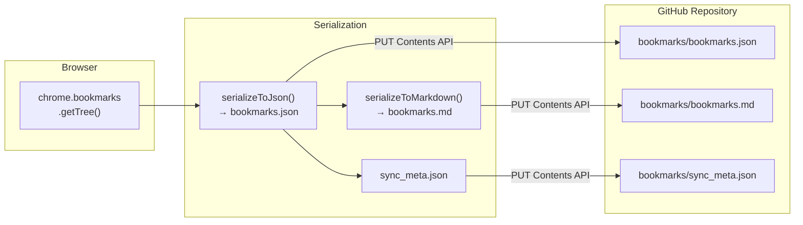
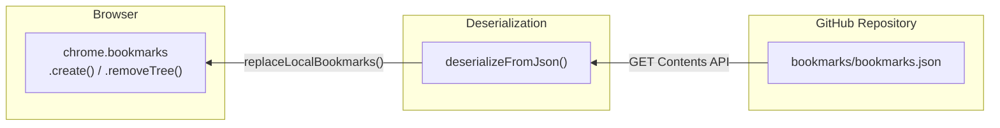

# BookHub — Data Formats and Data Flow

## Overview

BookHub converts browser bookmarks into two file formats (JSON and Markdown), stores them on GitHub, and manages synchronization state locally. This document describes every data format and how data flows through the system.

## Data Flow: Push



## Data Flow: Pull



## File Formats

### `bookmarks.json` — Machine-Readable Bookmark Data

This is the **primary data file** used for synchronization. It contains the full bookmark tree with metadata.

```json
{
  "version": 1,
  "exportedAt": "2026-02-08T15:30:00.000Z",
  "deviceId": "a1b2c3d4-e5f6-7890-abcd-ef1234567890",
  "bookmarks": [
    {
      "title": "Bookmarks Bar",
      "dateAdded": 1700000000000,
      "type": "folder",
      "children": [
        {
          "title": "GitHub",
          "dateAdded": 1700000001000,
          "type": "bookmark",
          "url": "https://github.com"
        },
        {
          "title": "Dev Tools",
          "dateAdded": 1700000002000,
          "type": "folder",
          "children": [
            {
              "title": "MDN Web Docs",
              "dateAdded": 1700000003000,
              "type": "bookmark",
              "url": "https://developer.mozilla.org"
            }
          ]
        }
      ]
    },
    {
      "title": "Other Bookmarks",
      "dateAdded": 1700000000000,
      "type": "folder",
      "children": []
    }
  ]
}
```

#### Schema

| Field | Type | Description |
|---|---|---|
| `version` | `number` | Data format version (currently `1`) |
| `exportedAt` | `string` (ISO 8601) | Timestamp of export |
| `deviceId` | `string` (UUID) | Unique device identifier |
| `bookmarks` | `array` | Top-level bookmark folders |

#### Bookmark Node Schema

| Field | Type | Present in | Description |
|---|---|---|---|
| `title` | `string` | Both | Display name |
| `dateAdded` | `number` | Both | Chrome's `dateAdded` timestamp (ms since epoch) |
| `type` | `string` | Both | `"bookmark"` or `"folder"` |
| `url` | `string` | Bookmarks only | The URL |
| `children` | `array` | Folders only | Nested bookmark nodes |

### `bookmarks.md` — Human-Readable Markdown

Generated alongside the JSON for easy browsing on GitHub. **Not used for synchronization** — purely informational.

```markdown
# Bookmarks

> Last synced: 2026-02-08T15:30:00.000Z
> Device: `a1b2c3d4-e5f6-7890-abcd-ef1234567890`

## Bookmarks Bar

- [GitHub](https://github.com)

### Dev Tools

- [MDN Web Docs](https://developer.mozilla.org)

## Other Bookmarks
```

#### Formatting rules

- Top-level folders → `## Heading`
- Subfolders → `###`, `####`, etc. (up to `######`)
- Bookmarks → `- [title](url)` list items
- Bookmarks are rendered before subfolders within each folder
- Untitled folders show as `(Untitled)`

### `sync_meta.json` — Sync Metadata

Lightweight metadata file for quick reference.

```json
{
  "lastSync": "2026-02-08T15:30:00.000Z",
  "deviceId": "a1b2c3d4-e5f6-7890-abcd-ef1234567890",
  "version": 1
}
```

## Local Storage

BookHub uses two Chrome storage areas:

### `chrome.storage.sync` — User Settings

Synced across the user's Chrome instances. Contains:

| Key | Type | Default | Description |
|---|---|---|---|
| `githubToken` | `string` | `""` | GitHub Personal Access Token |
| `repoOwner` | `string` | `""` | Repository owner |
| `repoName` | `string` | `""` | Repository name |
| `branch` | `string` | `"main"` | Git branch |
| `filePath` | `string` | `"bookmarks"` | Base path in repo |
| `autoSync` | `boolean` | `true` | Auto-sync enabled |
| `syncInterval` | `number` | `15` | Sync interval in minutes |
| `language` | `string` | `"auto"` | UI language (`"auto"`, `"en"`, `"de"`, ...) |

### `chrome.storage.local` — Sync State

Device-local, not synced. Contains:

| Key | Type | Description |
|---|---|---|
| `deviceId` | `string` (UUID) | Unique identifier for this device |
| `lastRemoteShaJson` | `string` \| `null` | SHA of `bookmarks.json` on GitHub |
| `lastRemoteShaMd` | `string` \| `null` | SHA of `bookmarks.md` on GitHub |
| `lastRemoteShaMeta` | `string` \| `null` | SHA of `sync_meta.json` on GitHub |
| `lastSyncTime` | `string` (ISO 8601) \| `null` | Timestamp of last successful sync |
| `lastSyncData` | `string` (JSON) \| `null` | Serialized bookmark JSON from last sync |
| `hasConflict` | `boolean` | Whether a conflict was detected |

The `lastSyncData` field is critical for **change detection**: it stores the JSON-serialized bookmarks as they were at the last successful sync. Both local and remote states are compared against this snapshot.

## GitHub Contents API Interaction

All file operations use the **GitHub Contents API**:

### Reading a file

```
GET /repos/{owner}/{repo}/contents/{path}?ref={branch}
```

Response includes:
- `content` — Base64-encoded file content
- `sha` — Git blob SHA (needed for updates)

### Creating or updating a file

```
PUT /repos/{owner}/{repo}/contents/{path}
```

Request body:
```json
{
  "message": "Bookmark sync from device a1b2c3d4 - 2026-02-08T15:30:00.000Z",
  "content": "<base64-encoded content>",
  "branch": "main",
  "sha": "<current file SHA, required for updates>"
}
```

The `sha` field is **required** when updating an existing file. If the SHA doesn't match the current file on GitHub (someone else updated it), the API returns **409 Conflict**.

### Base64 Encoding

The GitHub API requires content in Base64. BookHub uses Unicode-safe encoding/decoding:

- **Encode**: `TextEncoder` → byte array → `String.fromCharCode` → `btoa()`
- **Decode**: `atob()` → byte array → `TextDecoder`

This correctly handles non-ASCII characters (e.g., bookmark titles in German, Japanese, etc.).

### Authentication

All requests include:
```
Authorization: token {PAT}
Accept: application/vnd.github.v3+json
```

The PAT requires the `repo` scope for read/write access to repository contents.

## Data Comparison

The `bookmarksEqual(a, b)` function compares two serialized bookmark objects:

```javascript
JSON.stringify(a.bookmarks) === JSON.stringify(b.bookmarks)
```

This comparison:
- **Includes**: All bookmark titles, URLs, folder structures, ordering, `dateAdded`
- **Ignores**: `exportedAt`, `deviceId`, `version` (metadata)

This means a sync won't be triggered just because the timestamp or device ID changed — only actual bookmark content changes matter.
