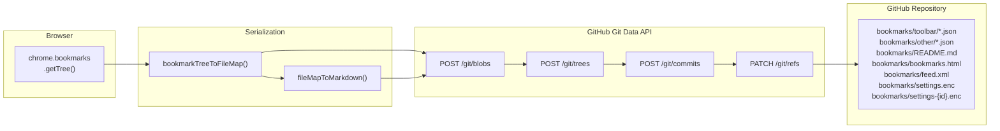
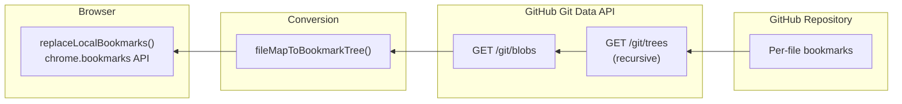

# GitSyncMarks — Data Formats and Data Flow

## Overview

GitSyncMarks stores each bookmark as an individual JSON file in a Git repository. The directory structure mirrors the bookmark folder hierarchy. Synchronization uses the GitHub Git Data API for atomic multi-file commits.

## Data Flow: Push



## Data Flow: Pull



## File Formats

### Bookmark File (e.g. `github_a1b2.json`)

Each bookmark is a minimal JSON file:

```json
{
  "title": "GitHub",
  "url": "https://github.com"
}
```

Filename format: `{slug-from-title}_{4-char-hash-from-url}.json`

The hash (FNV-1a of the URL, base-36) ensures uniqueness. The slug makes files human-readable.

### `_order.json` — Folder Ordering

Each folder contains an `_order.json` that defines the order of its children:

```json
[
  "github_a1b2.json",
  "stackoverflow_c3d4.json",
  {"dir": "dev-tools", "title": "Dev Tools"}
]
```

Entries are either:
- **String**: A bookmark filename
- **Object**: A subfolder with `dir` (directory name) and `title` (original display name)

Files not listed in `_order.json` (e.g., manually created) are picked up automatically and appended at the end.

### `_index.json` — Metadata

```json
{
  "version": 2
}
```

### `README.md` — Human-Readable Overview

Auto-generated on every push. Shows all bookmarks as Markdown with folder headings. Not used for sync — purely informational.

```markdown
# Bookmarks

> Last synced: 2026-02-09T15:30:00.000Z

## Bookmarks Bar

- [GitHub](https://github.com)
- [Stack Overflow](https://stackoverflow.com)

### Dev Tools

- [MDN Web Docs](https://developer.mozilla.org)

## Other Bookmarks
```

### `bookmarks.html` — Netscape Format for Browser Import

Auto-generated on push when mode is Auto (default). Uses the Netscape Bookmark File format (`<!DOCTYPE NETSCAPE-Bookmark-file-1>`) which Chrome, Firefox, Edge, and Safari can import directly. Not used for sync — purely for importing bookmarks without the extension.

### `feed.xml` — RSS 2.0 Feed

Auto-generated on push when mode is Auto (default). Each bookmark becomes an `<item>` with title, link, and category (folder path). Subscribable via any RSS reader (Feedly, Thunderbird, etc.); useful for automations (Slack, IFTTT, n8n) or embedding on websites. Works as a live feed via `raw.githubusercontent.com` or GitHub Pages.

### `settings.enc` / `settings-{id}.enc` — Encrypted Settings

Optional. When "Sync settings to Git" is enabled, the extension writes an encrypted copy of all settings (profiles, tokens, sync preferences) to the repo. Uses the same `gitsyncmarks-enc:v1` format as the manual encrypted export (PBKDF2 + AES-256-GCM). The password is stored locally per device in `chrome.storage.local` and never synced.

Two modes are available:
- **Global** (default): All devices share a single `settings.enc`. On pull/sync, the remote file is decrypted and applied (last-write-wins).
- **Individual**: Each device writes to `settings-{deviceId8}.enc`. Remote settings from `settings.enc` are not applied. Other devices can list and import individual device configs via the UI.

Excluded from three-way merge (`DIFF_IGNORE_SUFFIXES` + `SETTINGS_ENC_PATTERN`).

### Complete Repository Structure

```
bookmarks/
  _index.json
  README.md
  bookmarks.html
  feed.xml
  settings.enc              (global mode)
  settings-a1b2c3d4.enc    (individual mode, per device)
  toolbar/
    _order.json
    github_a1b2.json
    stackoverflow_c3d4.json
    dev-tools/
      _order.json
      mdn-web-docs_e5f6.json
  other/
    _order.json
    ...
```

Root folders are mapped by role:
| Role | Chrome | Firefox |
|---|---|---|
| `toolbar` | Bookmarks Bar (ID: `1`) | Bookmarks Toolbar (`toolbar_____`) |
| `other` | Other Bookmarks (ID: `2`) | Bookmarks Menu (`menu________`) |

On Firefox, the `other` role uses the Bookmarks Menu root (`menu________`); on Chrome it uses Other Bookmarks. Only toolbar and other are synced; menu and mobile are no longer used.

### GitHub Repos Folder (Optional)

When enabled (`githubReposEnabled`), a folder "GitHubRepos (username)" is created under the configured root (toolbar or other). It contains bookmarks to all user repos (public and private). Updated manually via "Update GitHub Repos"; changes are synced through the normal bookmark sync. On pull, if the folder is not in Git, it is preserved locally.

## Local Storage

### `chrome.storage.sync` — User Settings

Per-profile keys (repo config, githubRepos) live in `profiles[id]`; others are global.

| Key | Type | Default | Description |
|---|---|---|---|
| `repoOwner` | `string` | `""` | Repository owner |
| `repoName` | `string` | `""` | Repository name |
| `branch` | `string` | `"main"` | Git branch |
| `filePath` | `string` | `"bookmarks"` | Base path in repo |
| `githubReposEnabled` | `boolean` | `false` | Show GitHub Repos folder |
| `githubReposParent` | `string` | `"other"` | Folder position: `toolbar` or `other` |
| `githubReposUsername` | `string` | `""` | GitHub username (set on first refresh, for folder name) |
| `autoSync` | `boolean` | `true` | Auto-sync enabled |
| `syncInterval` | `number` | `15` | Sync interval (minutes) |
| `language` | `string` | `"auto"` | UI language |
| `generateReadmeMd` | `string` | `"auto"` | Generate README.md: `"off"`, `"manual"`, or `"auto"` |
| `generateBookmarksHtml` | `string` | `"auto"` | Generate bookmarks.html: `"off"`, `"manual"`, or `"auto"` |
| `generateFeedXml` | `string` | `"auto"` | Generate feed.xml (RSS 2.0): `"off"`, `"manual"`, or `"auto"` |
| `syncSettingsToGit` | `boolean` | `false` | Sync encrypted settings to Git repo |
| `settingsSyncMode` | `string` | `"global"` | Settings sync mode: `"global"` (shared) or `"individual"` (per device) |

### `chrome.storage.local` — Sync State + Token

| Key | Type | Description |
|---|---|---|
| `githubToken` | `string` | Encrypted PAT (`enc:v1:<iv>:<ciphertext>`) |
| `deviceId` | `string` | UUID for this device |
| `lastSyncFiles` | `object` | `{ [path]: { sha, content } }` — snapshot at last sync |
| `lastCommitSha` | `string` | Git commit SHA at last sync |
| `lastSyncTime` | `string` | ISO 8601 timestamp of last sync |
| `hasConflict` | `boolean` | Whether a conflict was detected |
| `settingsSyncPassword` | `string` | Password for settings.enc encryption (device-local, never synced) |

The `lastSyncFiles` object is the **base state** for three-way merge. It maps each file path to its blob SHA (for remote change detection) and content (for local change detection).

## GitHub Git Data API Interaction

All sync operations use the **Git Data API** for atomic multi-file commits:

### Reading the Remote State

```
GET /repos/{owner}/{repo}/git/ref/heads/{branch}     → commitSha
GET /repos/{owner}/{repo}/git/commits/{commitSha}     → treeSha
GET /repos/{owner}/{repo}/git/trees/{treeSha}?recursive=1  → all files + SHAs
GET /repos/{owner}/{repo}/git/blobs/{blobSha}         → file content (base64)
```

### Writing (Atomic Multi-File Commit)

```
POST /repos/{owner}/{repo}/git/blobs                  → create file blob
POST /repos/{owner}/{repo}/git/trees                  → create new tree (incremental)
POST /repos/{owner}/{repo}/git/commits                → create commit
PATCH /repos/{owner}/{repo}/git/refs/heads/{branch}   → update branch
```

For empty repos (no branch yet), `POST /git/refs` creates the initial branch.

### Efficiency

A typical sync with few changes:
- 3 API calls to read (ref + commit + tree)
- N calls to fetch changed blob contents
- M calls to create new blobs
- 3 calls to write (tree + commit + ref update)

Total: ~6 + N + M calls, regardless of total bookmark count.

## Token Encryption

The GitHub PAT is encrypted at rest using AES-256-GCM:

1. Non-extractable `CryptoKey` generated once and stored in IndexedDB
2. Encrypted as `"enc:v1:<base64-iv>:<base64-ciphertext>"` in `chrome.storage.local`
3. Decrypted transparently on load; legacy plain-text tokens handled gracefully
4. Token never stored in `chrome.storage.sync`
