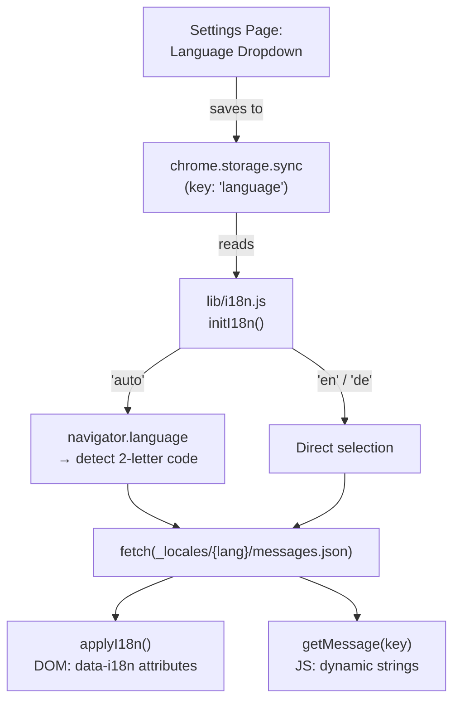

# GitSyncMarks — Internationalization (i18n)

## Concept

GitSyncMarks uses a **hybrid i18n approach**:

1. **Chrome's built-in `_locales/`** for manifest-level strings (`name`, `description`) — these use `__MSG_key__` placeholders and are resolved by Chrome at install time based on the browser's locale.
2. **Custom runtime i18n system** (`lib/i18n.js`) for all UI strings — this allows the user to **manually select** a language in the settings, independent of the browser locale.

The custom system loads the same `_locales/{lang}/messages.json` files used by Chrome, so there is only one set of translation files to maintain.



## File Format

Translation files follow the **Chrome i18n message format** and are located at `_locales/{code}/messages.json`:

```json
{
  "extName": {
    "message": "GitSyncMarks"
  },
  "popup_syncNow": {
    "message": "Sync Now"
  },
  "sync_pushFailed": {
    "message": "Push failed: $1"
  }
}
```

- Each key maps to an object with a `message` field
- Substitution placeholders use `$1`, `$2`, etc.
- Keys are organized by prefix: `popup_`, `options_`, `sync_`, `api_`, `serializer_`

### Currently Supported Languages

| Code | Language | File |
|---|---|---|
| `en` | English | `_locales/en/messages.json` |
| `de` | Deutsch | `_locales/de/messages.json` |
| `fr` | Français | `_locales/fr/messages.json` |
| `es` | Español | `_locales/es/messages.json` |

## How to Add a New Language

### Step 1: Create the messages file

Copy the English file as a template:

```bash
cp _locales/en/messages.json _locales/{code}/messages.json
```

Replace `{code}` with the ISO 639-1 two-letter code (e.g., `fr`, `es`, `ja`).

### Step 2: Translate all strings

Open the new file and translate every `"message"` value. Keep the keys unchanged. Keep `$1`, `$2` substitution placeholders in their correct positions.

Example (French):
```json
{
  "extName": {
    "message": "GitSyncMarks"
  },
  "popup_syncNow": {
    "message": "Synchroniser maintenant"
  },
  "sync_pushFailed": {
    "message": "Push échoué : $1"
  }
}
```

### Step 3: Register the language

In `lib/i18n.js`, add an entry to the `SUPPORTED_LANGUAGES` array:

```javascript
export const SUPPORTED_LANGUAGES = [
  { code: 'en', name: 'English' },
  { code: 'de', name: 'Deutsch' },
  { code: 'fr', name: 'Français' },
  { code: 'es', name: 'Español' },
];
```

The `name` field is what appears in the language dropdown. Use the language's **native name**.

### Step 4: Done

No other changes are needed. The language will automatically appear in the settings dropdown, and the i18n system will load and apply it.

## How It Works in Detail

### Initialization (`initI18n()`)

1. Read the `language` setting from `chrome.storage.sync` (default: `'auto'`)
2. If `'auto'`: detect from `navigator.language` (first 2 characters)
3. Validate the language is in `SUPPORTED_LANGUAGES`; fall back to `'en'` if not
4. Fetch `_locales/{lang}/messages.json` via `chrome.runtime.getURL()` + `fetch()`
5. If language is not English, also load `_locales/en/messages.json` as fallback
6. Cache both message sets in module-level variables

`initI18n()` is **idempotent** — calling it multiple times returns the cached promise.

### Translation (`getMessage(key, substitutions)`)

1. Look up `key` in the current language's messages
2. If not found, look up in the English fallback
3. If still not found, return the key itself (graceful degradation)
4. Replace `$1`, `$2`, ... with the provided substitution values

### DOM Translation (`applyI18n()`)

Scans the DOM for elements with translation attributes:

| Attribute | Effect |
|---|---|
| `data-i18n="key"` | Sets `textContent` |
| `data-i18n-html="key"` | Sets `innerHTML` (for trusted content with HTML tags) |
| `data-i18n-placeholder="key"` | Sets `placeholder` attribute |
| `data-i18n-title="key"` | Sets `title` attribute |

Example HTML:
```html
<button data-i18n="popup_syncNow">Sync Now</button>
<input data-i18n-placeholder="options_ownerPlaceholder" placeholder="your-github-username">
<small data-i18n-html="options_tokenHint">Requires the <code>repo</code> scope.</small>
```

### Language Switching (`reloadI18n()`)

When the user changes the language in settings:

1. `chrome.storage.sync.set({ language: newLang })` saves the choice
2. `reloadI18n()` clears the cache and re-initializes with the new language
3. `applyI18n()` re-translates all DOM elements
4. No page reload needed

### Fallback Chain

```
getMessage("some_key")
    ↓
currentMessages["some_key"]  →  found? → return message
    ↓ (not found)
fallbackMessages["some_key"]  →  found? → return message
    ↓ (not found)
return "some_key"  (the key itself)
```

## Where i18n is Used

| Context | Init | Translation |
|---|---|---|
| `popup.js` | `await initI18n()` in DOMContentLoaded | `applyI18n()` + `getMessage()` |
| `options.js` | `await initI18n()` in DOMContentLoaded | `applyI18n()` + `getMessage()` |
| `background.js` | `initI18n()` at startup + on install/update | (delegates to sync engine) |
| `lib/sync-engine.js` | Relies on background init | `getMessage()` for status messages |
| `lib/github-api.js` | Relies on background init | `getMessage()` for error messages |
| `lib/bookmark-serializer.js` | Relies on background init | `getMessage()` for Markdown strings |

## Key Design Decisions

1. **Why not use Chrome's built-in `chrome.i18n.getMessage()`?** — It only supports the browser's locale and does not allow runtime language switching. Users wanted manual language selection.

2. **Why reuse `_locales/` files?** — One set of files serves both Chrome's `__MSG_` system (for manifest) and our custom system (for UI). Less duplication.

3. **Why `data-i18n` attributes instead of `chrome.i18n.getMessage()` in JS?** — Cleaner separation of content and logic. HTML serves as the source of truth for which elements need translation. `applyI18n()` handles everything in one sweep.

4. **Why English as the fallback?** — English is the most complete translation and serves as the default. If a key is missing in another language, the English version is shown rather than a raw key.
