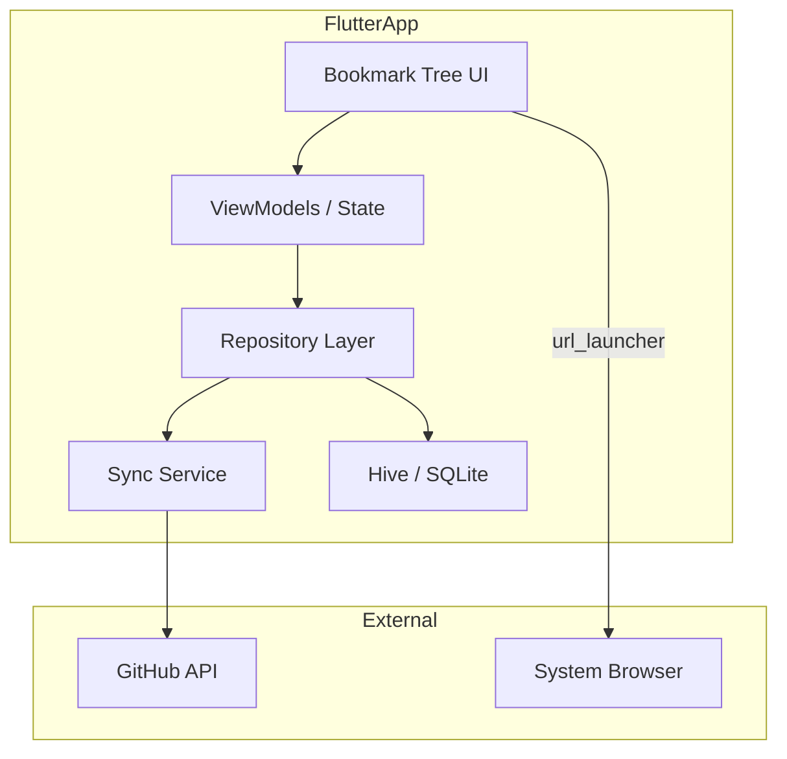

# Flutter Bookmark Sync App – Idea for Future Implementation

**Status:** POC started in [GitSyncMarks-Android](https://github.com/d0dg3r/GitSyncMarks-Android) repo.  
**Created:** February 2025

---

## Goal

Cross-platform app (iOS + Android) with Flutter that:
- Syncs bookmarks from the GitSyncMarks GitHub repo (read-only)
- Displays the bookmark tree (toolbar, other only; subfolders)
- Opens URLs in the user-selected browser on tap
- Caches bookmarks locally for offline use
- No tab saving – read-only sync and open only

---

## Architecture



---

## Tech Stack

| Component | Flutter Package |
|-----------|-----------------|
| HTTP | `http` or `dio` |
| Token storage | `flutter_secure_storage` |
| Local cache | `hive` or `sqflite` |
| Open URLs | `url_launcher` (`LaunchMode.externalApplication`) |
| State | `provider` or `riverpod` |
| Navigation | `go_router` or Navigator |
| GitHub OAuth (optional) | `oauth2` / `flutter_appauth` |

---

## GitHub API (Read-Only)

Use **Contents API**:

```
GET /repos/{owner}/{repo}/contents/{path}?ref={branch}
```

- Recursive walk: `bookmarks/` → `bookmarks/toolbar/` → `bookmarks/toolbar/*.json`
- Per folder: read contents; decode `type: "file"` entries as base64 blobs
- Parse `_order.json` for ordering
- Parse `*.json` (except `_order.json`, `_index.json`) as bookmark `{ "title", "url" }`

Alternative: **Git Data API** (more efficient for many files):

```
GET /repos/{owner}/{repo}/git/trees/{treeSha}?recursive=1
GET /repos/{owner}/{repo}/git/blobs/{blobSha}
```

Token: GitHub PAT with `repo` scope (same as GitSyncMarks).

---

## Data Model

```dart
abstract class BookmarkNode {}
class BookmarkFolder extends BookmarkNode {
  String title;
  List<BookmarkNode> children;
  String role; // toolbar, other
}
class Bookmark extends BookmarkNode {
  String title;
  String url;
}
```

Parsing analogous to `lib/bookmark-serializer.js`: `_order.json` + filenames → tree.

---

## UI Structure

1. **Settings Screen**
   - GitHub Token (PAT), Owner, Repo, Branch, Base Path (e.g. `bookmarks`)
   - Browser selection: System default, Chrome, Firefox, Safari (package ID per platform)
   - Sync button

2. **Bookmark List Screen (Main)**
   - Expandable tree (e.g. `expandable` package or custom `ListView.builder` with indentation)
   - Folder: `ListTile` with chevron, tap to expand/collapse
   - Bookmark: `ListTile` with title, tap opens URL
   - Pull-to-refresh for sync
   - Empty state: configuration hint

3. **Browser Selection**
   - Android: `PackageManager` → apps with `Intent.ACTION_VIEW` + `http`
   - iOS: `canLaunch` / `launchUrl` – default browser; explicit selection limited
   - `url_launcher` `LaunchMode.externalApplication` opens in system browser

---

## Project Structure

```
gitsyncmarks_app/
  lib/
    main.dart
    app.dart
    config/
    models/           # BookmarkNode, BookmarkFolder, Bookmark
    services/
      github_api.dart
      sync_service.dart
      storage_service.dart
    repositories/
      bookmark_repository.dart
    screens/
      settings_screen.dart
      bookmark_list_screen.dart
    widgets/
      bookmark_tile.dart
      folder_tile.dart
  pubspec.yaml
  android/
  ios/
```

---

## Implementation Phases

### Phase 1: Scaffold (~1 week)
- Create Flutter project
- Navigation (Settings, Bookmark List)
- Settings UI: Token, Owner, Repo, Branch, Base Path
- `flutter_secure_storage` for token

### Phase 2: GitHub Integration (~1 week)
- `GitHubApi` service: Contents API, recursive loading
- Parse `_order.json` and bookmark JSON
- `BookmarkRepository` with sync logic

### Phase 3: Local Cache (~3–4 days)
- Hive/SQLite: persist last sync result
- Offline display from cache
- Pull-to-refresh

### Phase 4: Bookmark UI (~1 week)
- Expandable tree (folders + bookmarks)
- `BookmarkTile` → `url_launcher`
- Empty states and error handling

### Phase 5: Browser Selection (~2–3 days)
- Android: list installed browsers
- `url_launcher` with `LaunchMode.externalApplication`
- Settings for preferred browser

### Phase 6: Polish (~3–5 days)
- Error handling (401, 403, network)
- Loading indicators
- Optional: Dark mode, i18n (EN/DE)

---

## Estimated Effort

| Phase | Duration |
|-------|----------|
| 1 – Scaffold | 1 week |
| 2 – GitHub API | 1 week |
| 3 – Cache | 3–4 days |
| 4 – UI | 1 week |
| 5 – Browser | 2–3 days |
| 6 – Polish | 3–5 days |

**Total: ~4–5 weeks** for an MVP on iOS and Android.

---

## Next Steps (when implementing)

1. Create Flutter project: `flutter create gitsyncmarks_app`
2. Add packages: `http`, `flutter_secure_storage`, `hive`, `url_launcher`, `provider`
3. Set up repo structure (lib/config, models, services, etc.)
4. Start with Phase 1 (Settings, Navigation)
