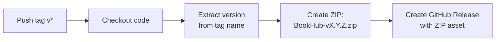

# BookHub — Release Process

## Versioning Strategy

BookHub follows **Semantic Versioning** (SemVer):

```
MAJOR.MINOR.PATCH
```

| Component | When to increment | Example |
|---|---|---|
| **MAJOR** | Breaking changes (e.g., new permission, data format change) | 1.0.0 → 2.0.0 |
| **MINOR** | New features (e.g., i18n support, new sync mode) | 1.2.0 → 1.3.0 |
| **PATCH** | Bug fixes, small improvements | 1.3.0 → 1.3.1 |

The version is declared in `manifest.json` → `"version"`.

### Version History

| Version | Description |
|---|---|
| `1.0.0` | Initial release: bookmark sync with GitHub |
| `1.1.0` | Open source (MIT license), English translation |
| `1.2.0` | Chrome Web Store preparation, privacy policy |
| `1.3.0` | Multilanguage support (i18n) with manual language selection |

## How to Create a New Release

### 1. Update the version

Edit `manifest.json` and increment the `"version"` field:

```json
{
  "version": "1.4.0"
}
```

### 2. Commit and push

```bash
git add -A
git commit -m "Bump version to v1.4.0"
git push origin main
```

### 3. Create and push a Git tag

```bash
git tag v1.4.0
git push origin v1.4.0
```

This triggers the **GitHub Actions workflow** automatically.

### 4. Wait for the workflow

The GitHub Actions workflow will:
1. Check out the code
2. Create a ZIP file (`BookHub-v1.4.0.zip`) containing all extension files
3. Create a GitHub Release with the ZIP as a download asset

You can monitor progress at: `https://github.com/d0dg3r/BookHub/actions`

### 5. Verify the release

Go to `https://github.com/d0dg3r/BookHub/releases` and verify:
- The release name is correct (e.g., "BookHub v1.4.0")
- The ZIP file is attached and downloadable
- Installation instructions are included in the release notes

## GitHub Actions Workflow

The workflow is defined in `.github/workflows/release.yml`.

### Trigger

```yaml
on:
  push:
    tags:
      - 'v*'
```

It runs **only** when a tag matching `v*` (e.g., `v1.3.0`) is pushed.

### What it does



### Files included in the ZIP

```
manifest.json
background.js
popup.html / popup.js / popup.css
options.html / options.js / options.css
lib/                (all JS modules)
icons/              (all icon sizes)
_locales/           (all language files)
LICENSE
PRIVACY.md
README.md
```

**Excluded** from the ZIP: `docs/`, `store-assets/`, `.github/`, `.gitignore`, `.git/`

### Required permissions

The workflow needs `contents: write` permission to create releases:

```yaml
permissions:
  contents: write
```

This is already configured in the workflow file.

## Chrome Web Store Update Process

When publishing or updating the extension on the Chrome Web Store:

### First-time setup

1. Register as a Chrome Web Store developer ($5 one-time fee)
2. Go to [Chrome Web Store Developer Dashboard](https://chrome.google.com/webstore/devconsole)
3. Create a new item and upload the ZIP
4. Fill in listing details (see `store-assets/listing.md` for prepared texts)
5. Upload screenshots and promo images from `store-assets/`
6. Submit for review

### Updating an existing listing

1. Create a new release (follow the steps above)
2. Download the ZIP from the GitHub release
3. Go to the Developer Dashboard → BookHub → Package
4. Upload the new ZIP
5. Update the version description if needed
6. Submit for review

### Store assets location

All Chrome Web Store assets are in `store-assets/`:

| File | Purpose | Dimensions |
|---|---|---|
| `icon128-store.png` | Store listing icon | 128 x 128 |
| `screenshot-1.png` | Popup screenshot | 1280 x 800 |
| `screenshot-2.png` | Settings screenshot | 1280 x 800 |
| `promo-small.png` | Small promo tile | 440 x 280 |
| `promo-marquee.png` | Marquee promo tile | 1400 x 560 |
| `listing.md` | All listing texts | — |

## Troubleshooting

### Tag already exists

If you accidentally created a tag with the wrong version:

```bash
git tag -d v1.4.0              # Delete local tag
git push origin :refs/tags/v1.4.0   # Delete remote tag
```

Then create the correct tag and push again.

### Workflow failed

Check the Actions tab on GitHub for error logs. Common issues:
- Missing files referenced in the ZIP command
- Permission issues (ensure `contents: write` is set)

### ZIP doesn't include new files

If you added new top-level files or directories, update the `zip` command in `.github/workflows/release.yml` to include them.
