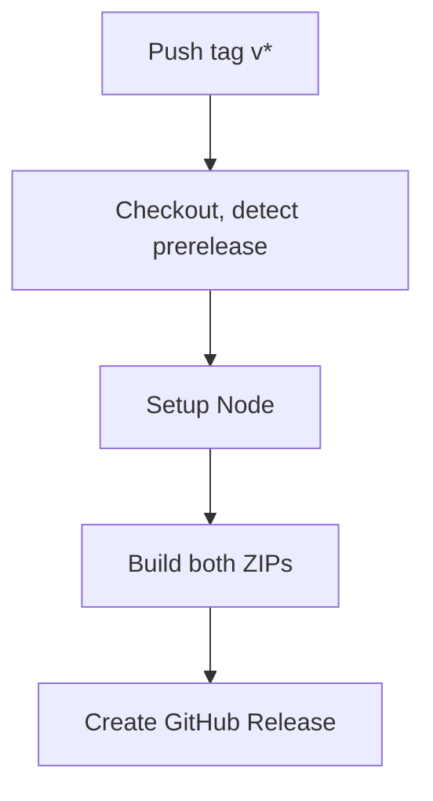

# GitSyncMarks — Release Process

For a detailed list of changes per version, see [CHANGELOG.md](../CHANGELOG.md).

## Versioning Strategy

GitSyncMarks follows **Semantic Versioning** (SemVer):

```
MAJOR.MINOR.PATCH
```

| Component | When to increment | Example |
|---|---|---|
| **MAJOR** | Breaking changes (e.g., new permission, data format change) | 1.0.0 → 2.0.0 |
| **MINOR** | New features (e.g., i18n support, new sync mode) | 1.2.0 → 1.3.0 |
| **PATCH** | Bug fixes, small improvements | 1.3.0 → 1.3.1 |

The version is declared in `manifest.json` → `"version"`. It must match `manifest.firefox.json` and `package.json`.

### Version History

| Version | Description |
|---|---|
| `2.3.0` | Encrypted settings export (password-protected .enc); plain JSON and encrypted formats supported; import with password prompt for .enc files |
| `2.2.1` | Sync feedback message fix (merge shows push/pull success); state regression fix (stale fetch guard, cache-busting); debug log extended with commit hashes |
| `2.2.0` | GitHub Repos folder, multiple profiles, onboarding, profile add auto-switch, profile limit display, spinner, profile switch UX, popup redesign, shorter pull message, keyboard shortcuts, Help tab (collapsible accordion), options header (language dropdown only), French and Spanish; settings import round-trip fix; auto-save on switches and before actions; compact Options UI (all tabs); Backup tab redesign; contributors Patrick W., Gernot B. |
| `2.1.2` | Store buttons in README, responsive mobile layout for Firefox Android, testing guide (docs/TESTING.md) |
| `2.1.1` | New icon (blue bookmark + green sync arrow) for extension, store assets, and favicons |
| `2.1.0` | Sync profiles, sync on startup/focus, theme (light/dark/auto), redesigned Backup tab, tabbed options (GitHub/Sync/Backup), commit link in popup, pre-release workflow — see [CHANGELOG.md](../CHANGELOG.md) |
| `2.0.1` | Fix: false merge conflicts when two devices edit the same folder concurrently (`_order.json` content-level merge); harden GitHub Action inputs; update Firefox manifest and i18n; update store screenshots |
| `2.0.0` | Per-file bookmark storage, three-way merge sync, Firefox support, automation (GitHub Actions), cross-browser build system |
| `1.5.0` | Token encryption at rest (AES-256-GCM), token moved to local storage |
| `1.4.0` | Tabbed options page, import/export, GitHub project links, improved description |
| `1.3.0` | Multilanguage support (i18n) with manual language selection |
| `1.2.0` | Chrome Web Store preparation, privacy policy |
| `1.1.0` | Open source (MIT license), English translation |
| `1.0.0` | Initial release: bookmark sync with GitHub |

## Branch Workflow

Two phases: development and release.

### Phase 1: Development

| Step | Action |
|------|--------|
| 1 | Create a feature branch from `main`: `feature/browser-notifications` or `develop/2.2.0` |
| 2 | Implement features, commit |
| 3 | Open PR from `feature/xxx` to `main` |
| 4 | Review, merge |
| 5 | For more features: create new feature branches from `main`, again PR → main |

**Naming:** Single feature `feature/xyz`; multiple features for a version `develop/2.2.0`; bugfixes `fix/description`.

### Phase 2: Release

| Step | Action |
|------|--------|
| 1 | Create release branch from `main`: `release/v2.2.0` |
| 2 | Bump version in `manifest.json`, `manifest.firefox.json`, `package.json` to `2.2.0` |
| 3 | Update `CHANGELOG.md` with v2.2.0 entry |
| 4 | Update version history in `docs/RELEASE.md` |
| 5 | Open PR from `release/v2.2.0` to `main` |
| 6 | Merge (main now has the release version) |
| 7 | Tag and push: `git tag v2.2.0 && git push origin v2.2.0` |
| 8 | GitHub Actions creates the release with ZIPs |

## How to Create a New Release

### 1. Update the version

Edit `manifest.json`, `manifest.firefox.json`, and `package.json` — set the same `"version"` in all three files:

```json
{
  "version": "1.4.0"
}
```

### 2. Commit and push

```bash
git add -A
git commit -m "Bump version to v1.4.0"
git push origin main
```

### 3. Create and push a Git tag

```bash
git tag v1.4.0
git push origin v1.4.0
```

This triggers the **GitHub Actions workflow** automatically.

### 4. Wait for the workflow

The GitHub Actions workflow will:
1. Check out the code and detect prerelease (Pre-tags: `-pre.N`, `-alpha.N`, etc.)
2. Build both ZIPs (`GitSyncMarks-vX.X.X-chrome.zip`, `GitSyncMarks-vX.X.X-firefox.zip`)
3. Create the GitHub Release

E2E tests and screenshot generation in CI are currently disabled (see [ROADMAP.md](../ROADMAP.md) backlog). Run them locally before tagging.

You can monitor progress at: `https://github.com/d0dg3r/GitSyncMarks/actions`

### 5. Verify the release

Go to `https://github.com/d0dg3r/GitSyncMarks/releases` and verify:
- The release name is correct (e.g., "GitSyncMarks v1.4.0")
- The ZIP file is attached and downloadable
- Installation instructions are included in the release notes

## Pre-Releases

Tags with a pre-release suffix (`-pre.N`, `-alpha.N`, `-beta.N`, `-rc.N`) trigger the same build but are published as **Pre-releases** on GitHub — downloadable but not marked as the latest release.

**Example workflow for `v2.1.0-pre.1`:**

1. Set version to `2.1.0-pre.1` in `manifest.json`, `manifest.firefox.json`, and `package.json`
2. Commit, push to main
3. Create and push the tag: `git tag v2.1.0-pre.1 && git push origin v2.1.0-pre.1`
4. The workflow runs and creates a Pre-release with both ZIPs attached

Supported suffixes: `-pre.N`, `-alpha.N`, `-beta.N`, `-rc.N` (e.g. `v2.1.0-rc.3`).

## GitHub Actions Workflow

The workflow is defined in `.github/workflows/release.yml`.

### Trigger

```yaml
on:
  push:
    tags:
      - 'v*'
```

It runs **only** when a tag matching `v*` (e.g., `v1.3.0`) is pushed.

### What it does

1. **Setup:** Checkout, detect prerelease, install Node
2. **Build:** `build.sh` creates both ZIP packages (Chrome and Firefox)
3. **Release:** Create GitHub Release with both ZIPs attached

E2E tests and screenshot generation are disabled in CI (see [ROADMAP.md](../ROADMAP.md) backlog).



The Chrome package uses `manifest.json`, the Firefox package uses `manifest.firefox.json` (renamed to `manifest.json` during build).

### Files included in the ZIPs

```
manifest.json        (browser-specific)
background.js
popup.html / popup.js / popup.css
options.html / options.js / options.css
lib/                 (all JS modules)
icons/               (all icon sizes)
_locales/            (all language files)
LICENSE
PRIVACY.md
README.md
```

**Excluded** from the ZIP: `docs/`, `store-assets/`, `.github/`, `.gitignore`, `.git/`, `manifest.firefox.json`, `scripts/`, `package.json`

### Required permissions

The workflow needs `contents: write` permission to create releases (already configured).

## Chrome Web Store Update Process

When publishing or updating the extension on the Chrome Web Store:

### First-time setup

1. Register as a Chrome Web Store developer ($5 one-time fee)
2. Go to [Chrome Web Store Developer Dashboard](https://chrome.google.com/webstore/devconsole)
3. Create a new item and upload the ZIP
4. Fill in listing details (see `store-assets/chrome-store.md` for prepared texts)
5. Upload screenshots and promo images from `store-assets/`
6. Submit for review

### Updating an existing listing

1. Create a new release (follow the steps above)
2. Download the ZIP from the GitHub release
3. Go to the Developer Dashboard → GitSyncMarks → Package
4. Upload the new ZIP
5. Update the version description if needed
6. Submit for review

### Store assets location

All Chrome Web Store assets are in `store-assets/`:

| File | Purpose | Dimensions |
|---|---|---|
| `icon128-store.png` | Store listing icon | 128 x 128 |
| `en/chrome-*.png` | Options tabs and popup (EN) | 1280 x 800 |
| `de/chrome-*.png` | Options tabs and popup (DE) | 1280 x 800 |
| `fr/chrome-*.png` | Options tabs and popup (FR) | 1280 x 800 |
| `es/chrome-*.png` | Options tabs and popup (ES) | 1280 x 800 |
| `{en,de,fr,es}/firefox-*.png` | Firefox (copied from Chrome) | 1280 x 800 |
| `promo-small.png` | Small promo tile | 440 x 280 |
| `promo-marquee.png` | Marquee promo tile | 1400 x 560 |
| `chrome-store.md` | Chrome listing texts (EN, DE, FR, ES) | — |
| `firefox-store.md` | Firefox listing texts (EN, DE, FR, ES) | — |
| `listing.md` | Index with links to both | — |

## Troubleshooting

### Tag already exists

If you accidentally created a tag with the wrong version:

```bash
git tag -d v1.4.0              # Delete local tag
git push origin :refs/tags/v1.4.0   # Delete remote tag
```

Then create the correct tag and push again.

### Workflow failed

Check the Actions tab on GitHub for error logs. Common issues:
- Missing files referenced in the ZIP command
- Permission issues (ensure `contents: write` is set)

### ZIP doesn't include new files

The ZIPs are created by `scripts/build.sh`. If you added new top-level files or directories, add them to the `SHARED_FILES` or `SHARED_DIRS` arrays in `scripts/build.sh`.
