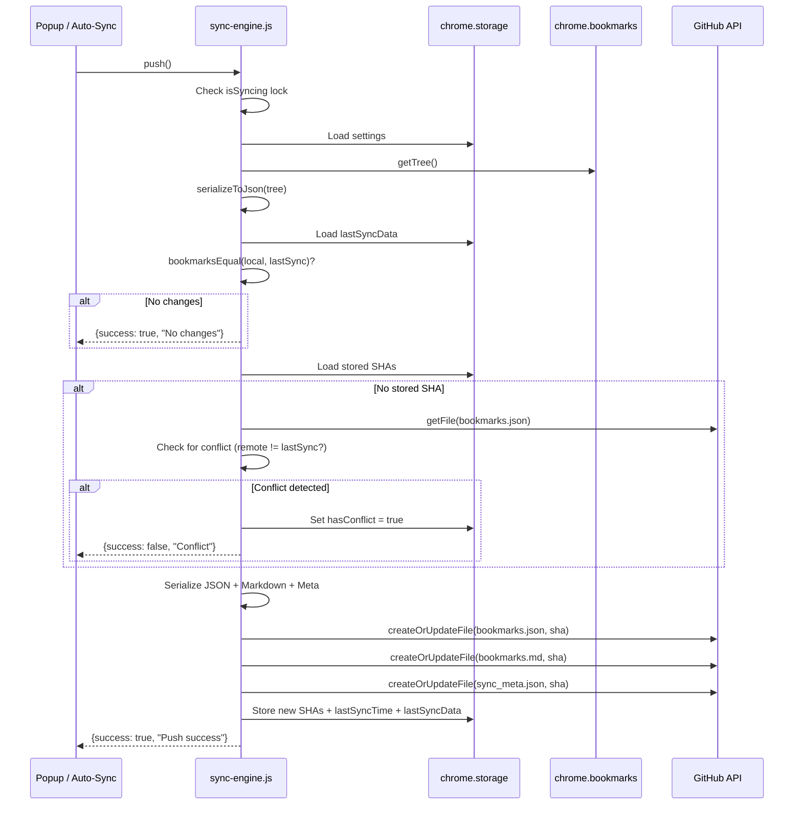
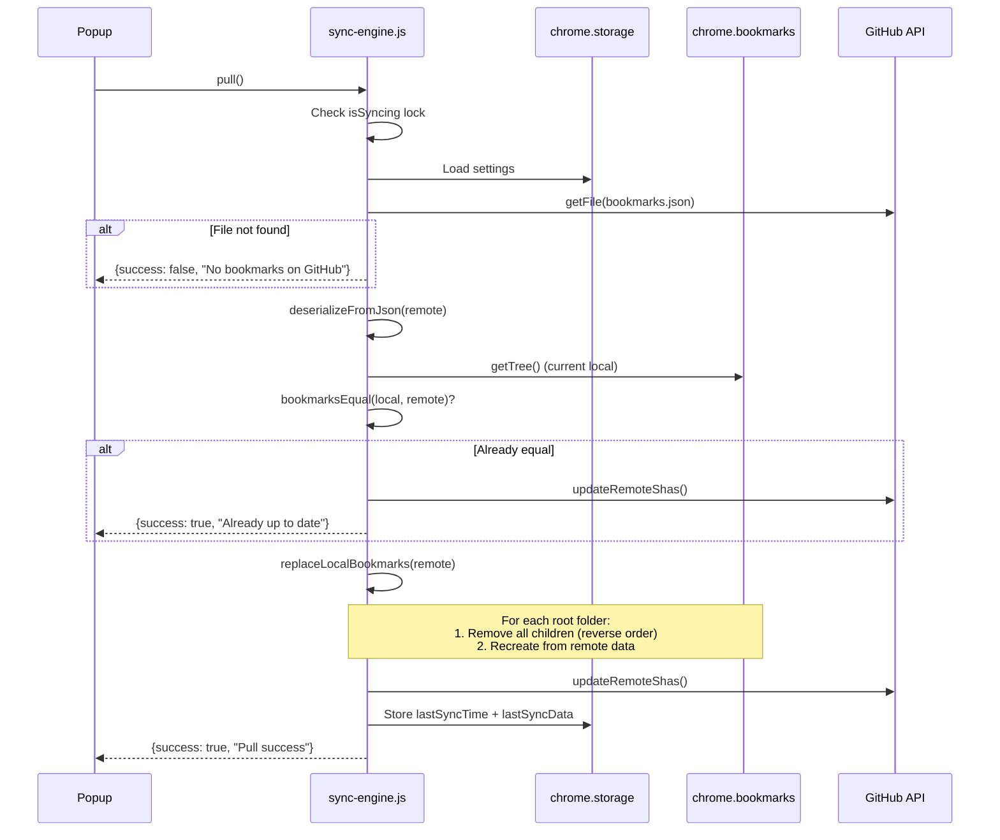
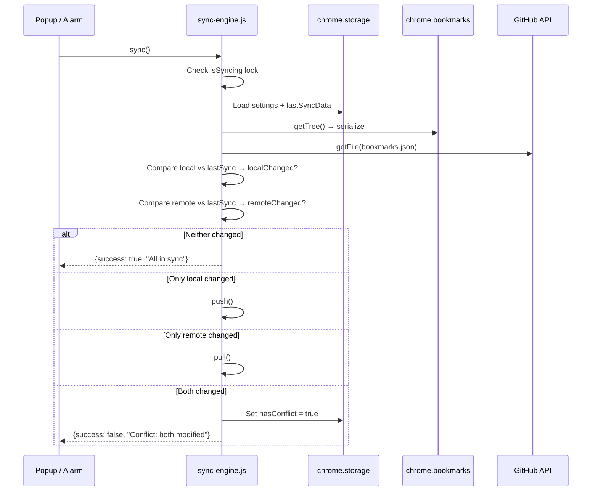
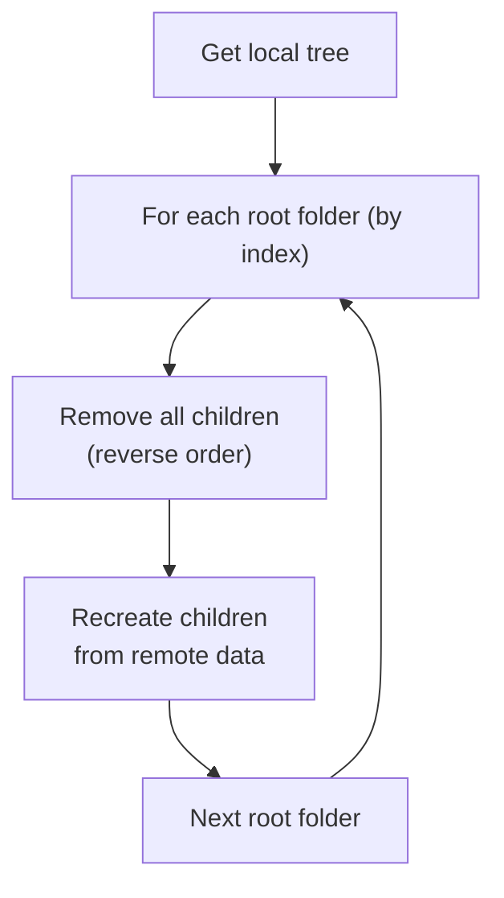

# BookHub — Sync Logic

## Overview

BookHub implements **bidirectional bookmark synchronization** between the browser and a GitHub repository. The sync engine supports three operations: **Push**, **Pull**, and **Sync** (bidirectional). All operations are protected by a re-entrancy lock and communicate results back to the UI.

## Sync Operations

### Push (Local → GitHub)

Pushes the current local bookmarks to the GitHub repository.



### Pull (GitHub → Local)

Fetches bookmarks from GitHub and replaces all local bookmarks.



### Sync (Bidirectional)

Compares both sides and decides the appropriate action.



## Conflict Detection

Conflicts are detected by comparing **three states**:

| State | Source | Description |
|---|---|---|
| **Local** | `chrome.bookmarks.getTree()` | Current browser bookmarks |
| **Remote** | GitHub `bookmarks.json` | Latest version on GitHub |
| **Last Sync** | `chrome.storage.local` (`lastSyncData`) | Snapshot from the last successful sync |

**Conflict decision matrix:**

| Local vs LastSync | Remote vs LastSync | Action |
|---|---|---|
| Same | Same | Nothing to do |
| Changed | Same | Push |
| Same | Changed | Pull |
| Changed | Changed | **Conflict** — user must choose |

### SHA-based Conflict Prevention

When pushing files, the GitHub Contents API requires the current file SHA for updates. If the SHA doesn't match (someone else modified the file), the API returns **HTTP 409 Conflict**. This is caught as a `GitHubError` and reported to the user.

Additionally, before pushing, the engine fetches the remote file to compare its content against `lastSyncData`. If the remote content differs from what was last synced, a conflict is raised *before* attempting the push.

### Conflict Resolution

When a conflict is detected:

1. The `hasConflict` flag is set in `chrome.storage.local`
2. The popup shows a conflict warning with two buttons:
   - **Local → GitHub** (force push) — overwrites remote with local
   - **GitHub → Local** (force pull) — overwrites local with remote
3. The chosen operation clears the conflict flag on success

## Debounce Mechanism

When bookmarks change locally (create, edit, move, delete), an auto-push is triggered. To prevent excessive API calls during rapid changes (e.g., importing bookmarks, reorganizing folders), a **debounce** mechanism is used:

```
Bookmark event → triggerAutoSync() → debouncedPush(5000ms)
                                          ↓
                               clearTimeout (if pending)
                                          ↓
                               setTimeout(push, 5000ms)
```

- **Default delay**: 5 seconds
- Each new event resets the timer
- Only fires once all rapid changes have settled
- Only fires if auto-sync is enabled and extension is configured

### Re-Entrancy Guard

A module-level `isSyncing` boolean prevents concurrent sync operations:

```
push() or pull() called
    ↓
if (isSyncing) → return early with "Sync already in progress"
    ↓
isSyncing = true
    ↓
... perform sync ...
    ↓
finally: isSyncing = false
```

The `background.js` also checks `isSyncInProgress()` before triggering auto-sync from bookmark events. This prevents a pull operation (which modifies bookmarks) from triggering a push via the bookmark event listeners.

## Auto-Sync vs. Manual Sync

| Trigger | Function | When |
|---|---|---|
| Bookmark event | `debouncedPush()` | Any bookmark create/edit/move/delete |
| Periodic alarm | `sync()` | Every N minutes (configurable, default 15) |
| "Sync Now" button | `sync()` | User clicks in popup |
| "Push" button | `push()` | User clicks in popup |
| "Pull" button | `pull()` | User clicks in popup |
| Conflict resolution | `push()` or `pull()` | User chooses in popup |

## The `replaceLocalBookmarks` Algorithm

When pulling remote bookmarks, the local bookmark tree is fully replaced:

1. Get the current local bookmark tree via `chrome.bookmarks.getTree()`
2. Iterate over root-level folders (Bookmarks Bar, Other Bookmarks, Mobile Bookmarks)
3. For each root folder:
   a. Remove all existing children in **reverse order** (to avoid index shifting)
   b. Recursively recreate children from the remote data
4. Root folders themselves are never deleted (Chrome doesn't allow it)


