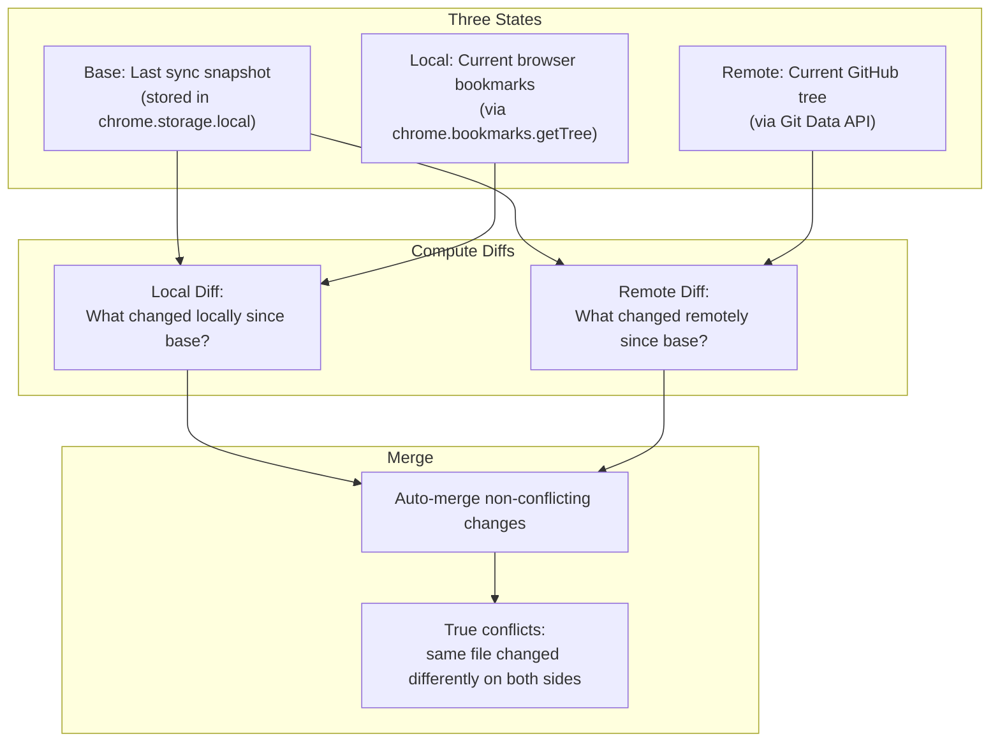
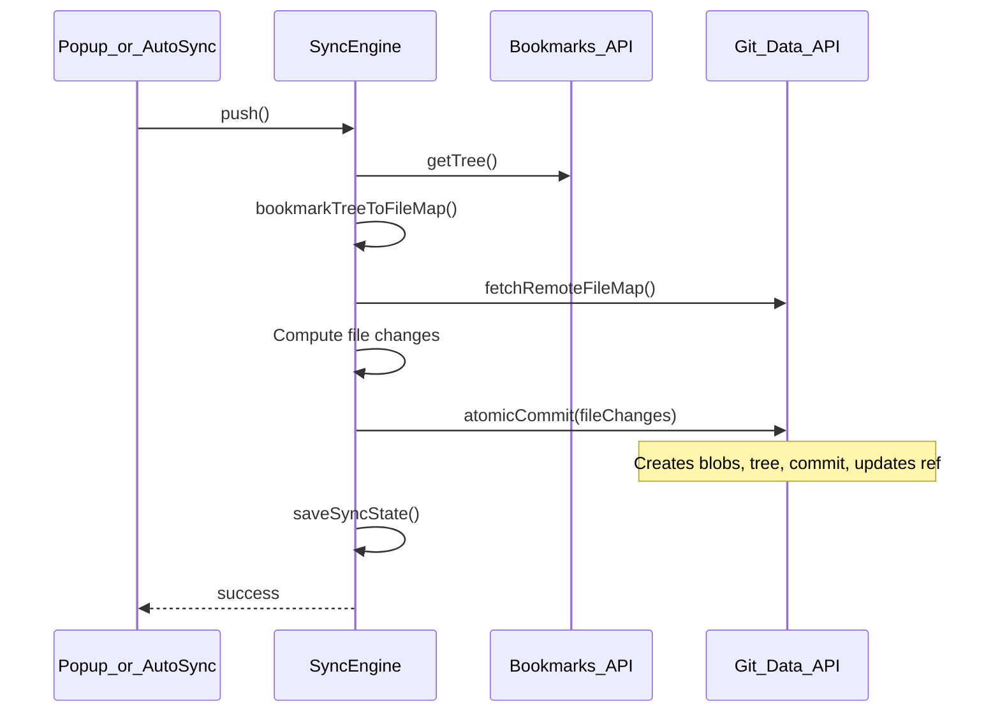
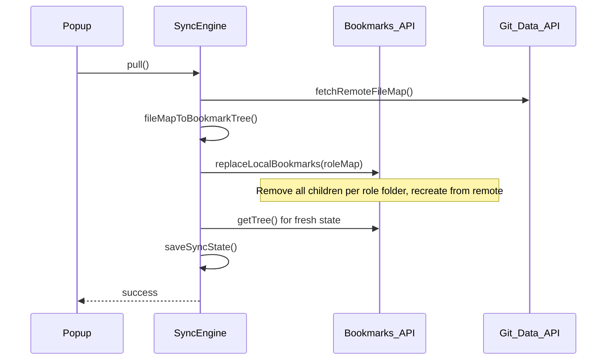
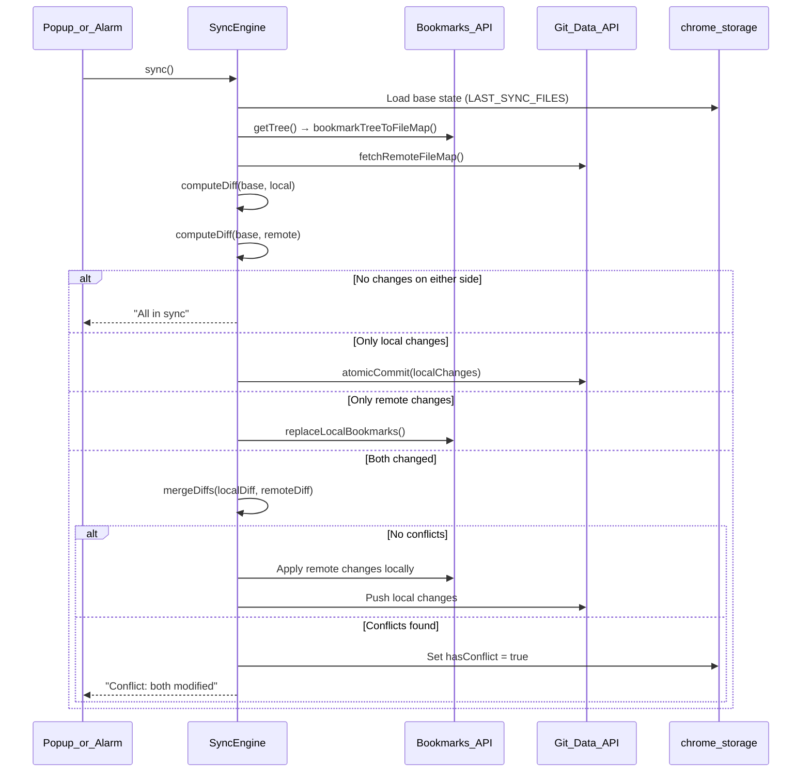

# GitSyncMarks — Sync Logic

## Overview

GitSyncMarks implements **bidirectional bookmark synchronization** using a **three-way merge** algorithm. Each bookmark is stored as an individual JSON file. The sync engine compares three states — base (last sync), local (browser), and remote (GitHub) — to automatically merge non-conflicting changes.

## Core Concept: Three-Way Merge



## Sync Operations

### Push (Local → GitHub)

Full push of all local bookmarks as individual files using atomic commit.



### Pull (GitHub → Local)

Fetch remote file map, convert to bookmark tree, replace local bookmarks.



### Sync (Bidirectional Three-Way Merge)



## Diff Computation

`computeDiff(base, current)` compares two file maps (path → content) and produces:

| Category | Meaning |
|---|---|
| **added** | Files in `current` but not in `base` |
| **removed** | Files in `base` but not in `current` |
| **modified** | Files in both but with different content |

Generated/meta files (`README.md`, `_index.json`) are excluded from diff via `filterForDiff()`.

## Merge Rules

`mergeDiffs(localDiff, remoteDiff)` applies these rules per file path:

| Local | Remote | Action |
|---|---|---|
| Added | — | Push to GitHub |
| — | Added | Create locally |
| Modified | — | Push to GitHub |
| — | Modified | Apply locally |
| Removed | — | Delete on GitHub |
| — | Removed | Delete locally |
| Same change | Same change | No action needed |
| Different change | Different change | **Conflict** |
| Removed | Removed | No action needed |

## Conflict Detection and Resolution

When `mergeDiffs` finds conflicts (same file changed differently on both sides):

1. `hasConflict` flag is set in `chrome.storage.local`
2. Popup shows conflict warning with resolution buttons:
   - **Local → GitHub** (force push) — overwrites remote
   - **GitHub → Local** (force pull) — overwrites local
3. The chosen operation clears the conflict flag

### First Sync Special Cases

When no base state exists (first sync ever):

| Local | Remote | Action |
|---|---|---|
| Has bookmarks | Empty repo | Push |
| Empty | Has data | Pull |
| Has bookmarks | Has data | Conflict (user must choose) |
| Empty | Empty | Nothing to do |

## Auto-Sync and Debounce

```
Bookmark event → triggerAutoSync() → debouncedSync(5000ms)
                                          ↓
                               clearTimeout (if pending)
                                          ↓
                               setTimeout(sync, 5000ms)
```

- Default delay: 5 seconds
- Each new event resets the timer
- Uses `sync()` (three-way merge), not just push
- Suppressed for 10 seconds after a pull (to ignore bookmark events from `replaceLocalBookmarks`)

### Re-Entrancy Guard

A module-level `isSyncing` boolean prevents concurrent operations. `background.js` also checks `isSyncInProgress()` and `isAutoSyncSuppressed()` before triggering auto-sync.

## The `replaceLocalBookmarks` Algorithm

Uses **role-based mapping** for cross-browser compatibility:

1. Get local bookmark tree via `chrome.bookmarks.getTree()`
2. Detect each root folder's role via `detectRootFolderRole()` (uses browser-specific IDs with title fallback)
3. For each role in the remote data (toolbar, other, menu, mobile):
   a. Find the matching local root folder
   b. Remove all existing children (reverse order)
   c. Recursively recreate from remote data
4. Roles not present locally are skipped (e.g., Chrome has no "menu")

## Optimized Remote Fetching

`fetchRemoteFileMap()` minimizes API calls:

1. `getLatestCommitSha()` — 1 call
2. `getCommit()` + `getTree(recursive=1)` — 2 calls → full file list with SHAs
3. For each file: compare blob SHA with stored base SHA
   - **SHA matches** → use cached content from base state (0 calls)
   - **SHA differs** → `getBlob()` (1 call per changed file)

In the common case (few files changed), this is 3 + N calls where N is the number of changed files.
