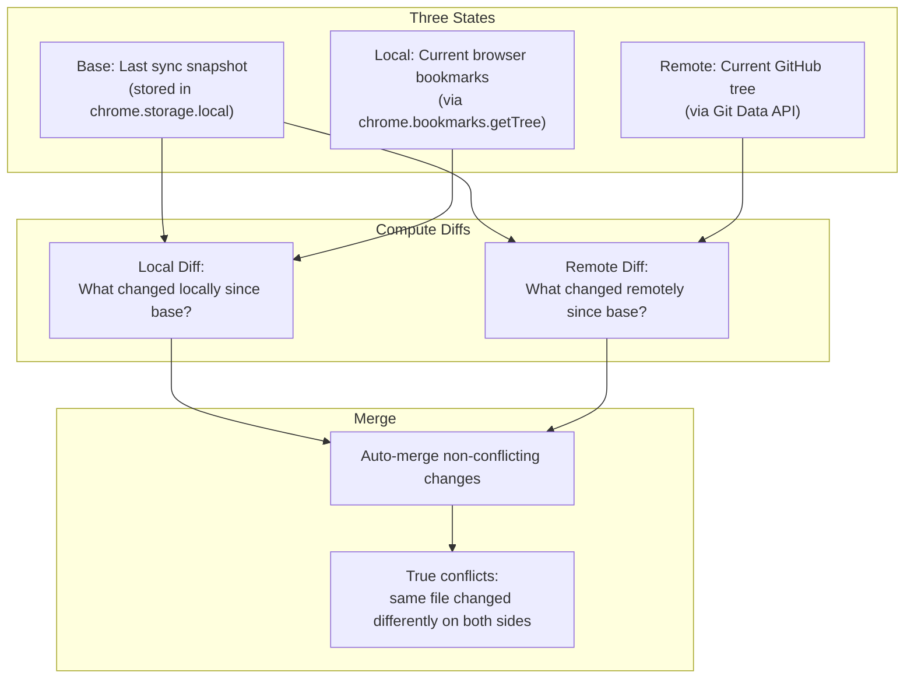
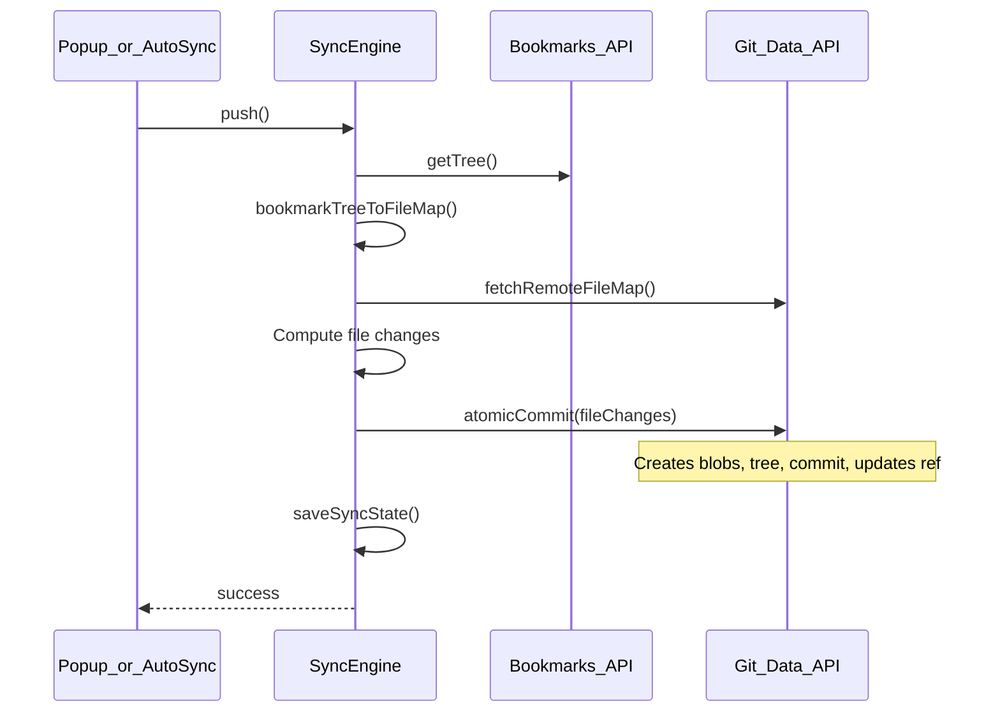
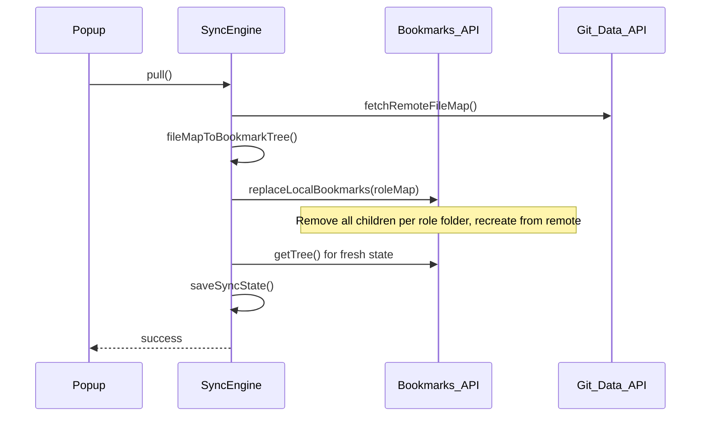
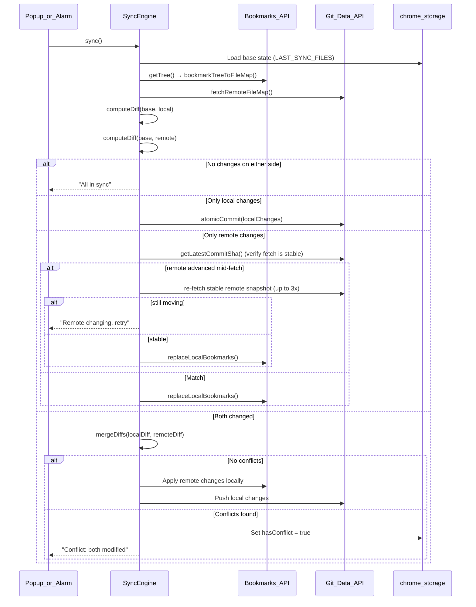

# GitSyncMarks — Sync Logic

## Overview

GitSyncMarks implements **bidirectional bookmark synchronization** using a **three-way merge** algorithm. Each bookmark is stored as an individual JSON file. The sync engine compares three states — base (last sync), local (browser), and remote (Git provider) — to automatically merge non-conflicting changes.

Transport is provider-specific ([`lib/git-provider.js`](../lib/git-provider.js): GitHub/GitLab tree API, Gitea-family Contents API, or GitLab atomic commits); merge logic in [`lib/sync-core.js`](../lib/sync-core.js) is provider-neutral. GitLab uses commit SHA instead of tree SHA as cache key.

## Core Concept: Three-Way Merge


```mermaid
flowchart TD
    subgraph inputs [Three States]
        Base["Base: Last sync snapshot\n(stored in chrome.storage.local)"]
        Local["Local: Current browser bookmarks\n(via chrome.bookmarks.getTree)"]
        Remote["Remote: Current GitHub tree\n(via Git Data API)"]
    end
    subgraph diff [Compute Diffs]
        LocalDiff["Local Diff:\nWhat changed locally since base?"]
        RemoteDiff["Remote Diff:\nWhat changed remotely since base?"]
    end
    subgraph merge [Merge]
        AutoMerge["Auto-merge non-conflicting changes"]
        Conflict["True conflicts:\nsame file changed differently on both sides"]
    end
    Base --> LocalDiff
    Local --> LocalDiff
    Base --> RemoteDiff
    Remote --> RemoteDiff
    LocalDiff --> AutoMerge
    RemoteDiff --> AutoMerge
    AutoMerge --> Conflict
```

## Sync Operations

### Push (Local → GitHub)

Full push of all local bookmarks as individual files using atomic commit.


```mermaid
sequenceDiagram
    participant UI as Popup_or_AutoSync
    participant SE as SyncEngine
    participant BM as Bookmarks_API
    participant GH as Git_Data_API

    UI->>SE: push()
    SE->>BM: getTree()
    SE->>SE: bookmarkTreeToFileMap()
    SE->>GH: fetchRemoteFileMap()
    SE->>SE: Compute file changes
    SE->>GH: atomicCommit(fileChanges)
    Note over GH: Creates blobs, tree, commit, updates ref
    SE->>SE: saveSyncState()
    SE-->>UI: success
```

### Pull (GitHub → Local)

Fetch remote file map, convert to bookmark tree, replace local bookmarks.


```mermaid
sequenceDiagram
    participant UI as Popup
    participant SE as SyncEngine
    participant BM as Bookmarks_API
    participant GH as Git_Data_API

    UI->>SE: pull()
    SE->>GH: fetchRemoteFileMap()
    SE->>SE: fileMapToBookmarkTree()
    SE->>BM: replaceLocalBookmarks(roleMap)
    Note over BM: Remove all children per role folder, recreate from remote
    SE->>BM: getTree() for fresh state
    SE->>SE: saveSyncState()
    SE-->>UI: success
```

### Sync (Bidirectional Three-Way Merge)


```mermaid
sequenceDiagram
    participant UI as Popup_or_Alarm
    participant SE as SyncEngine
    participant BM as Bookmarks_API
    participant GH as Git_Data_API
    participant Storage as chrome_storage

    UI->>SE: sync()
    SE->>Storage: Load base state (LAST_SYNC_FILES)
    SE->>BM: getTree() → bookmarkTreeToFileMap()
    SE->>GH: fetchRemoteFileMap()

    SE->>SE: computeDiff(base, local)
    SE->>SE: computeDiff(base, remote)

    alt No changes on either side
        SE-->>UI: "All in sync"
    else Only local changes
        SE->>GH: atomicCommit(localChanges)
    else Only remote changes
        SE->>GH: getLatestCommitSha() (verify fetch is stable)
        alt remote advanced mid-fetch
            SE->>GH: re-fetch stable remote snapshot (up to 3x)
            alt still moving
                SE-->>UI: "Remote changing, retry"
            else stable
                SE->>BM: replaceLocalBookmarks()
            end
        else Match
            SE->>BM: replaceLocalBookmarks()
        end
    else Both changed
        SE->>SE: mergeDiffs(localDiff, remoteDiff)
        alt No conflicts
            SE->>BM: Apply remote changes locally
            SE->>GH: Push local changes
        else Conflicts found
            SE->>Storage: Set hasConflict = true
            SE-->>UI: "Conflict: both modified"
        end
    end
```

## Diff Computation

`computeDiff(base, current)` compares two file maps (path → content) and produces:

| Category | Meaning |
|---|---|
| **added** | Files in `current` but not in `base` |
| **removed** | Files in `base` but not in `current` |
| **modified** | Files in both but with **semantically** different content |

Content comparison uses `contentEquals()`, which compares valid JSON by canonical form (recursively sorted object keys; array order preserved). Cosmetic differences (key order, whitespace) therefore do not register as modifications or conflicts. Non-JSON or unparseable content falls back to exact string comparison.

Generated/meta files (`README.md`, `_index.json`, `bookmarks.html`, `feed.xml`, `dashy-conf.yml`, `settings.enc`) are excluded from diff via `DIFF_IGNORE_SUFFIXES`. Individual settings files (`settings-{id}.enc`) are excluded via `SETTINGS_ENC_PATTERN`.

## Merge Rules

`mergeDiffs(localDiff, remoteDiff)` applies these rules per file path:

| Local | Remote | Action |
|---|---|---|
| Added | — | Push to GitHub |
| — | Added | Create locally |
| Modified | — | Push to GitHub |
| — | Modified | Apply locally |
| Removed | — | Delete on GitHub |
| — | Removed | Delete locally |
| Same change | Same change | No action needed |
| Different change | Different change | **Conflict** |
| Removed | Removed | No action needed |

## Duplicate Entry Prevention

Duplicate entries in `_order.json` (the same bookmark filename or folder key listed more than once) can cause the reconstructed bookmark tree to contain doubled siblings. Three layers prevent this:

1. **Deserialization** (`buildFolderChildren`): Tracks seen `orderEntryKey` values while walking `_order.json`. The first occurrence of a key is emitted; subsequent duplicates are silently skipped.

2. **Three-way merge** (`mergeOrderJson`): After merging local and remote additions/removals, a stable dedupe pass collapses any remaining duplicate keys in the result. This handles cases where the local `_order.json` itself already contained duplicates before the merge.

3. **Serialization** (`processFolder`): When converting the browser bookmark tree to files, a bookmark whose deterministic filename (`{slug}_{hash}.json`) was already emitted in the same folder is skipped. This guards against unusual browser states where the same URL appears as duplicate siblings.

Deduplication uses the `orderEntryKey` function: bookmark filenames are keyed by the string itself; folder entries are keyed by `dir:{name}`. Two different files with the same URL but different titles (producing different filenames) are **not** collapsed — they are distinct entries from the sync engine's perspective.

## Conflict Detection and Resolution

When `mergeDiffs` finds conflicts (same file changed differently on both sides):

1. `hasConflict` flag is set in `chrome.storage.local`
2. Popup shows conflict warning with resolution buttons:
   - **Local → GitHub** (force push) — overwrites remote
   - **GitHub → Local** (force pull) — overwrites local
3. The chosen operation clears the conflict flag

### First Sync Special Cases

When no base state exists (first sync ever):

| Local | Remote | Action |
|---|---|---|
| Has bookmarks | Empty repo | Push |
| Empty | Has data | Pull |
| Has bookmarks | Has data | Conflict (user must choose) |
| Empty | Empty | Nothing to do |

## Auto-Sync and Debounce

```
Bookmark event → triggerAutoSync() → debouncedSync(5000ms)
                                          ↓
                               clearTimeout (if pending)
                                          ↓
                               setTimeout(sync, 5000ms)
```

- Default delay: 5 seconds
- Each new event resets the timer
- Uses `sync()` (three-way merge), not just push
- Suppressed for 10 seconds after a pull (to ignore bookmark events from `replaceLocalBookmarks`)
- **Overlap coalescing**: if the debounce fires while a sync is already running, the run is re-armed (bounded by the max-wait timer) instead of being dropped, so edits made during an in-flight sync are not lost

### Re-Entrancy Guard

A module-level `isSyncing` boolean prevents concurrent operations. `background.js` also checks `isSyncInProgress()` and `isAutoSyncSuppressed()` before triggering auto-sync.

## The `replaceLocalBookmarks` Algorithm

Uses **role-based mapping** for cross-browser compatibility:

1. Get local bookmark tree via `chrome.bookmarks.getTree()`
2. Detect each root folder's role via `detectRootFolderRole()` (uses browser-specific IDs with title fallback)
3. For each local root folder, get its role and the corresponding remote data:
   a. Only roles in `SYNC_ROLES` (toolbar, other) are processed; menu and mobile are ignored.
   b. **GitHub Repos preservation**: When `githubReposEnabled` is on and the target role matches `githubReposParent`, and Git data does not contain a folder titled `GitHubRepos (username)` (or any `GitHubRepos (` prefix when username is unknown), the local GitHubRepos folder is preserved and merged into the data before replacement
   c. Remove all existing children (reverse order)
   d. Recursively recreate from merged remote data
4. Result: All bookmarks appear in both browsers; GitHubRepos folder is kept on pull when not in Git

## Stable-Snapshot Guard (Path 8)

When only remote changes exist (path 8), the API response may be cached or eventually consistent. To avoid overwriting local state with stale data (e.g. right after our own push), `getLatestCommitSha()` is re-checked before applying. If the branch HEAD advanced since our fetch, the engine re-fetches a fresh remote snapshot (up to 3 attempts). If the remote is still moving after the retries, the sync does **not** report "all in sync" (which previously hid pending remote changes); instead it returns `sync_remoteChangedRetry` so the user can retry.

**Stale-base guard:** If `localModifiedSinceSync` is set (bookmark create/remove/change/move since last successful sync) and the remote diff vs base only adds paths that are absent from local, sync pushes deletes to the remote instead of pulling. This recovers when `lastSyncFiles` was shrunk without a matching remote commit (e.g. profile-switch cache update). Normal path-8 pull still applies when the user did not edit bookmarks locally (remote changes from another device).

Bookmark events call `markLocalBookmarksModified()` in `background.js`; successful sync clears the flag.

## Truncated-Tree Guard

GitHub truncates the recursive tree listing for very large repositories (>100k entries or >7 MB). `GitHubAPI.getTree()` surfaces the `truncated` flag and `fetchRemoteFileMap()` aborts with `api_treeTruncated` rather than acting on a partial tree, which would otherwise misread missing entries as deletions and risk wiping remote data during cleanup.

GitHub API requests use `cache: no-store` to reduce cache-related staleness.

## Optimized Remote Fetching

`fetchRemoteFileMap()` minimizes API calls:

1. `getLatestCommitSha()` — 1 call
2. `getCommit()` + `getTree(recursive=1)` — 2 calls → full file list with SHAs
3. For each file: compare blob SHA with stored base SHA
   - **SHA matches** → use cached content from base state (0 calls)
   - **SHA differs** → `getBlob()` (1 call per changed file)

In the common case (few files changed), this is 3 + N calls where N is the number of changed files.

**Blob GET concurrency:** `getBlob` requests run in batches of five parallel calls (not all at once). Large repositories (hundreds of bookmarks) previously issued one concurrent request per file; GitHub’s secondary rate limits treat that as abusive.

**Blob POST (upload) via trees:** `atomicCommit` does **not** call `POST /git/blobs` per file. Each changed file is included in `POST /git/trees` with a `content` field; GitHub creates blobs server-side. Batches are split by entry count (~400) and approximate JSON size (`lib/github-tree-batch.js`) so each tree request stays within GitHub payload limits; multiple tree calls are chained with `base_tree` until the full change set is applied, then one commit and ref update.

**History / pinned commit:** `fetchRemoteFileMapAtCommit()` uses the same batched blob fetch. A small in-memory cache (few entries, short TTL) deduplicates work when preview and restore target the same commit SHA in quick succession.

## Sync History and Restore

### Commit History

`listSyncHistory()` calls `GitHubAPI.listCommits({ path })` (the REST [List Commits](https://docs.github.com/en/rest/commits/commits#list-commits) endpoint filtered by the bookmark base path). Returns the last 20 commits with SHA, message, date, and author. GitSyncMarks-generated subjects follow `… from <deviceId> — <ISO8601>` (em dash); `lib/sync-commit-message.js` extracts `<deviceId>` for the Settings **Client** column (full subject remains available on hover). Commits from other tools keep the raw message string but may not parse.

### Restore from Commit

`restoreFromCommit(commitSha)` fetches the full file map at a specific commit via `fetchRemoteFileMapAtCommit()` — the same tree-walking logic as regular pull but pinned to a chosen commit SHA instead of the branch tip. The result is applied locally via `replaceLocalBookmarks()`. This only changes local bookmarks; it does not force-push or rewrite the remote branch. The next sync will detect the divergence and push the restored state.

### Diff Preview

`getCommitDiffPreview(commitSha)` fetches both the target commit's file map and the current local bookmarks, filters out internal files (`_order.json`, `_index.json`, generated files, settings), then computes a structured diff. Each bookmark JSON file is parsed to extract `{ title, url }` for user-friendly display. Returns lists of added (in target but not local), removed (in local but not target), and changed entries. The options UI renders the preview inline under the selected history row: summary badges, then Added and Removed in two columns (collapsed `<details>` by default), then Changed full width below, then Restore/Close. The history table uses one grid row per commit: headers and cells share the same four columns (date, short SHA, client id, actions). Preview and restore are icon buttons in the last column; the row matching `lastCommitSha` shows a checkmark icon plus a “current” label. Restore uses a two-step confirmation on the same control (first click arms, second click runs `restoreFromCommit`) without a browser `confirm()` dialog. The same pattern applies to Restore inside an open diff preview (text buttons there).

### Undo Last Sync

Before any operation that applies remote changes locally (`pull()`, sync path 8, sync path 9 merge), the current `lastCommitSha` is saved as `previousCommitSha` in the profile's sync state. The "Undo last sync" button in the UI calls `restoreFromCommit(previousCommitSha)` to revert to the pre-sync state.

## Profile Switch

`switchProfile()` in `lib/profile-manager.js` uses helpers in `lib/profile-switch-logic.js` and diff utilities in `lib/sync-diff.js`.

**Leaving the current profile:**

1. Snapshot browser bookmarks to a file map.
2. `buildSwitchPushChanges()` compares against `lastSyncFiles` via `computeDiff()` / `filterForDiff()`.
3. If no bookmark changes → skip commit; refresh `lastSyncFiles` via `mergeLocalIntoSyncFiles()` (updates content and SHAs; **keeps paths removed locally** so the next sync still sees them as `localDiff.removed`).
4. If changes → `commitBookmarkChanges()` with only added/modified/removed paths, then `saveSyncState()` (no full-tree commit, no post-commit refetch).

**Loading the target profile:**

1. If `lastSyncFiles` cache exists and `lastCommitSha` is set → `getLatestCommitSha()` (cheap HEAD check).
2. HEAD equals cached SHA → use cache (no download).
3. HEAD differs → `fetchRemoteFileMap()` with `lastSyncFiles` as base (delta blob fetch for changed files only).
4. HEAD check fails (offline) → fall back to cache.
5. Cache without `lastCommitSha` (legacy) → use cache; no blocking pull.
6. No cache → full `fetchRemoteFileMap()` as before.

Local bookmarks are still replaced via `replaceLocalBookmarks()` (full remove/create per role folder).

## Profile Transfer (Cross-Profile Copy)

`lib/profile-transfer.js` copies bookmark file maps between profiles without switching. Source data: browser tree (if source is active), else remote fetch, else `lastSyncFiles` cache. Generated files and auto-managed folders (`GitHubRepos`, `GiteaRepos`, `Linkwarden`) are stripped. Modes: **replace** (overwrite target map; remote files not in the result are deleted on push) or **merge** (conflict if same path differs; existing target files are kept — duplicate folder names can result). UI shows merge/replace warnings and a confirm dialog for merge when the target already has data. Optional `pushForProfile()` commits to the target primary remote and updates sync state. The transfer dialog reports progress via a runtime port: loading steps (`1 of 2`), remote fetch, then `$current of $total files` during per-file Gitea commits (GitHub batch commit jumps from `0` to `$total`).

## Remote Orphan Cleanup

`previewRemoteOrphans()` / `cleanRemoteOrphans()` in `lib/sync-core.js` compare the canonical local file map (browser tree for the active profile, else `lastSyncFiles`) to the remote repository. Paths on the remote under the profile's `filePath` that are absent locally (excluding generated/settings files) are orphans. `cleanRemoteOrphans()` runs `pushForProfile()` with `replaceRemote: true` and a dedicated commit message, deleting orphan files without changing local bookmarks. Options UI: Sync sub-tab.

## Push Mirror Destinations

Each profile may define `mirrors[]` — secondary Git remotes that receive a **push-only** copy after every successful primary commit (`push()`, sync path 7/9). Mirrors do not participate in fetch or three-way merge. `pushToMirrors()` filters files per mirror (`pushGenerated`, `pushSettings`), skips when `lastPushedCommitSha === primaryCommitSha` (server-side mirror loop guard), and records per-mirror errors in `syncState.mirrors` without rolling back the primary commit.
